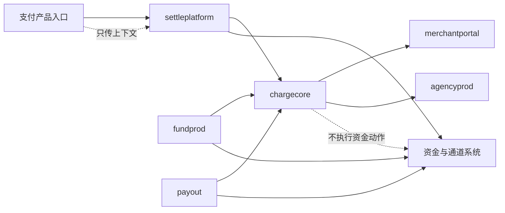
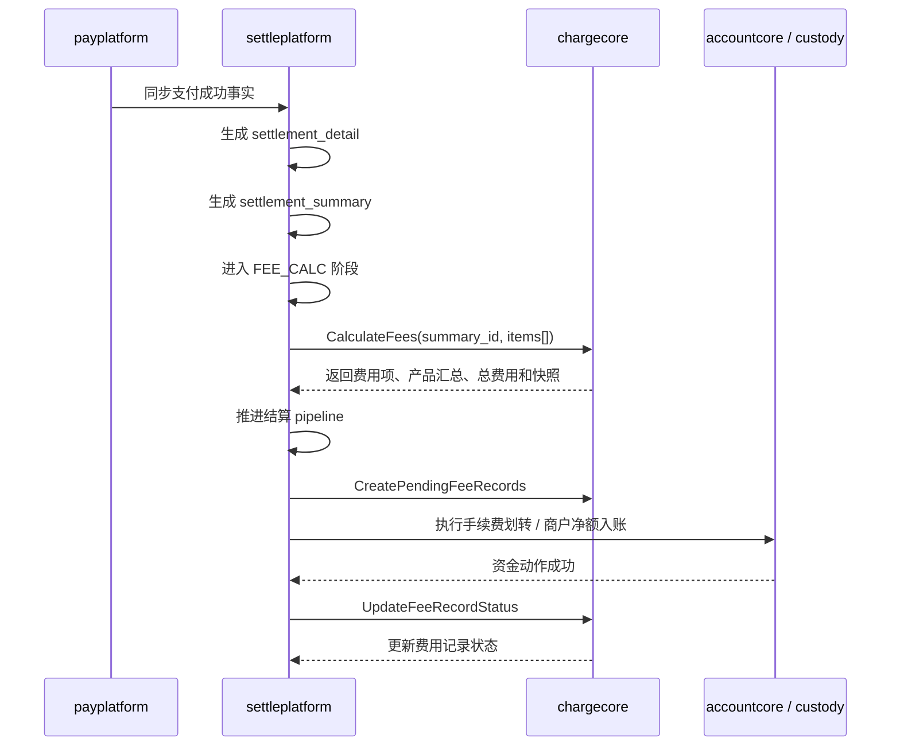
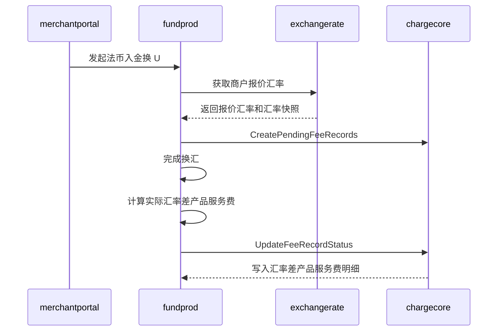
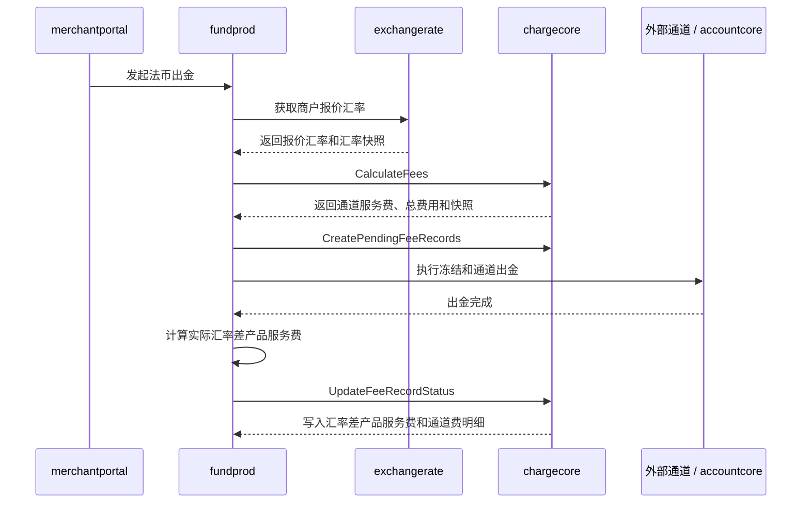
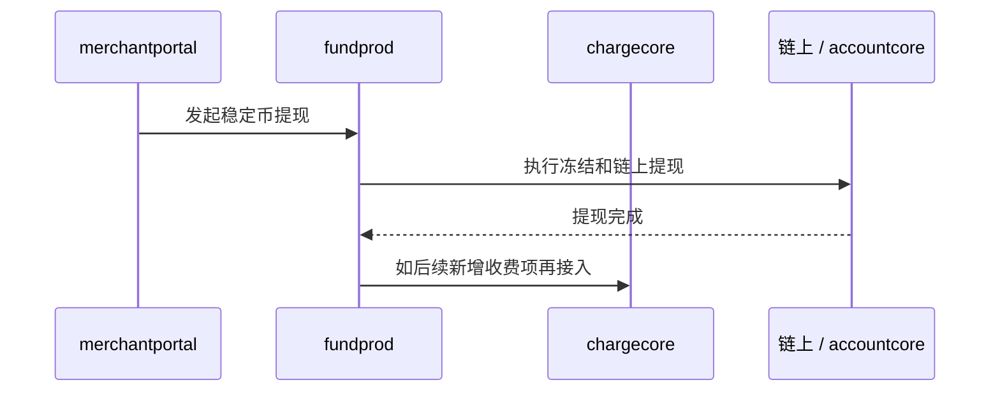
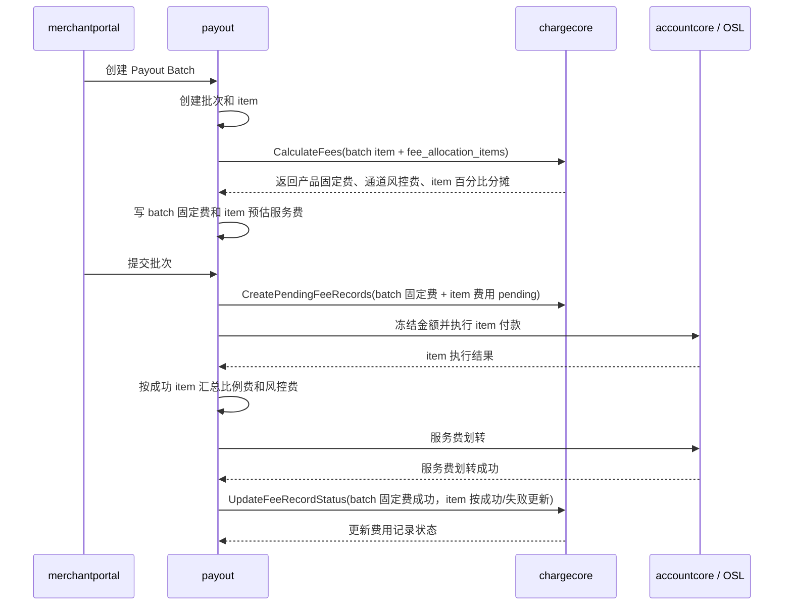
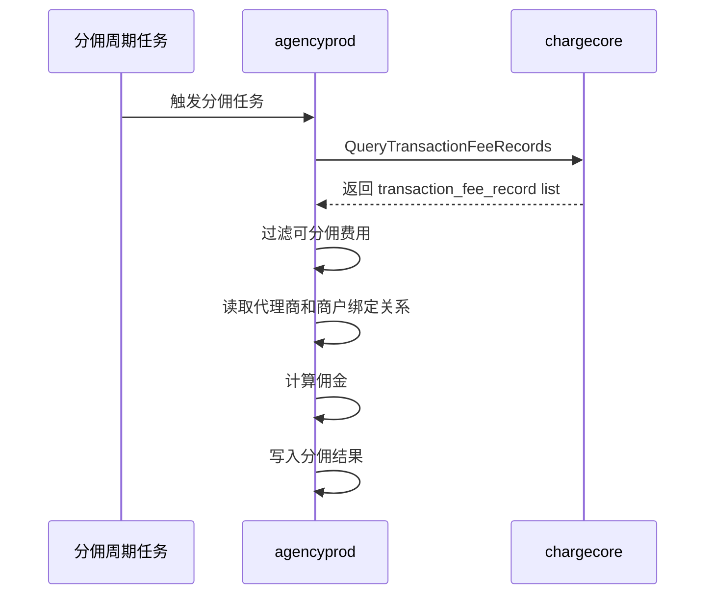

# StablePay 费率管理模块改造及收费账单影响面盘点
本文档只描述“被动接入收费核心能力的业务系统影响面”。`chargecore`、`payadmin`、`merchantcore`、`merchantportal` 费用查询页等计费能力承载系统建设细节，以主技术方案为准。
本文档回答三个问题：
- 哪些业务系统需要消费 `chargecore`。
- 当前这些系统是如何取费率、算费用、落结果的。
- 现有 `chargecore` 模型是否支撑这些业务系统完成收费改造。
说明：
- 小数位处理属于 `chargecore` 统一计费口径，不属于业务系统各自实现的策略。
- 本文档中的历史取整差异仅用于说明现状和测试关注点；改造后业务系统应以 `chargecore.CalculateFees` 返回的费用项和总费用为准。
## 0. 业务影响面总览图

## 1. 影响面收敛原则
### 1.1 按收费时点收敛系统
| 收费时点 | 收费执行方 | 判断 |
| --- | --- | --- |
| T+1 | `settleplatform` | 支付类产品在结算阶段统一计费。`paymentprod`、`payplatform`、`commerce`、`shopify` 等上游入口不直接调用 `chargecore` 收费，只负责让结算侧拿到必要上下文。 |
| realtime | `fundprod`、`payout` | 出入金、提现、批量付款等业务在发起、确认或完成时就需要知道费用，费用会影响冻结金额、实际到账、服务费划转和费用记录流转。 |
| result consumer | `agencyprod` | 不参与费率匹配和扣费执行，只读取 `chargecore` 已完成收费结果 list，作为分佣收入事实来源。 |


| 系统 / 领域 | 类型 | 是否直接调用 `chargecore` | 核心原因 |
| --- | --- | --- | --- |
| `settleplatform` | T+1 收费执行方 | 是 | 支付类产品服务费和通道服务费在结算阶段统一计算、入账、落明细。 |
| `fundprod` | realtime 收费执行方 | 是 | Off Ramp、法币出金、稳定币提现等出入金场景需要实时费用结果；On Ramp 汇率差产品服务费先登记待执行记录，再在完成后更新结果。 |
| `payout` | realtime 收费执行方 | 是 | Batch Payouts 需要在创建 / 提交 / 完成阶段计算费用并影响冻结和服务费划转。 |
| `agencyprod` | 收费结果下游 | 是，读取结果 | 从 `chargecore.transaction_fee_record` 获取已完成收费 list，替代只从结算汇总取手续费基数。 |


### 1.2 侧面系统不作为主改造对象
以下系统可能需要侧面改造或作为数据血缘，但不作为“收费执行方”展开：
| 系统 | 在本文件中的定位 |
| --- | --- |
| `paymentprod` | 支付产品层，产生 Payment Link / Invoice / Subscription 等业务上下文；T+1 收费由 `settleplatform` 收住。 |
| `payplatform` | 支付平台层，承接支付 session、trade order、payment order；不在支付成功时直接收费。 |
| `commerce` / `shopify` | 电商入口和渠道上下文来源；主要影响 Shoplazza / Shopyy 等条件通道费是否能命中。 |
| `merchantportal` | 业务发起页可能需要展示预估费用；费用查询页属于主技术方案，不放在本影响面文档展开。 |
| `accountcore` | 账户余额、冻结、扣减、入账执行方；不维护收费规则。 |
| `chaincore` / `channelcore` | 链上或外部通道执行方；可提供通道成本血缘，但不维护 StablePay 对商户收费规则。 |
| `exchangerate` | On/Off Ramp 汇率差产品服务费配置来源；本期不迁入 `chargecore` 配置模型。 |
| `billprod` | 旧账单 / 文件账单系统；不是新的交易级收费明细事实源。 |
| Payroll | PRD 有默认配置预留，但当前业务未建设；不做存量影响面盘点。 |


## 2. ChargeCore 对业务消费方提供的能力
### 2.1 收费执行方使用的能力
`settleplatform`、`fundprod`、`payout` 作为收费执行方，主路径按“先计算、先登记待执行记录、后更新执行结果”接入 `chargecore`；On/Off Ramp 汇率差产品服务费是例外，它由 `exchangerate + fundprod` 产生费用结果，但仍走同一费用记录流转：
| 能力 | 说明 |
| --- | --- |
| 费用计算 | 业务系统传入商户、产品、金额、币种、收费时点、来源业务标识和费用上下文；`chargecore` 返回命中的费用项和总费用。On/Off Ramp 汇率差产品服务费不走该能力。 |
| 规则快照 | `chargecore` 返回产品服务费配置、通道服务费规则、汇率报价引用等快照，供业务系统保存和后续落明细。 |
| 费用记录状态流转 | 业务系统先创建 `pending` 费用记录，完成真实扣费 / 入账 / 资金动作后，再更新为 `succeeded` 或 `failed`。 |
| 幂等 | 按 `source_system + source_biz_type + source_biz_id + source_event_id + fee_category + fee_item + fee_channel` 或等价业务键保证同一项费用不重复落库。 |
补充口径：
- `source_biz_id` 表示业务主单号，`source_event_id` 表示收费执行事件 ID。
- `source_event_id` 默认可与 `source_biz_id` 同值；当前主要例外是 `settleplatform` 支付类 T+1 计费，建议使用 `settlement_detail.id` 作为 `source_event_id`。
- 配置层费率统一按 `USD` 定价；所有配置表中的固定费用、`conditions` 内金额条件及其币种统一表达为 `USD`；`transaction_fee_record.base_amount_currency`、`fee_currency` 只表达业务基数币种和实际收费币种，可为 `USD / USDT / USDC` 等具体币种。
- `chargecore.CalculateFees` 对产品服务费和通道服务费的百分比部分统一按最小货币单位向上取整；固定费用按配置值直接计入。
- 业务系统不自行理解或配置取整策略，不按费率复算最终收费金额；如果业务系统需要拆分、冻结或展示明细，也应以 `chargecore` 返回的费用项和总费用为依据。
- 通道服务费规则按 `product_code + fee_item + conditions` 命中；本期业务接入重点提供渠道和交易金额上下文，`source_biz_type` 保留为后续扩展条件，不作为本期影响面必改项。
- 当前 payadmin 只开放“渠道”和“交易金额”两类触发条件；同一规则内渠道最多一条，交易金额最多一个条件表达，前端区间条件落库为一组 `gte + lte`。
- `chargecore` 三张配置模型统一落在 MongoDB 配置库，`transaction_fee_record` 继续落在 MySQL 结果库。

通道服务费条件上下文：
| 条件字段 | 来源系统需要提供的上下文 | 支持操作符 |
| --- | --- | --- |
| `channel` | 店铺渠道、支付渠道、外部通道等渠道语义 | `eq` |
| `transaction_amount` | 交易金额，按 minor units 传入并携带币种；支持单点判断或区间判断 | `eq` / `lt` / `lte` / `gt` / `gte` |


职责边界：
- `chargecore` 负责“该收哪些费用、每项多少钱、总共多少钱、费用来源是什么”。
- 业务系统负责“什么时候收、怎么冻结、怎么扣、怎么入账、失败怎么释放”。
- 小数位策略由 `chargecore` 在费用计算时完成，业务系统只消费计算结果。
- `transaction_fee_record` 承载收费结果与 `chargecore` 内部执行状态；对外查询默认只消费成功收费结果。
### 2.2 收费结果下游使用的能力
`agencyprod` 不需要调用费率匹配和费用计算接口，只需要读取已完成收费结果：
| 能力 | 说明 |
| --- | --- |
| 明细 list | 按商户、时间范围、币种、产品、费用类别、业务类型查询已完成收费记录。 |
| 费用类别 | `fee_category` 区分 `product_service_fee`、`channel_service_fee`。`agencyprod` 自己决定哪些费用可作为分佣收入来源。 |
| 业务追溯 | `source_system`、`source_biz_type`、`source_biz_id`、`source_event_id` 用于追溯费用来自哪笔业务。 |
| 金额与币种 | `fee_amount`、`fee_currency` 用于下游聚合。 |
| 来源引用与快照 | `fee_source_ref_type/ref_id/version`、`fee_snapshot` 用于审计和解释费用来源。 |


## 3. 费用事件与明细粒度
`transaction_fee_record` 的粒度是“一项费用一条记录”，不是“一笔交易一条记录”。一个业务 event 可以产生多条费用。
| 业务 event | 费用明细示例 | 收费时点 | 收费执行方 |
| --- | --- | --- | --- |
| Payments 普通支付结算 | 产品服务费、风控服务费、条件平台服务费 / 通道手续费 | T+1 | `settleplatform` |
| Payment Links 支付结算 | 产品服务费、风控服务费 | T+1 | `settleplatform` |
| Invoicing 发票收款结算 | 产品服务费、风控服务费 | T+1 | `settleplatform` |
| Subscription 订阅扣款结算 | 产品服务费、风控服务费 | T+1 | `settleplatform` |
| Payouts 付款成功 | 产品服务费、风控服务费 | realtime | `payout` |
| On Ramp 法币入金换 U 完成 | 汇率差产品服务费 | realtime | `fundprod` |
| Off Ramp 法币出金完成 | 汇率差产品服务费、OSL 银行手续费 | realtime | `fundprod` |


说明：
- On/Off Ramp 汇率差产品服务费仍由 `exchangerate + fundprod` 汇率链路产生，不走普通产品服务费配置表。
- On/Off Ramp 汇率差产品服务费不展示给商户账单，但仍作为收费结果写入 `transaction_fee_record`。
- 商户账单是否展示不在 `transaction_fee_record` 物理字段中维护，由查询层按固定规则过滤。
- `agencyprod` 分佣读取的是收费结果事实，是否参与分佣由 `agencyprod` 的收入规则决定；`chargecore` 不计算佣金。
## 4. T+1 收费：SettlePlatform
### 4.1 系统交互图
`settleplatform` 手里已经有“哪些交易要结算”的事实，`chargecore` 只接管“这些交易该收哪些费用、每项多少钱”。结算 pipeline、手续费划转、商户净额入账仍由 `settleplatform` 负责；费用记录在真实收费前先登记 `pending`，在真实收费 / 入账成功后再更新为最终执行结果。

### 4.2 生产数据与代码共同说明了什么
| 观察点 | 生产数据 / 代码表现 | 对交互设计的含义 |
| --- | --- | --- |
| `settlement_detail` 是逐笔结算明细 | 导出数据中每条 detail 有 `summary_id`、`merchant_id`、`payment_id`、`product_code`、`trade_id`、`amount`、`amount_received`、`currency`、`paid_chain_type`、`payment_method`、`payment_channel` | 它适合作为 `chargecore` 逐笔计算费用的输入事实。 |
| `settlement_summary` 是同商户结算汇总 | summary 按 `merchant_id + settlement_date + chain_type + currency` 聚合，有 `payment_gross_amount`、`payment_fee_amount`、`payment_net_amount`、`payment_tx_count`、`settlement_date`、`status` | 它适合作为 `CalculateFees` 的批量请求边界和结算 pipeline 聚合结果，不适合作为 `transaction_fee_record` 的唯一粒度。 |
| 当前代码已经逐笔计费 | `FeeCalculationRequested` 后，charging 模块按 `summary_id` 查 `settlement_detail`，逐笔计算后汇总成 `FeeCalculated` | 本期不是新增一个完全陌生节点，而是把现有逐笔计费节点替换为调用 `chargecore`。 |
| 当前费用来源仍是 `merchantcore` | `charging.Calculate` 调 `merchantcore.GetFeeConfigByDate`，再用 `amount * percent_rate + fixed_fee` 算手续费 | 本期改为由 `chargecore` 根据产品服务费配置和通道服务费规则统一计算。 |
| 历史小数位规则不统一 | 支付结算老链路、Payout item 明细、出入金汇差等代码中曾分别存在四舍五入、银行家舍入、截断等处理 | 本期不要求各业务系统实现取整策略；统一以 `chargecore.CalculateFees` 返回结果作为收费依据，测试时验证业务系统没有继续使用本地复算结果覆盖 `chargecore` 金额。 |
| 当前 detail 的 `fee_amount` 不是收费结果来源 | 导出样例中 `settlement_detail.fee_amount` 基本为 0；实际手续费体现在 `settlement_summary.payment_fee_amount` 和 pipeline 输出 | 新明细不能简单从 `settlement_detail.fee_amount` 搬字段，而应以 ChargeCore 计算结果 + settle 实际执行结果为准。 |
| 产品码已经存在 | 导出 detail 中可见 `payment`、`invoice`、`payment_link` | T+1 的基础产品服务费命中有字段基础；Subscription 是否能稳定识别仍需单独确认。 |
| 上下文字段有基础但不完整 | detail 有链、支付方式、支付渠道、wallet code；但 Shoplazza / Shopyy / 交易所支付等业务来源未必在当前 charging 查询字段里 | 若通道费条件依赖店铺 / 来源系统，需要扩展 settle 查询上下文或从关联订单补充。 |


### 4.3 生产样本观察
本节记录 2026-06-04 从生产库抽取的 `settleplatform` 真实样本，用于校对当前 master 链路与本次改造后的验收口径。

当前生产链路特征：
- 实时交易归集阶段会先生成 `settlement_summary` 和 `settlement_detail`，此时支付费用通常仍为 0。
- 每日结算任务后，`settlement_summary.payment_fee_amount` / `payment_net_amount` 会体现已计算的产品服务费。
- 当前 master 链路的 `settlement_detail.fee_amount`、`rule_id`、`rule_version`、`package_id`、`percent_rate`、`fixed_fee`、`min_fee`、`max_fee` 仍可能为空或 0，费用主要体现在 summary 汇总层。
- 退款费用当前保持 0，本期 `settleplatform -> chargecore` 改造仍不对退款明细调用 `CalculateFees`。
- `settlement_pipeline` 记录结算流水执行进度；完成样本中 `current_step=BALANCE_UPDATE`、`status=COMPLETED`，说明手续费计算和余额更新已经走完。

生产样本摘要：

| 场景 | 表 | 主键 | 商户 | 结算日 | 链/币种 | 金额观察 | 状态 |
| --- | --- | --- | --- | --- | --- | --- | --- |
| 实时归集后、日结前 | `settlement_summary` | `0a0396e6-c196-4f99-9219-242d992e9e53` | `8000579819299567` | `2026-06-05` | BSC / USDT | `payment_gross_amount=50000`、`payment_fee_amount=0`、`payment_net_amount=50000` | `pending` |
| 实时归集后、日结前 | `settlement_detail` | `20260604110200301995610000115151` | `8000579819299567` | `2026-06-05` | BSC / USDT | `amount=50000`、`amount_received=50000`、`fee_amount=0`、费用快照字段为空 | `status=4` |
| 日结完成后 | `settlement_summary` | `54382daa-2fa7-40ad-994b-cd9e0e486935` | `8000579819299567` | `2026-06-04` | BSC / USDT | `payment_gross_amount=1000`、`payment_fee_amount=10`、`payment_net_amount=990` | `completed` |
| 日结完成后 | `settlement_detail` | `20260603110200301995610000115141` | `8000579819299567` | `2026-06-04` | BSC / USDT | `amount=1000`、`amount_received=1000`、`fee_amount=0`、费用快照字段为空 | `status=4` |
| 日结完成后 | `settlement_pipeline` | `23766660-e580-45cd-a8b9-e2f8714fece6` | `8000579819299567` | `2026-06-04` | - | `flow_type=custody`、`current_step=BALANCE_UPDATE`、`retry_count=1` | `COMPLETED` |

其他可复用 completed 样本：

| `summary_id` | 商户 | 结算日 | 链/币种 | `payment_tx_count` | `payment_gross_amount` | `payment_fee_amount` | `payment_net_amount` |
| --- | --- | --- | --- | --- | --- | --- | --- |
| `f3a9a635-efce-4f5a-9520-3aa3b8a0a6a3` | `8000262557535555` | `2026-06-04` | TRON / USDT | 1 | 51744 | 776 | 50968 |
| `12b2cac2-fa86-4a3f-adf1-852eaa91b00a` | `8000820970144915` | `2026-06-03` | BSC / USDT | 5 | 18637 | 148 | 18489 |
| `c77f7c9c-8bc9-47ca-9650-250281542b73` | `8000087797117025` | `2026-06-03` | SOLANA / USDC | 1 | 100 | 1 | 99 |
| `2a458521-cb4a-4331-84ed-ab546dc907b4` | `8000579819299567` | `2026-06-02` | BSC / USDT | 6 | 1716 | 17 | 1699 |

对本期改造的校对意义：
- `chargecore` 接入后，`settleplatform` 仍应保持 summary 层的收费结果口径：`payment_net_amount = payment_gross_amount - payment_fee_amount`。
- 新增的 `chargecore.transaction_fee_record` 应补齐当前生产缺失的交易级费用明细、费用来源、费率快照和通道服务费拆分。
- `CalculateFees` 必须返回完整 `fee_components`，即使上游暂时只使用总费用，也不能依赖上游系统自行补齐费用明细。
- 支付类产品的 `fee_date` 应沿用当前生产按 `settlement_date` 取费率的语义，支持 T+1 结算时按业务归属日计费。

可复用查询：

```sql
SELECT *
FROM settlement_summary
WHERE status = 'completed'
ORDER BY settlement_date DESC, updated_at DESC
LIMIT 5;

SELECT *
FROM settlement_detail
WHERE summary_id = '<summary_id>'
ORDER BY created_at DESC
LIMIT 20;

SELECT *
FROM settlement_pipeline
WHERE summary_id = '<summary_id>'
LIMIT 5;

SELECT *
FROM settlement_pipeline_step
WHERE pipeline_id = '<pipeline_id>'
ORDER BY id ASC
LIMIT 20;
```

### 4.4 本期交互方式
`settleplatform` 保持 T+1 收费执行点不变，交互拆成两个动作：
| 动作 | 发起方 | 时点 | 作用 |
| --- | --- | --- | --- |
| `CalculateFees` | `settleplatform` | `FEE_CALC` 阶段 | 按一个 `settlement_summary` 批量传入同一商户下的逐笔 detail，拿回每笔交易的费用项、按产品汇总费用、总费用和计费快照。 |
| `CreatePendingFeeRecords` | `settleplatform` | 实际手续费划转 / 余额入账前 | 创建待执行费用记录。 |
| `UpdateFeeRecordStatus` | `settleplatform` | 真实手续费划转 / 余额入账成功后 | 将对应费用记录更新为 `succeeded`；失败则更新为 `failed`。 |


本期改造点：
| 改造点 | 说明 |
| --- | --- |
| 调用 `chargecore.CalculateFees` | 在原 `FEE_CALC` 阶段，由 `chargecore` 完成规则命中、费用项计算、总费用汇总。 |
| 保留账务执行 | `settleplatform` 继续负责结算编排、商户净额入账、公司手续费入账。 |
| 费用记录流转 | 实际入账 / 扣费前，调用 `CreatePendingFeeRecords`；完成后调用 `UpdateFeeRecordStatus` 更新执行结果。 |
| 补齐上下文 | 需要让 `settleplatform` 能拿到产品码、业务类型、店铺 / 渠道来源、支付渠道等用于通道费命中的上下文。 |


### 4.5 `CalculateFees` 请求示例
```json
{
  "source_system": "settleplatform",
  "summary_id": "sum_xxx",
  "merchant_id": "800000000001",
  "settlement_date": "2026-05-20",
  "charge_timing": "t1",
  "fee_currency": "USDT",
  "items": [
    {
      "source_biz_type": "payment_session",
      "source_biz_id": "pay_xxx",
      "source_event_id": "settlement_detail_xxx",
      "product_code": "payment",
      "base_amount": "100.00",
      "base_amount_currency": "USDT",
      "context": {
        "trade_id": "sess_xxx",
        "summary_id": "sum_xxx",
        "payment_id": "pay_xxx",
        "order_source_system": "shoplazza",
        "paid_chain_type": "TRON",
        "payment_method": "crypto",
        "payment_channel": "wallet",
        "wallet_code": "bitget"
      }
    }
  ]
}
```
说明：
- `amount` 优先使用当前代码已采用的 `amount_received`；没有 `amount_received` 时使用 `amount`。
- `settlement_detail` 中退款类型不进入正向收费，沿用当前代码跳过 / 反向处理口径。
- `summary_id` 是结算批次 / event 级追溯字段，真正费用明细仍按 item 拆成多条。
- `CalculateFees` 请求级 `merchant_id` 固定为该 `settlement_summary` 的商户；如果未来出现跨商户批量，调用方必须按商户拆分请求。
### 4.6 `CalculateFees` 返回示例
```json
{
  "summary_id": "sum_xxx",
  "total_fee_amount": "0.35",
  "fee_currency": "USDT",
  "fee_amount_by_product": {
    "payment": "0.35"
  },
  "items": [
    {
      "source_biz_id": "pay_xxx",
      "source_event_id": "settlement_detail_xxx",
      "total_fee_amount": "0.35",
      "fee_items": [
        {
          "fee_category": "product_service_fee",
          "fee_item": "product_service_fee",
          "fee_amount": "0.25",
          "fee_source_ref_type": "product_service_fee_package",
          "fee_source_ref_version": 1
        },
        {
          "fee_category": "channel_service_fee",
          "fee_item": "risk_control_fee",
          "fee_amount": "0.10",
          "fee_source_ref_type": "channel_service_fee_rule",
          "fee_source_ref_version": 1
        }
      ]
    }
  ]
}
```
`settleplatform` 使用 `total_fee_amount` / `fee_amount_by_product` 推进原有 pipeline，并暂存或携带 `fee_items` 快照，用于后续创建待执行费用记录和更新执行结果。
### 4.7 预计落库示例
以下示例按评审易读的展示口径表达金额；实际落库仍按 `bigint + currency` 的 minor units 方式存储。
| fee_record_id | merchant_id | product_code | source_system | source_biz_type | source_biz_id | source_event_id | fee_category | fee_item | fee_channel | base_amount | base_amount_currency | percentage_rate | percentage_fee_amount | fixed_fee_amount | fee_amount | fee_currency | fee_source_ref_type | fee_source_ref_id | fee_source_ref_version | charge_timing | charged_at | fee_snapshot 摘要 | 商户账单展示 |
| --- | --- | --- | --- | --- | --- | --- | --- | --- | --- | --- | --- | --- | --- | --- | --- | --- | --- | --- | --- | --- | --- | --- | --- |
| `tfr_pay_001` | `m_1001` | `payment` | `settleplatform` | `payment_session` | `pay_xxx` | `settlement_detail_xxx` | `product_service_fee` | `product_service_fee` | - | `1000.00` | `USDT` | `1.00%` | `10.00` | `0` | `10.00` | `USDT` | `product_service_fee_package` | `9101000000000001` | `1` | `t1` | `2026-05-19T23:59:59Z` | 命中默认产品服务费套餐；保留结算明细、支付订单、原始金额快照 | 是 |
| `tfr_pay_002` | `m_1001` | `payment` | `settleplatform` | `payment_session` | `pay_xxx` | `settlement_detail_xxx` | `channel_service_fee` | `risk_control_fee` | `stablepay_risk_control` | `1000.00` | `USDT` | `0` | `0` | `0.10` | `0.10` | `USDT` | `channel_service_fee_rule` | `9103000000000002` | `1` | `t1` | `2026-05-19T23:59:59Z` | 命中风控费规则；保留渠道上下文、命中条件、规则版本快照 | 是 |
| `tfr_pay_003` | `m_1001` | `payment` | `settleplatform` | `payment_session` | `pay_xxx` | `settlement_detail_xxx` | `channel_service_fee` | `platform_service_fee` | `exchange_payment` | `1000.00` | `USDT` | `0.25%` | `2.50` | `0` | `2.50` | `USDT` | `channel_service_fee_rule` | `9103000000000003` | `1` | `t1` | `2026-05-19T23:59:59Z` | 命中条件平台服务费规则；保留渠道来源、订单来源和规则快照 | 是 |


### 4.8 SettlePlatform 待确认项
| 编号 | 问题 | 为什么需要确认 |
| --- | --- | --- |
| `Q-T1-001` | Subscription 最终按 `product_code=subscription` 计费，还是当前订单层仍可能表现为 `invoice` 后由结算侧覆盖？ | PRD 中 Subscription 和 Invoice 默认费率不同；如果产品码错，会直接影响费用金额。 |
| `Q-T1-002` | `settleplatform` 是否能稳定拿到 Shoplazza / Shopyy / 交易所支付等条件通道费所需上下文？ | 决定是否需要上游入口系统补传字段。 |


## 5. Realtime 收费：FundProd
### 5.1 系统交互图
`fundprod` 是出入金 / 资金产品编排系统。它手里有“这笔出入金是否成功、实际到账多少、通道实际收了多少”的事实，`chargecore` 接管“应该收哪些费用、每项多少钱、完成后怎么形成统一费用记录”。
On Ramp：

法币 Off Ramp：

Crypto 稳定币提现：

### 5.2 代码现状说明了什么
| 场景 | 当前模式 |
| --- | --- |
| On Ramp 法币入金换 U | 产品服务费通过汇率差体现，由 `exchangerate` 返回 display rate / spread，完成后在资金操作记录中体现平台汇差收益。 |
| Off Ramp 法币出金 | 产品服务费通过汇率差体现；历史通道费曾读取 Mongo `fx_channel_fee_config`，本期发布目标规则收敛为 OSL 银行手续费 `35 USD / 笔`。 |
| Crypto 稳定币提现 | 当前代码中手续费计算逻辑基本未实现，`CalculateFee` 返回 0；链上 gas / 网络费不等价于商户收费，且本期不再新增风控服务费。 |


| 观察点 | 代码表现 | 对交互设计的含义 |
| --- | --- | --- |
| On Ramp 汇率差在实际执行完成后才稳定 | `fiat_deposit` 完成后写 `FundOperationRecord.PlatformSpreadRevenue` | 汇率差产品服务费适合在实际执行完成后更新费用记录，不适合在报价阶段直接落结果。 |
| Off Ramp 已有通道费快照 | `GetFXQuote` 使用 `ChannelFeeSnapshot`，提现链路会 `SetFee(payoutResult.ChannelFee)` | 现有链路已经有通道费概念，本期是把配置和计算迁到 `chargecore`。 |
| Crypto 提现当前未真正计费 | `domain/withdraw.CalculateFee` 返回 0 | 本期仍维持不收费口径；若后续新增收费项，再单独扩展 `chargecore` 配置与落库。 |
| 资金动作仍在 fundprod | 提现链路负责冻结、释放、通道 payout、完成事件处理 | `chargecore` 不替代资金执行，只提供费用计算和结果明细。 |


### 5.3 本期交互方式
`fundprod` 的交互也拆成两个动作：
| 动作 | 发起方 | 时点 | 作用 |
| --- | --- | --- | --- |
| `CalculateFees` | `fundprod` | quote / create / execute 前 | 获取通道服务费、风控费等可配置费用、总费用和快照，用于展示、冻结金额、实际到账估算；On Ramp 汇率差不走该接口。 |
| `CreatePendingFeeRecords` | `fundprod` | 出入金 / 提现实际执行前 | 创建待执行费用记录。 |
| `UpdateFeeRecordStatus` | `fundprod` | 出入金 / 提现成功后 | 将对应费用记录更新为 `succeeded`；失败则更新为 `failed`。 |


本期改造点：
| 场景 | 改造方向 |
| --- | --- |
| On Ramp | 汇率差产品服务费继续由 `exchangerate + fundprod` 产生；先登记待执行记录，再在完成后更新为成功结果，`fee_source_ref_type=exchange_rate_quote`。 |
| Off Ramp 法币出金 | 询价 / 创建阶段调用 `chargecore` 预估银行手续费；先登记待执行记录，再按实际结果更新汇率差产品服务费和 OSL 银行手续费。 |


### 5.4 `CalculateFees` 请求示例
```json
{
  "source_system": "fundprod",
  "merchant_id": "800000000001",
  "charge_timing": "realtime",
  "fee_currency": "USDT",
  "context": {
    "quote_id": "fxq_xxx",
    "channel": "OSL",
    "source_currency": "USDT",
    "target_currency": "USD",
    "fee_mode": "exclusive"
  },
  "items": [
    {
      "source_biz_type": "fiat_offramp_payout",
      "source_biz_id": "wr_xxx",
      "source_event_id": "wr_xxx",
      "product_code": "off_ramp",
      "base_amount": "1000.00",
      "base_amount_currency": "USDT",
      "context": {
        "quote_id": "fxq_xxx",
        "channel": "OSL",
        "source_currency": "USDT",
        "target_currency": "USD"
      }
    }
  ]
}
```
### 5.5 预计落库示例
以下示例按评审易读的展示口径表达金额；实际落库仍按 `bigint + currency` 的 minor units 方式存储。
| fee_record_id | merchant_id | product_code | source_system | source_biz_type | source_biz_id | source_event_id | fee_category | fee_item | fee_channel | base_amount | base_amount_currency | percentage_rate | percentage_fee_amount | fixed_fee_amount | fee_amount | fee_currency | fee_source_ref_type | fee_source_ref_id | fee_source_ref_version | charge_timing | charged_at | fee_snapshot 摘要 | 商户账单展示 |
| --- | --- | --- | --- | --- | --- | --- | --- | --- | --- | --- | --- | --- | --- | --- | --- | --- | --- | --- | --- | --- | --- | --- | --- |
| `tfr_on_001` | `m_2001` | `on_ramp` | `fundprod` | `fiat_onramp_conversion` | `deposit_xxx` | `deposit_xxx` | `product_service_fee` | `fx_spread_product_service_fee` | - | `1000.00` | `USD` | - | - | - | `按实际汇率差` | `USDC` | `exchange_rate_quote` | `fxq_onramp_xxx` | 可空 | `realtime` | `2026-05-19T10:00:00Z` | 保留报价快照、系统汇率、实际执行汇率、汇差收益计算依据 | 否 |
| `tfr_off_001` | `m_2001` | `off_ramp` | `fundprod` | `fiat_offramp_payout` | `wr_xxx` | `wr_xxx` | `product_service_fee` | `fx_spread_product_service_fee` | - | `1000.00` | `USDC` | - | - | - | `按实际汇率差` | `USDC` | `exchange_rate_quote` | `fxq_offramp_xxx` | 可空 | `realtime` | `2026-05-19T10:05:00Z` | 保留报价快照、系统汇率、实际执行汇率、汇差收益计算依据 | 否 |
| `tfr_off_002` | `m_2001` | `off_ramp` | `fundprod` | `fiat_offramp_payout` | `wr_xxx` | `wr_xxx` | `channel_service_fee` | `bank_fee` | `osl` | `1000.00` | `USDC` | `0` | `0` | `35.00` | `35.00` | `USDT` | `channel_service_fee_rule` | `9103000000000004` | `1` | `realtime` | `2026-05-19T10:05:00Z` | 保留 OSL 银行手续费规则、报价关联、提现请求和渠道上下文 | 是 |


### 5.6 FundProd 待确认项
| 编号 | 问题 | 为什么需要确认 |
| --- | --- | --- |
| `Q-FUND-004` | 链上 gas / network fee 是否进入本次统一收费明细？ | 它和 PRD 风控服务费不是同一概念，需要避免混淆。 |


## 6. Realtime 收费：Payout
### 6.1 系统交互图

### 6.2 代码现状说明了什么
| 观察点 | 代码表现 | 对交互设计的含义 |
| --- | --- | --- |
| 费率来源曾在 `merchantcore` | 原创建批次逻辑调用 `GetFeeConfigByDate(product_code=payouts)`，并存在默认费率兜底 | 本期改为调用 `chargecore.CalculateFees`，不再直接读 `merchantcore` 费率，也不允许用本地默认费率覆盖 ChargeCore 结果。 |
| 当前已有费用快照 | batch 保存 `fee_rate`、`fixed_fee`、`service_fee_amount`、`debit_amount`；item 保存 `service_fee_amount` | 字段继续复用：batch 保存总费用与产品固定费，item 保存比例费 + 风控费的预估金额。 |
| MerchantPortal 当前是批次级预估 | 创建页当前按固定公式预估，固定费用只加一次 | 本期 Payout 展示后端返回的预估结果；产品固定费仍按 batch 收一次，比例费和风控费按 item 计算。 |
| 冻结按总扣款金额执行 | `debit_amount = total_amount + service_fee_amount` | 费用计算必须发生在提交 / 冻结前。 |
| 按成功 item 汇总服务费 | `SettledServiceFeeAmount = SUM(item.service_fee_amount WHERE status=succeeded)` | 产品服务费百分比和风控服务费都应进入 `item.service_fee_amount`，成功 item 收、失败 item 不收。 |
| 已有服务费划转 | 最终划转金额使用 `SettledServiceFeeAmount + FixedFee` | `FixedFee` 本期只承载 batch 产品固定费；风控服务费不再进入 `FixedFee`。 |

### 6.3 本期改造方向
| 改造点 | 说明 |
| --- | --- |
| 创建 / 修改阶段费用预估 | 调用 `chargecore.CalculateFees`，顶层 item 使用 `source_biz_type=payout_batch`，并传入 `fee_allocation_items[]` 覆盖有效 payout item。 |
| 产品服务费百分比分摊 | ChargeCore 对 `fee_allocation_items[]` 逐条执行 `ceil(item_amount * percentage_rate)`，返回 item 级分摊；Payout 将该金额写入 item 预估服务费。 |
| item 风控服务费 | 命中的 `risk_control_fee` 按 item 维度加到 `payout_items.service_fee_amount`；最终只对成功 item 收取。 |
| batch 级费用 | 产品固定费不分摊到 item，进入 `payout_batches.fixed_fee`；后续实际收费使用 `SettledServiceFeeAmount + FixedFee`。 |
| 提交阶段冻结金额 | 按“全量有效 item 预估费用 + batch 固定费”冻结；执行完成后失败 item 的 item 级费用随失败金额一起释放。 |
| 费用记录状态流转 | 提交时创建 batch 固定费 pending record，以及 item 比例费 / item 风控费 pending record；批次完成后 batch 固定费更新为 `succeeded`，item 记录按成功 / 失败分别更新为 `succeeded` / `failed`。 |
| 前端展示 | MerchantPortal Payout 页面展示后端返回的费用结果，不再本地硬编码公式。 |
| 幂等维度 | `source_biz_type=payout_batch`，`source_biz_id=batch_id`；batch 固定费 `source_event_id=batch_id`，item 比例费和风控费 `source_event_id=payout_item.id`。 |

### 6.4 `CalculateFees` 请求示例
以下示例用展示口径表达金额；真实 RPC 中 `base_amount` 和 allocation `base_amount` 均为 minor units。
```json
{
  "source_system": "payout",
  "merchant_id": "800000000001",
  "charge_timing": "realtime",
  "fee_currency": "USDT",
  "context": {
    "batch_id": "pb_xxx",
    "channel": "OSL",
    "network": "TRON",
    "fee_mode": "exclusive"
  },
  "items": [
    {
      "source_biz_type": "payout_batch",
      "source_biz_id": "pb_xxx",
      "source_event_id": "pb_xxx",
      "product_code": "payouts",
      "base_amount": "1000.00",
      "base_amount_currency": "USDT",
      "fee_allocation_items": [
        {
          "allocation_id": "payout_item_001",
          "base_amount": "100.01",
          "base_amount_currency": "USDT"
        },
        {
          "allocation_id": "payout_item_002",
          "base_amount": "899.99",
          "base_amount_currency": "USDT"
        }
      ],
      "context": {
        "batch_id": "pb_xxx",
        "channel": "OSL",
        "network": "TRON"
      }
    }
  ]
}
```
### 6.5 预计落库示例
以下示例按评审易读的展示口径表达金额；实际落库仍按 `bigint + currency` 的 minor units 方式存储。
| fee_record_id | merchant_id | product_code | source_system | source_biz_type | source_biz_id | source_event_id | fee_category | fee_item | fee_channel | base_amount | base_amount_currency | percentage_rate | percentage_fee_amount | fixed_fee_amount | fee_amount | fee_currency | fee_source_ref_type | fee_source_ref_id | fee_source_ref_version | charge_timing | charged_at | fee_snapshot 摘要 | 商户账单展示 |
| --- | --- | --- | --- | --- | --- | --- | --- | --- | --- | --- | --- | --- | --- | --- | --- | --- | --- | --- | --- | --- | --- | --- | --- |
| `tfr_payout_001` | `m_3001` | `payouts` | `payout` | `payout_batch` | `pb_xxx` | `payout_item_001` | `product_service_fee` | `product_service_fee` | - | `100.01` | `USDT` | `0.10%` | `0.11` | `0` | `0.11` | `USDT` | `product_service_fee_package` | `9101000000000005` | `1` | `realtime` | `2026-05-19T14:00:00Z` | 保留 batch 与 item 上下文、逐 item round_up 分摊和命中配置快照 | 是 |
| `tfr_payout_002` | `m_3001` | `payouts` | `payout` | `payout_batch` | `pb_xxx` | `payout_item_001` | `channel_service_fee` | `risk_control_fee` | `stablepay_risk_control` | `100.01` | `USDT` | `0` | `0` | `0.10` | `0.10` | `USDT` | `channel_service_fee_rule` | `9103000000000008` | `1` | `realtime` | `2026-05-19T14:00:00Z` | 保留风控费规则、batch 与 item 上下文和规则版本快照；该费用按成功 item 收取 | 是 |
| `tfr_payout_003` | `m_3001` | `payouts` | `payout` | `payout_batch` | `pb_xxx` | `pb_xxx` | `product_service_fee` | `product_service_fee` | - | `1000.00` | `USDT` | `0` | `0` | `3.00` | `3.00` | `USDT` | `product_service_fee_package` | `9101000000000005` | `1` | `realtime` | `2026-05-19T14:00:00Z` | 保留 batch 上下文和产品固定费配置快照；该费用按 batch 收取一次 | 是 |

### 6.6 验收关注点
| 关注点 | 验收口径 |
| --- | --- |
| 取费率来源 | 创建、修改、提交前二次校验均调用 `chargecore.CalculateFees`，不再由 Payout 本地或 `merchantcore` 复算最终收费金额。 |
| item 分摊 | `payout_items.service_fee_amount` 必须等于 item 比例费 + item 风控费，而不是 Payout 本地银行家舍入结果。 |
| partial success | 成功 item 的比例服务费和风控服务费进入 `SettledServiceFeeAmount`；失败 item 的比例费和风控费不收。 |
| batch 级费用 | 产品固定费进入 `FixedFee`，最终服务费划转金额为 `SettledServiceFeeAmount + FixedFee`。 |
| fee record | `transaction_fee_record` 支持 batch 和 item 两种 event 维度；batch 固定费使用 `source_event_id=batch_id`，item 比例费和风控费使用 `source_event_id=payout_item.id`。 |

## 7. `agencyprod` 分佣
### 7.1 系统交互图

### 7.2 领域边界
| 领域 | 职责 |
| --- | --- |
| `chargecore` | 提供平台已完成收费结果 list，包括费用类别、金额、币种、业务来源、来源快照。 |
| `agencyprod` | 判断哪些收费结果可作为分佣收入来源，读取代理商绑定关系和分佣配置，计算佣金并落自己的分佣结果。 |


### 7.3 当前实现理解
| 位置 | 当前职责 |
| --- | --- |
| `stablepay-agencyprod` | 代理商主数据、商户绑定关系、分佣模板、分佣配置、奖励配置、代理商门户。 |
| `stablepay-settleplatform/modules/agency` | 当前分佣执行、分佣汇总、分佣明细、奖励触发、代理商入账等实现位置；领域和系统口径仍统一归到 `agencyprod` 讨论。 |


### 7.4 本期改造方向
`agencyprod` 的改造方向是：
- 保留代理商配置、商户绑定关系、现有分佣执行和结果表。
- 将分佣收入事实来源从 `settlement_summary.payment_fee_amount` 逐步切到 `chargecore.transaction_fee_record` list 或聚合查询。
- `agencyprod` 自己根据业务规则过滤可分佣费用；`chargecore` 只提供费用事实，不提供佣金结论。
建议 `chargecore` 至少提供通用 list 查询：
```json
{
  "merchant_ids": ["800000000001"],
  "charged_at_start": "2026-05-01 00:00:00",
  "charged_at_end": "2026-05-02 00:00:00",
  "fee_categories": ["product_service_fee"],
  "currencies": ["USDT"],
  "status": "succeeded"
}
```
返回字段至少包含：
| 字段 | 用途 |
| --- | --- |
| `fee_record_id` | 分佣侧追溯到具体收费明细。 |
| `merchant_id` | 匹配代理商绑定关系。 |
| `product_code` | 区分产品来源。 |
| `source_system/source_biz_type/source_biz_id` | 追溯业务来源。 |
| `fee_category/fee_item/fee_channel` | 费用分类和过滤。 |
| `fee_amount/fee_currency` | 分佣侧聚合金额。 |
| `charged_at` | 按分佣周期取数。 |


## 8. 侧面系统影响
### 8.1 上游上下文系统
| 系统 | 本期关注点 | 是否直接调用 `chargecore` |
| --- | --- | --- |
| `paymentprod` | Payment Link / Invoice / Subscription 等产品语义是否能传到结算侧；尤其 Subscription 不应误按 Invoice 费率。 | 否 |
| `payplatform` | `product_code`、`source_system`、支付订单、交易订单上下文是否能被 `settleplatform` 使用。 | 否 |
| `commerce` / `shopify` | Shoplazza / Shopyy / Shopify 等店铺渠道上下文是否能用于条件通道费命中。 | 否 |


### 8.2 展示与账单系统
| 系统 | 本期关注点 |
| --- | --- |
| `merchantportal` | 业务发起页展示预估费用时，不应前端硬编码；商户费用查询页读 `chargecore`，但属于主方案。 |
| `billprod` | 旧账单和文件下载链路保留；不作为 `transaction_fee_record` 的替代。 |


### 8.3 资金与通道执行系统
| 系统 | 本期关注点 |
| --- | --- |
| `accountcore` | 作为冻结、扣款、入账、验数血缘；不维护收费规则。 |
| `chaincore` / custody | 作为链上或托管通道执行血缘；不维护 StablePay 对商户收费规则。 |
| `channelcore` | 外部通道返回费用可作为成本或快照参考；对商户收费仍以 `chargecore` 规则和业务实际执行结果为准。 |


## 9. 模型支撑性判断
按目前模型，`chargecore` 可以支撑三类业务接入：
| 需求 | 当前模型是否支撑 | 说明 |
| --- | --- | --- |
| 一个业务 event 多笔费用 | 支撑 | `transaction_fee_record` 一项费用一条记录。 |
| T+1 与 realtime 两种收费时点 | 支撑 | `charge_timing` 区分 `t1` / `realtime`，业务系统按各自实际收费动作推进费用记录状态。 |
| 产品服务费和通道服务费拆分 | 支撑 | `fee_category` + `fee_item` + `fee_channel`。 |
| 商户级产品服务费配置 | 支撑 | `merchant_product_service_fee_config` 直接配置商户特殊费率，不绑定标准产品服务费套餐。 |
| 默认产品服务费套餐 | 支撑 | `product_service_fee_package`，仅在未命中商户特殊费率时作为标准费率回退来源。 |
| 通道服务费条件规则 | 支撑 | `channel_service_fee_rule.conditions` 使用条件数组表达渠道、交易金额等命中条件；`source_biz_type` 保留为扩展字段，本期发布规则不依赖。 |
| 配置冲突检测 | 支撑 | 标准产品服务费不做冲突检测；通道服务费允许多条规则叠加，不做冲突检测；商户产品服务费新增、编辑、开启时校验同一商户同一产品当前和未来规则时间不重叠。 |
| On/Off Ramp 汇率差费用 | 支撑 | 不迁配置；汇率差费用记录通过 `fee_source_ref_type=exchange_rate_quote` 和 `fee_snapshot` 追溯。 |
| `agencyprod` 从收费明细取 list | 支撑 | 按商户、时间、币种、费用类别、业务来源查询成功收费 fee record。 |
| 事件级 `amount_received` / 总额表 | 暂不新增 | 当前可通过 source event 聚合明细；如后续商户账单、分佣、财务稳定依赖 event 级事实，再评估新增 `transaction_fee_event`。 |


## 10. 集中待确认项
| 编号 | 归属 | 待确认问题 | 影响 |
| --- | --- | --- | --- |
| `Q-T1-001` | `settleplatform` | Subscription 最终产品码 / 计费语义如何保证为 `subscription`。 | 影响订阅默认费率和明细产品码。 |
| `Q-T1-002` | `settleplatform` | 条件通道费所需渠道上下文是否都能在结算侧拿到。 | 影响是否需要改上游系统传参。 |
| `Q-FUND-004` | `fundprod` | 链上 gas / network fee 是否进入本次统一收费明细。 | 避免把外部成本与 PRD 风控服务费混淆。 |


## 11. 上线验数与样例核对计划
| 场景 | 需要抓取的数据 | 核对目标 |
| --- | --- | --- |
| 支付类 T+1 | 结算明细、结算汇总、支付订单、店铺渠道、当前手续费入账 | 验证 `settleplatform` 能否构造 ChargeCore 入参，并预测新明细。 |
| Payouts | batch、item、冻结记录、服务费划转、前端展示金额 | 验证 Payout 产品服务费 `0.1% + 3 USD / batch` 与服务费划转口径一致。 |
| Off Ramp 法币出金 | quote、withdraw request、fund operation record、Mongo 通道费配置、通道返回费用 | 验证汇率差产品服务费与 OSL 银行手续费的落库方式。 |
| Crypto 稳定币提现 | withdraw request、链上 transfer event、accountcore 冻结 / 扣减 | 验证本期不新增商户收费项后，链路仍可保持 0 手续费口径。 |
| `agencyprod` 分佣 | agency 绑定关系、现有 commission detail、settlement summary、ChargeCore 预测明细 | 验证从结算汇总取数切到收费明细 list 后的差异。 |
