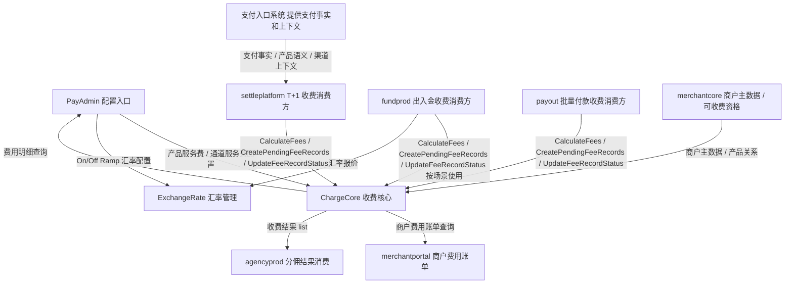
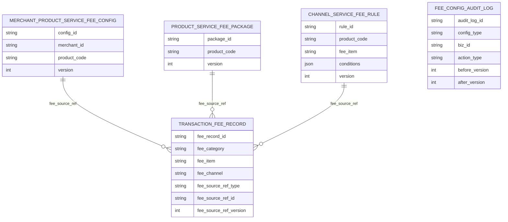

# StablePay 费率管理模块改造及收费账单技术方案
## 1. 方案概述
### 1.1 背景
当前 StablePay 已具备商户维度的一客一价能力，但产品服务费、通道服务费、汇率管理类产品服务费、商户费用账单、代理商分佣之间仍然分散在多个系统和多种模型中：
- `merchantcore` 当前承载普通产品费率配置，核心表为 `fee_rate_package`、`fee_rate_config`
- `settleplatform` 当前承载 Payments / Payment Links / Invoice / Subscription 等支付类产品的 T+1 计费执行，现状由结算链路调用 `merchantcore.GetFeeConfigByDate` 取费率并完成费用入账
- `exchangerate` 维护 On/Off Ramp 汇率规则，核心表为 `exchange_rate_rule_config`
- `fundprod` 当前仍通过 Mongo `fx_channel_fee_config` 维护部分 Off Ramp 通道费阶梯
- `payout` 当前费用获取采用“默认费率兜底 + `merchantcore.GetFeeConfigByDate` 动态取费”的模式
- `billprod` 有旧的 `billing_detail` 与账单中心链路，但该表语义偏账单汇总，不是 PRD 所定义的统一费用记录事实
- `merchantportal` 当前账单页读取的是 `billprod.QueryBills` 返回的账单汇总/下载信息，不是交易级费用账单
PRD 评审后，本期新增独立系统 `chargecore`，用于承载收费域核心能力。结合本次需求和领域边界判断，收费域应从商户主数据域中解耦出来，形成独立职责中心。
本次需求的核心是统一配置模型、统一费用结果落库、统一商户账单与运营查询口径。
### 1.2 目标
本期目标如下：
- 新增 `chargecore` 作为收费核心系统
- 将产品服务费与通道服务费在配置层拆分管理，并统一归口到 `chargecore`
- 保持 On/Off Ramp 产品服务费继续由汇率管理维护，不改动原汇率配置能力
- 将 `product_service_fee_package`、`merchant_product_service_fee_config`、`channel_service_fee_rule`、`transaction_fee_record` 四张收费域核心表统一归属到 `chargecore`
- 建立统一计费明细表 `transaction_fee_record`
- 将各产品费用记录统一归集到 `chargecore.transaction_fee_record`
- 新增商户费用账单查询能力，账单数据来源于 `chargecore.transaction_fee_record`
- 新增运营后台费用明细查询能力
- 为代理商分佣提供统一费用结果关联基础
### 1.3 范围边界
本次包含：
- `payadmin` 费率管理模块改造
- `chargecore` 新系统初始化与收费域模型承载
- `merchantcore` 职责收敛为商户主数据与可收费资格提供方
- `fundprod` Off Ramp / 稳定币提现等可配置费用计算接入，以及 On/Off Ramp 汇率差费用记录流转接入
- `payout` 统一费用计算与费用记录流转接入
- `settleplatform` T+1 支付类产品统一费用计算与费用记录流转接入
- `chargecore` 提供统一费用计算、费用记录执行状态流转、运营明细查询和商户账单查询接口
- `merchantportal` 新增商户费用账单查询接口与页面改造
- `payadmin` 新增费用明细查询与权限
本次不包含：
- 改造 On/Off Ramp 汇率管理规则本身
- 改造实时计费过程中的冻结、解冻、失败释放等中间态逻辑
- 直接替换 `billprod.billing_detail`
- 将所有业务系统的扣费执行统一收敛到单一计费服务
- 在本方案中展开逐字段迁移脚本、双写灰度和完整回灌实施细节
### 1.4 关键决策
#### 决策一：统一计费明细表按“费用项”落一条
本方案采用：
- `一项费用一条记录`
原因：
- PRD 明确一笔交易可能命中多个通道服务费
- 产品服务费与通道服务费需要独立归类
- 运营查询、代理商分佣、商户账单的聚合维度并不相同，明细表需保留最细粒度结果
#### 决策二：收费域核心表统一归属 `chargecore`
本方案采用：
- `product_service_fee_package` 归属 `chargecore`
- `merchant_product_service_fee_config` 归属 `chargecore`
- `channel_service_fee_rule` 归属 `chargecore`
- `transaction_fee_record` 归属 `chargecore`
边界判断如下：
- `merchantcore` 更像“谁可以被收费”
- `chargecore` 更像“该怎么收、收了什么”
因此：
- 商户主体、商户产品开通、商户资格等信息继续属于 `merchantcore`
- 产品服务费套餐、商户产品服务费配置、通道服务费规则、收费结果明细统一属于 `chargecore`
#### 决策三：收费继续由业务系统处理，`transaction_fee_record` 承载收费结果与内部执行状态
本期边界：
- 收费执行、冻结、扣款、入账、失败释放等动作继续由业务系统处理
- `chargecore` 负责费用计算、费用快照、收费结果承载与查询
`transaction_fee_record` 调整为：
- 支持业务系统先写入待执行费用记录
- 实际扣费 / 划转 / 入账完成后，由业务系统回调更新执行结果
状态字段仅用于 `chargecore` 内部表达该条费用记录的执行结果，不承载业务中间态语义
对外口径：
- Merchant Portal、`agencyprod`、运营主查询默认只消费成功收费结果
#### 决策四：`visible_to_merchant` 本期不作为物理列落库
虽然 PRD sheet 字段中列出了 `visible_to_merchant`，但结合需求正文和澄清结论，本期它仅体现为一条固定展示规则：
- On/Off Ramp 通过汇率管理产生的产品服务费，不在商户费用账单中展示
因此本方案采用：
- `transaction_fee_record` 不新增 `visible_to_merchant` 物理列
- Merchant Portal 账单查询层按固定业务规则过滤
过滤规则如下：
- 普通产品产品服务费：展示
- 通道服务费：展示
- On/Off Ramp 且通过汇率管理链路计算出的产品服务费：不展示
#### 决策五：配置层统一按 `USD` 定价，结果层按实际收费币种落库
本期配置口径：
- `chargecore` 配置层费率统一按 `USD` 定价
- 配置表中的 `fixed_fee_currency`、`conditions` 内金额条件币种，本期发布规则统一使用 `USD`
结果口径：
- `transaction_fee_record.base_amount_currency` 记录真实业务计费基数币种
- `transaction_fee_record.fee_currency` 记录真实收费币种，可为 `USD` / `USDT` / `USDC` 等具体币种
- 当配置定价币种与实际收费币种不一致时，换算依据保留在 `fee_snapshot`
#### 决策六：配置库统一使用 MongoDB，流水结果库继续使用 MySQL
本期存储口径：
- `product_service_fee_package`
- `merchant_product_service_fee_config`
- `channel_service_fee_rule`
统一落在 `chargecore` 配置库 MongoDB
`transaction_fee_record` 继续落在 MySQL，作为收费结果流水库
#### 决策七：`billing_detail` 本期保留，不直接替换
`billing_detail` 属于现有账单域存量表，不作为本期统一费用记录事实的承载表。本期方案：
- 新增 `chargecore.transaction_fee_record`
- 保留现有旧账单链路
- 新的商户费用账单与运营费用查询统一基于 `transaction_fee_record`
#### 决策八：本期不收敛扣费执行系统，但收敛统一计费计算职责
本期仍由各业务系统在原有业务时点完成：
- 提供业务上下文给 `chargecore`
- 调用 `chargecore` 计算命中的费用项与总费用
- 调用 `chargecore` 创建待执行费用记录
- 实际扣费
- 调用 `chargecore` 更新费用记录执行结果
职责边界如下：
- `chargecore` 负责收费规则承载
- `chargecore` 负责规则命中、逐项费用计算、总费用汇总、计费快照生成
- `chargecore` 负责费用记录流转和费用结果查询
- 业务系统负责真正执行扣款、记账、资金划转等资金动作
不在本期将所有业务统一改造成一个集中式扣费执行服务，但“该收哪些费用、每项多少、合计多少”应统一收敛到 `chargecore`。
#### 决策九：采用独立 `chargecore`，而不是继续将收费域依附在 `merchantcore`
业界实践更偏向于将“收费规则定义 + 商户收费绑定 + 收费结果”统一收敛在定价/收费域，而不是继续留在商户主数据域：
- Stripe Platform pricing tool 支持平台维护 pricing scheme、pricing group、account override，收费规则定义和账户绑定均在平台定价能力中维护
- Adyen split configuration profile 支持平台维护 profile 与 rules，再将 profile 关联到 store，收费规则定义和对象绑定均在收费/分账域中维护
因此本方案采用：
- `chargecore` 作为收费域事实中心
- `merchantcore` 作为商户域事实中心
#### 决策十：收费配置模型按产品服务费与通道服务费拆分命名
本期收费域核心表采用以下命名：
- `product_service_fee_package`
- `merchant_product_service_fee_config`
- `channel_service_fee_rule`
- `transaction_fee_record`
命名原则：
- 产品服务费通用套餐继续使用 `package` 语义，承接标准费率套餐
- 商户产品服务费配置使用 `config` 语义，表达商户级特殊费率覆盖
- 通道服务费使用 `rule` 语义，表达按费用科目和触发条件命中
- 统一费用明细使用 `record` 语义，表达收费记录流水
#### 决策十一：费用明细使用 `fee_source_ref_*` 记录来源引用
`transaction_fee_record` 是收费记录流水表，但需要保留“本次费用来自哪条配置、规则或报价”的稳定追溯能力。因此本期采用：
- `fee_source_ref_type`
- `fee_source_ref_id`
- `fee_source_ref_version`
该字段组只记录来源引用，不替代 `fee_snapshot`。完整命中规则、条件、报价和业务扩展字段仍进入 `fee_snapshot`。
#### 决策十二：运行时接入以“先创建待执行记录，再更新执行结果”为主，外部已计算费用也走同一结果流转
业务系统运行时不直接拼装产品服务费配置查询和通道服务费规则查询。对于 `chargecore` 承载配置的可配置费用，统一调用：
- `CalculateFees`：收费前计算命中的费用项、逐项金额、总费用和快照
- `CreatePendingFeeRecords`：实际扣费前创建待执行费用记录
- `UpdateFeeRecordStatus`：实际扣费 / 划转 / 入账完成后更新执行结果
其中 `CalculateFees` 支持同一商户下的批量 `items[]`：
- 请求级字段固定 `merchant_id`、`source_system`、`charge_timing`、`fee_currency` 等公共上下文
- `items[]` 承载 item 级 `product_code`、`source_biz_type`、`source_biz_id`、`source_event_id`、`base_amount` 和业务上下文
- `settleplatform` 的一个 `settlement_summary` 当前按 `merchant_id + settlement_date + chain_type + currency` 聚合，符合“同一商户下多 item”边界，可按一个结算批次传入多条 `settlement_detail`
- `fundprod` 等 realtime 单笔场景按一个 item 传入
- `payout` 按 batch 作为顶层 item 传入，并在该 item 下传入 `fee_allocation_items[]`；ChargeCore 返回产品服务费百分比分摊结果，Payout 侧将百分比费与风控服务费落到 item 维度，产品固定费保留在 batch 维度
- 如果后续调用方存在跨商户批量，必须按商户拆分多次调用，不允许一个请求混入多个 `merchant_id`
对于 On/Off Ramp 汇率差产品服务费这类由外部链路产生费用结果的场景，不调用 `CalculateFees`，但仍通过 `CreatePendingFeeRecords + UpdateFeeRecordStatus` 接入统一费用记录流转。
`GetEffectiveProductServiceFeeConfig`、`MatchChannelServiceFeeRules` 仅作为运营排查辅助接口，不作为业务主链路接口。
#### 决策十三：`chargecore` 统一百分比费用的小数位处理
本期统一将 `chargecore.CalculateFees` 内的百分比费用计算收敛为：
- `percentage_fee_amount = ceil(base_amount * percentage_rate)`，按最小货币单位向上取整
- 只要百分比费用存在小数最小单位，即向上进一位
- 固定费用按配置值直接计入，不做取整
- 产品服务费和通道服务费中的百分比部分使用同一规则
- 对 `payout` 这类 batch 下多 item 的场景，若调用方传入 `fee_allocation_items[]`，产品服务费的百分比部分按 allocation item 逐条计算并汇总；Payout 风控服务费按成功 item 收取，产品固定费按 batch 收取一次

原因：
- 收费域需要统一“每项多少钱、总共多少钱”的结果口径，不能由不同业务系统自行采用截断、四舍五入或银行家舍入
- 本期计费场景以向商户收费为目标，小数位处理采用向上取整，避免少收
- 上游业务系统只消费 `chargecore` 返回的费用项、费用明细和总费用，不感知、不配置、不复算小数位策略

边界：
- On/Off Ramp 汇率差产品服务费不通过 `CalculateFees` 计算，其小数位处理仍由汇率链路自身负责
- 历史已经生成的费用记录不回算、不重算
- 测试时需要覆盖业务系统是否按 `chargecore` 返回结果执行收费，而不是校验业务系统自身实现取整策略
## 2. 现状分析
### 2.1 现有系统
| 系统 | 当前职责 | 当前现状问题 | 本期改造角色 |
| --- | --- | --- | --- |
| `payadmin` | 费率管理后台、汇率管理后台、权限控制 | 只有产品费率管理模型，暂无统一通道服务费模块与费用明细查询页 | 前台入口与权限承载 |
| `merchantcore` | 商户主数据与产品关系中心 | 当前还承载部分收费配置，领域边界偏重 | 商户主数据与可收费资格提供方 |
| `chargecore` | 收费核心系统 | 本期新增，需要承载收费规则与收费结果 | 收费域核心承载系统 |
| `exchangerate` | On/Off Ramp 汇率规则维护 | 只负责汇率规则，不负责统一费用记录落库 | 继续维护汇率类产品服务费配置 |
| `fundprod` | On/Off Ramp 询价、换汇、部分通道费计算 | Off Ramp 历史通道费仍有 Mongo `fx_channel_fee_config` 存量；本期配置口径以 `chargecore` 为准 | 汇率类费用结果接入方 |
| `payout` | Payout 业务执行 | 已有费率快照和费用结果字段，但未统一落库 | 普通产品费用结果接入方 |
| `payplatform` | 支付成功事实中心 | 负责 `trade_order` / `payment_order` 终态，不是 T+1 收费执行点 | 支付类计费上下文提供方 |
| `settleplatform` | T+1 结算、当前支付类产品服务费计算与入账 | 当前直接从 `merchantcore` 取费率并按汇总手续费入账，缺统一费用明细和通道服务费拆分 | 支付类 T+1 费用计算接入方与费用记录写入方 |
| `accountcore` | 账户余额与账户交易流水 | 只执行余额调整，不承载收费规则和费用分类 | 账务执行系统与验数血缘 |
| `billprod` | 账单中心、旧账单下载 | 能力偏账单汇总，不适合作为收费域事实中心 | 存量账单域系统 |
| `merchantportal` | 商户门户 | 缺交易级商户费用账单能力 | 商户费用账单展示端 |
| `agencyprod` | 代理商分佣模板、代理商配置、商户绑定关系、分佣执行 | 分佣规则已独立，但分佣基数缺统一费用结果关联基础；当前分佣执行代码位于 `settleplatform` 的 agency 模块 | 消费 `chargecore` 收费结果 list，作为分佣收入事实来源 |


### 2.2 现有能力
#### 2.2.1 产品服务费配置
当前收费域已有可复用模型原型：
- `fee_rate_package`
- `fee_rate_config`
特点：
- 同业务 ID 多版本设计，编辑新增版本
- 支持 `product_code`
- `payadmin` 已接通查询、创建、更新、审计日志
不足：
- 当前仍落在 `merchantcore`，不符合收费域长期归属
- 仅覆盖普通费率管理类产品服务费
- 表结构未显式支持 `fixed_fee_currency`
- 不支持通道服务费
#### 2.2.2 汇率管理类产品服务费
`exchangerate` 当前已有：
- `exchange_rate_rule_config`
- `exchange_rate_rule_change_log`
`fundprod` 当前已有：
- `fx_quote_snapshot`
- `fund_operation_record`
- Off Ramp 通道费 Mongo 集合 `fx_channel_fee_config`
现状说明：
- On/Off Ramp 产品服务费已通过 `spread_bps` 和商户报价汇率实现
- Off Ramp 外部通道费当前仍是独立老模型，不在统一费率管理体系内
- `fundprod` 已有 `ChannelFeeSnapshot`、`DisplayRate` 等快照基础
#### 2.2.3 现有账单能力
`billprod` 当前已有：
- `bill_summary`
- `fund_flow`
当前账单能力主要服务于旧账单下载与汇总展示，不等于本次 PRD 需要的交易级商户费用账单。
#### 2.2.4 `settleplatform` 生产样本观察
2026-06-04 已从生产库抽取 `settleplatform` 的 pending / completed 样本。当前生产费用主要体现在 `settlement_summary.payment_fee_amount` 和 `payment_net_amount`，`settlement_detail.fee_amount` 及费率快照字段仍可能为空或 0；本期 `chargecore` 接入后，需要在保持 summary 层金额口径不变的前提下，补齐交易级费用明细、费用来源、费率快照和通道服务费拆分。

详细样本、SQL 和验数口径见《StablePay 费率管理模块改造及收费账单影响面盘点》`4.3 生产样本观察`。
#### 2.2.5 权限基础
`payadmin` 当前已经有后端和前端双重权限控制：
- 权限表：`permission`、`role_permission`
- 后端中间件：`RequirePermission(...)`
- 已有汇率权限：`fx_rate.view`、`fx_rate.manage`
说明：
- 本次按 PRD 补齐费率管理 9 个权限点中的新增项：标准产品服务费、商户产品服务费、通道服务费、费用明细查询
- 老的 `fee_rate.list`、`fee_rate.edit` 入口权限先保留，用于兼容历史商户管理下的费率入口
- 不需要重新设计权限框架
### 2.3 约束条件
本次方案需要遵守以下约束：
- 不能改动 On/Off Ramp 现有汇率配置交互
- 不能直接复用 `billprod.QueryBills` 作为新商户费用账单接口
- 各产品实际扣费仍分散在不同系统
- 现网存在历史 Mongo 通道费配置，后续迁移时需要兼容处理
### 2.4 PRD 费用基线
本节用于沉淀 PRD 中已经明确的费用基线，作为后续影响面盘点、配置初始化、计费接口设计和测试用例校对的输入。
#### 2.4.1 产品服务费基础费率
| 产品 | 基础费率 | 结算模式 | 维护方式 |
| --- | --- | --- | --- |
| Payments | 1% | T+1，每日 0 点结算前一天交易 | 费率管理 |
| Payment Links | 同 Payments | T+1 | 费率管理 |
| Invoicing | 0.1% | 实时结算，当前仍为 T+1 | 费率管理 |
| Subscription | 1.3% | T+1 | 费率管理 |
| Payouts | 0.1% + 3 USD / batch | 实时结算，费率通过交易金额外扣；固定费用按 batch 级收取一次 | 费率管理 |
| Payroll | 0.1% + 3 USD / batch | 实时结算，费率通过交易金额外扣；固定费用按 batch 级收取一次 | 费率管理 |
| On Ramp | 0.5% | 实时结算，以汇率形式通过交易金额内扣 | 汇率管理 |
| Off Ramp | 0.5% | 实时结算，以汇率形式通过交易金额内扣 | 汇率管理 |


说明：
- Payments、Payment Links、Invoicing、Subscription、Payouts、Payroll 的产品服务费通过费率管理模块维护
- On Ramp、Off Ramp 的产品服务费通过汇率管理模块维护
- 无论配置来源是费率管理还是汇率管理，费用性质均归属于产品服务费
- Payroll 当前为后续业务，本期仅做配置模型和枚举预留，不展开存量链路影响面分析
#### 2.4.2 现有通道服务费说明
| 产品 | 费用科目 | 触发条件 | 收费比例 | 固定费用 | 备注 |
| --- | --- | --- | --- | --- | --- |
| Payments | 平台服务费 | 渠道 = Shopyy | 0.25% | - | 店铺渠道为 Shopyy 时收取 |
| Payments | 平台服务费 | 渠道 = Shoplazza | 0.25% | - | 店铺渠道为 Shoplazza 时收取 |
| Off Ramp | 银行手续费 | 渠道 = OSL | - | 35 USD / 笔 | 法币出金银行手续费 |
| Payments | 通道手续费 | 渠道 = 交易所支付 | 0.50% | - | 交易所支付通道费，暂未上线 |
| Payments | 风控服务费 | 默认收取 | - | 0.1 USD / 笔 | 所有 Payments 交易收取 |
| Payment Links | 风控服务费 | 默认收取 | - | 0.1 USD / 笔 | 所有 Payment Links 交易收取 |
| Invoicing | 风控服务费 | 默认收取 | - | 0.1 USD / 笔 | 所有 Invoicing 交易收取 |
| Subscription | 风控服务费 | 默认收取 | - | 0.1 USD / 笔 | 所有 Subscription 交易收取 |
| Payouts | 风控服务费 | 默认收取 | - | 0.1 USD / 笔 | 所有 Payouts 交易收取 |
| Payroll | 风控服务费 | 默认收取 | - | 0.1 USD / 笔 | 所有 Payroll 交易收取 |


说明：
- 通道服务费根据业务发生匹配自动叠加
- 一笔交易可以命中多个通道服务费
- 通道服务费不参与代理商分佣
- PRD 当前将渠道作为触发条件，不再作为独立配置维度
#### 2.4.3 计费事件默认拆分清单
计费事件默认拆分、默认合计、费用明细条数和商户展示 / 分佣口径，属于逐业务系统影响面盘点内容，单独维护在《StablePay 费率管理模块改造及收费账单影响面盘点》。
主技术方案只保留 PRD 明确的基础费率与通道服务费规则，避免将逐系统 event 拆分过程固化在主方案中。
## 3. 总体架构
### 3.1 系统职责
本期整体职责划分如下：
- `payadmin`：配置与运营查询入口
- `merchantcore`：商户主数据、商户产品关系、可收费资格
- `chargecore`：产品服务费套餐、商户费率配置、通道费规则、统一费用明细，以及运营查询、商户账单查询服务提供方
- `exchangerate`：On/Off Ramp 产品服务费配置中心
- `settleplatform`：T+1 支付类产品收费执行方，调用 `chargecore` 计算费用并在完成后写入明细
- `fundprod` / `payout`：realtime 收费执行方；可配置费用调用 `chargecore` 计算，完成后写入明细
- 支付入口类系统：提供支付事实、产品语义和渠道上下文，不直接执行 T+1 收费
- `merchantportal`：商户账单前台展示
- `agencyprod`：代理商分佣规则、代理商与商户绑定关系事实源，消费 `chargecore` 收费结果 list 作为分佣收入事实来源；当前分佣执行代码位于 `settleplatform` 的 agency 模块
### 3.2 架构图

### 3.3 运行时原则
主技术方案只定义稳定的运行时原则：
- `payadmin` 负责配置产品服务费、商户产品服务费和通道服务费。
- `chargecore` 负责规则命中、费用计算、快照生成、费用记录执行状态流转和查询。
- `settleplatform`、`fundprod`、`payout` 是本期直接消费 `chargecore` 的收费执行系统。
- 业务系统通过 `CalculateFees` 获取费用项和总费用，通过 `CreatePendingFeeRecords` 先登记待执行费用，再通过 `UpdateFeeRecordStatus` 回写最终执行结果。
- `CalculateFees` 返回的费用项金额和总费用是收费执行依据；业务系统不应基于配置费率自行复算最终收费金额。
- On/Off Ramp 汇率差产品服务费仍由 `exchangerate + fundprod` 产生，并通过 `CreatePendingFeeRecords + UpdateFeeRecordStatus` 写入 `transaction_fee_record`。
- `fundprod` 中 On Ramp 汇率差产品服务费不调用 `CalculateFees`，但仍通过 `CreatePendingFeeRecords` 先登记费用，再由 `UpdateFeeRecordStatus` 更新执行结果；Off Ramp 银行手续费等可配置费用才调用 `CalculateFees`。
- 逐系统交互步骤、入参样例和落库样例，以影响面盘点文档为准。
## 4. 模块设计
### 4.1 PayAdmin
#### 4.1.1 页面范围
本期 `payadmin` 费率管理页调整为四类入口：
- 标准产品服务费
- 商户产品服务费
- 通道服务费
- 汇率管理
其中：
- 前三类归属于统一费率管理域
- 汇率管理沿用现有实现
#### 4.1.2 后端接口
本期 `payadmin` 需要新增/改造如下接口能力：
- 产品服务费：通过 `chargecore` 提供套餐与商户费率 CRUD / 列表 / 审计日志接口
- 通道服务费：通过 `chargecore` 提供规则 CRUD / 列表 / 审计日志接口
- 费用明细查询：通过 `chargecore` 提供统一明细查询接口
#### 4.1.3 权限
权限映射如下：
| 权限编码 | 用途 |
| --- | --- |
| `standard_fee_rate.list` | 标准产品服务费查询 |
| `standard_fee_rate.edit` | 标准产品服务费编辑 |
| `merchant_fee_rate.list` | 商户产品服务费查询 |
| `merchant_fee_rate.edit` | 商户产品服务费编辑 |
| `channel_fee.list` | 通道服务费查询 |
| `channel_fee.edit` | 通道服务费编辑 |
| `fx_rate.view` | 汇率规则查询 |
| `fx_rate.manage` | 汇率规则编辑 |
| `fee_detail.view` | 统一费用明细查询 |
说明：
- 本期新增 `standard_fee_rate.*`、`merchant_fee_rate.*`、`channel_fee.*`、`fee_detail.view`
- `fx_rate.view`、`fx_rate.manage` 继续沿用原有权限
- 老的 `fee_rate.list`、`fee_rate.edit` 先保留，不作为本期新费率页的目标权限码
### 4.2 MerchantCore 与 ChargeCore
#### 4.2.1 MerchantCore 职责边界
`merchantcore` 本期职责收敛为：
- 商户主数据维护
- 商户产品开通关系维护
- 向 `chargecore` 或业务系统提供“谁可以被收费”的基础事实
本期不再将 `merchantcore` 作为收费规则主承载系统。
#### 4.2.2 ChargeCore 收费配置模型
`chargecore` 统一承载以下收费域核心表：
- `product_service_fee_package`
- `merchant_product_service_fee_config`
- `channel_service_fee_rule`
- `transaction_fee_record`
#### 4.2.3 ChargeCore RPC 能力
新增 RPC 能力如下：
| RPC | 用途 |
| --- | --- |
| `CreateProductServiceFeePackage` | 创建产品服务费套餐 |
| `UpdateProductServiceFeePackage` | 更新产品服务费套餐 |
| `CreateMerchantProductServiceFeeConfig` | 创建商户产品服务费配置 |
| `UpdateMerchantProductServiceFeeConfig` | 更新商户产品服务费配置 |
| `CreateChannelServiceFeeRule` | 创建通道服务费配置 |
| `UpdateChannelServiceFeeRule` | 更新通道服务费配置 |
| `ListChannelServiceFeeRules` | 列表查询 |
| `GetChannelServiceFeeRule` | 单条详情 |
| `ListChannelFeeAuditLogs` | 审计日志 |
| `CalculateFees` | 运行时统一计算命中的费用项与总费用 |
| `CreatePendingFeeRecords` | 业务实际扣费前创建待执行费用记录 |
| `UpdateFeeRecordStatus` | 业务扣费 / 划转 / 入账完成后更新费用记录执行结果 |
| `QueryTransactionFeeRecords` | 运营查询统一费用明细 |
| `QueryMerchantFeeBills` | 商户账单聚合查询 |
| `GetEffectiveProductServiceFeeConfig` | 查询生效产品服务费配置，供运营排查使用 |
| `MatchChannelServiceFeeRules` | 查询命中的通道服务费规则，供运营排查使用 |


运行时计费入参包含：
- `source_system`
- `merchant_id`
- `currency`
- `charge_timing`
- `items[]`
说明：`merchant_id` 是请求级公共字段，`items[]` 不再重复承载商户；同一请求内允许不同 `product_code`，但不允许不同商户。
`items[]` 每项包含：
- `source_biz_type`
- `source_biz_id`
- `source_event_id`
- `product_code`
- `amount`
- `currency`
- `context`
- 可选 `fee_allocation_items[]`：用于 batch 场景下的费用分摊明细；每项包含 `allocation_id`、`base_amount`、`base_amount_currency` 和可选上下文
运行时计费出参返回：
- 命中的费用项列表
- 每项费用的计算结果
- 总费用
- 按业务 item、产品、币种的费用汇总
- 逐项计费快照
说明：
- 本期不在 `chargecore` 中执行实际扣费
- `chargecore` 负责收费规则承载、统一计费计算、快照生成和结果归集
- `chargecore.CalculateFees` 中产品服务费和通道服务费的百分比部分统一按最小货币单位向上取整；固定费用按配置值直接计入
- `payout` 可通过 `fee_allocation_items[]` 让产品服务费百分比按 payout item 逐条向上取整；风控服务费按成功 item 收取，产品固定费保持 batch 级一次性收取
- 可配置费用由业务系统通过 `CalculateFees` 获取可执行的费用结果，通过 `CreatePendingFeeRecords + UpdateFeeRecordStatus` 完成费用记录流转
- 外部链路已产生费用结果的场景也通过 `CreatePendingFeeRecords + UpdateFeeRecordStatus` 接入统一费用记录流转，例如 On/Off Ramp 汇率差产品服务费
- 业务系统继续负责交易执行与实际扣费
### 4.3 ExchangeRate 与 FundProd
#### 4.3.1 ExchangeRate
`exchangerate` 本期不改动：
- `exchange_rate_rule_config`
- `exchange_rate_rule_change_log`
- 现有汇率配置交互
仅作为 On/Off Ramp 产品服务费的配置来源保留。
#### 4.3.2 FundProd
`fundprod` 本期作为 On/Off Ramp 业务接入方：
- 产品服务费继续沿用 `exchangerate + fundprod` 汇率管理链路
- 可配置通道服务费运行时配置源切换为 `chargecore.channel_service_fee_rule`
- 实际换汇 / 扣费完成后，将汇率差产品服务费与通道服务费结果写入 `chargecore.transaction_fee_record`
`fundprod` 的现状代码、Mongo `fx_channel_fee_config` 兼容、费用快照字段和真实样例校对，单独维护在影响面盘点文档。
### 4.4 业务系统接入方式
#### 4.4.1 普通费率管理类产品
首批明确接入：
- Payouts
后续按产品逐条补齐并联调：
- Payments
- Payment Links
- Invoicing
- Subscription
Payroll 当前为后续业务，本期不纳入存量链路接入和影响面盘点；但 `chargecore` 的 `product_code`、默认产品服务费套餐、默认通道服务费规则需要保留 `payroll` 预留枚举。
接入原则：
- 业务系统向 `chargecore.CalculateFees` 传入业务上下文
- `chargecore` 返回命中的产品服务费、通道服务费、逐项金额、总费用与计费快照
- 业务系统基于计算结果执行实际扣费
- 实际扣费前调用 `chargecore.CreatePendingFeeRecords`，完成后调用 `chargecore.UpdateFeeRecordStatus`
- Payments / Payment Links / Invoicing / Subscription 当前属于 T+1 结算计费，优先由 `settleplatform` 在结算计费步骤接入 `chargecore`，不在 `payplatform` 支付成功瞬间重复计费
- `payplatform` 需要保证 `product_code`、来源渠道、店铺、支付渠道、链和业务 metadata 能被 `settleplatform` 同步并用于通道服务费命中
说明：
- `payout` 已具备最明确的费率快照与费用结果字段，是首批改造重点
- Payments / Payment Links / Invoicing / Subscription 需要在技术实现阶段逐产品补齐来源业务映射、实际扣费时点、结算金额口径、落库责任系统
#### 4.4.2 On/Off Ramp
适用：
- On Ramp
- Off Ramp
接入原则：
- 产品服务费：继续使用 `exchangerate + fundprod` 现有汇率管理链路
- Off Ramp 银行手续费等可配置收费项：统一切到 `chargecore.CalculateFees`
- On Ramp 汇率差产品服务费：不通过 `CalculateFees` 计算，先创建 `pending` 费用记录，完成后更新执行结果
- 实际扣费前调用 `chargecore.CreatePendingFeeRecords`，完成后调用 `chargecore.UpdateFeeRecordStatus`
#### 4.4.3 业务系统影响面盘点
各业务系统从入口、当前费用逻辑、改造方向、调用 `chargecore` 入参出参到统一明细落库的详细盘点，单独维护在《StablePay 费率管理模块改造及收费账单影响面盘点》。
主技术方案只保留稳定接入原则；逐系统金额对比、真实数据样例、明细落库样例和待确认点，以影响面盘点文档为准。
### 4.5 BillProd（存量边界）
`billprod` 本期不再作为收费域核心承载系统。
保留定位：
- 旧账单下载与汇总相关存量能力
- `billing_detail`、`bill_summary` 等存量账单域对象
### 4.6 MerchantPortal
`merchantportal` 当前账单中心接口语义偏账单汇总/下载，不适合作为本次商户费用账单直接复用接口。
本期建议：
- 新增独立的商户费用账单页面与接口
- 查询数据直接来自 `chargecore.QueryMerchantFeeBills`
- 页面侧仅做查询与展示，不承担收费规则判断
查询口径：
- 仅查询当前登录商户自己的费用数据
- 基于 `transaction_fee_record` 按账单展示维度聚合产品服务费、通道服务费和总服务费
- 按固定规则过滤商户不可见费用，例如 On/Off Ramp 汇率差产品服务费
新页面展示字段以 PRD 为准：
- 交易时间
- 来源业务单号
- 产品
- 交易金额
- 交易币种
- 产品服务费
- 通道服务费
- 总服务费
- 费用科目
- 结算金额
- 备注
### 4.7 代理商分佣
PRD 已明确：
- 产品服务费参与代理商分佣
- 通道服务费不参与代理商分佣
- On/Off Ramp 产品服务费参与代理商分佣
因此统一明细表必须满足：
- 能区分 `fee_category`
- 能区分来源业务类型
- 能保留费用快照
- 能提供稳定 `fee_record_id`
本期边界：
- `agencyprod` 继续维护代理商分佣模板、代理商配置、商户绑定关系和绑定时的分佣快照。
- `agencyprod` 继续负责分佣日结、分佣入账、奖励触发和补偿任务；当前分佣执行代码位于 `settleplatform` 的 agency 模块。
- `chargecore` 不维护代理商规则，不在明细表物理字段中写“是否参与分佣”，只提供统一费用结果和分佣消费所需的收费结果查询。
分佣消费侧规则：
- 仅消费 `product_service_fee`
- `channel_service_fee` 直接排除
- On/Off Ramp 汇率差产品服务费虽然不展示给商户账单，但参与代理商分佣
## 5. 数据模型设计
### 5.0 数据模型关系
`chargecore` 本期核心数据模型分为配置态和费用记录态：
| 模型 | 关系说明 |
| --- | --- |
| `product_service_fee_package` | 标准产品服务费套餐，落在 MongoDB；一条套餐绑定一个 `product_code`，用于没有命中商户特殊费率时取费率，可同时承载百分比费率和固定费用 |
| `merchant_product_service_fee_config` | 商户产品服务费配置，落在 MongoDB；按 `merchant_id + product_code + effective_at/expires_at` 命中，直接配置商户特殊费率，不绑定标准产品服务费套餐 |
| `channel_service_fee_rule` | 通道服务费规则，落在 MongoDB；按 `product_code + fee_item + conditions` 命中；`conditions` 为空时表示该产品和费用科目下的默认规则，一笔业务可命中多条规则 |
| `transaction_fee_record` | 费用结果明细，落在 MySQL；一项费用一条记录，记录实际收费结果，并通过费用来源引用字段和 `fee_snapshot` 保留追溯能力 |
| `fee_config_audit_log` | 费率配置操作审计日志，落在 MySQL；记录配置创建、更新、停用、删除的前后快照，用于 payadmin 历史记录查询 |



说明：
- 关系图表达逻辑引用关系，不要求数据库层建立物理外键
- 配置态三表统一存储在 MongoDB，费用记录态 `transaction_fee_record` 存储在 MySQL
- `fee_config_audit_log` 是配置操作流水，不参与规则命中；虽记录配置快照，但不属于配置库
- `transaction_fee_record` 是结果流水表，不依赖配置表当前状态回算历史费用；费用来源引用仅用于运营追溯、影响面排查和对账
- On/Off Ramp 汇率类产品服务费由汇率管理链路产生，明细表可通过 `fee_source_ref_type=exchange_rate_quote` 记录汇率报价引用，完整报价与汇率快照进入 `fee_snapshot`
### 5.1 `transaction_fee_record`
落在 `chargecore` MySQL 结果库。
#### 5.1.1 字段设计
说明：现有 `stablepay-common` 已有 `payment` / `payment_link` / `invoice` / `subscription` / `payouts` 产品码常量，但尚未覆盖 On/Off Ramp 和 Payroll。本期 `chargecore` 产品码枚举以本方案为准；是否回补到 `stablepay-common` 作为共享常量，在开发阶段统一处理。
业务 ID 生成规则：
- `package_id` / `config_id` / `rule_id` / `fee_record_id` / `audit_log_id` 统一由 `chargecore` 基于 `leaf_alloc + ident` 生成 16 位业务 ID。
- 字段类型统一保留 `varchar(64)`，不改成数值型，兼容跨系统传输、历史迁移和后续扩展。
- 正常新增链路默认由 `chargecore` 生成业务 ID；历史迁移、初始化导数等特殊场景允许显式传入预分配 ID。
- 版本号由各配置集合自身维护，业务 ID 本身不承载版本语义。
- `version` 只用于配置审计、费用明细追溯和 `fee_source_ref_version` 回查，不作为 payadmin 页面上“版本”文案的唯一语义。
- 配置编辑统一在同一业务 ID 下新增版本，并将该业务 ID 下的旧版本标记为 `SUPERSEDED`；`SUPERSEDED` 版本不可再编辑、停用、删除或恢复。
- 配置状态变更不新增版本，只修改该业务 ID 最新版本的 `status` 并写入审计日志。
| 字段 | 类型 | 说明 |
| --- | --- | --- |
| `id` | bigint | 物理主键，便于控制大明细表的存储与二级索引成本 |
| `fee_record_id` | varchar(64) | 业务主键 / 费用明细号，唯一；由 `chargecore` 生成 16 位业务 ID |
| `merchant_id` | varchar(64) | 商户 ID |
| `product_code` | varchar(32) | 产品编码，首批枚举为 `payment` / `payment_link` / `invoice` / `subscription` / `payouts` / `payroll` / `on_ramp` / `off_ramp`；其中 `payroll` 为后续业务预留 |
| `fee_category` | varchar(32) | `product_service_fee` / `channel_service_fee` |
| `fee_item` | varchar(64) | 费用科目，通道服务费来自原型“费用科目”，产品服务费可使用固定枚举 |
| `fee_channel` | varchar(64) | 费用渠道，通道服务费来自原型“渠道”，产品服务费可为空 |
| `fee_source_ref_type` | varchar(64) | 费用来源引用类型，枚举见下方说明 |
| `fee_source_ref_id` | varchar(64) | 费用来源引用 ID，例如 `config_id` / `package_id` / `rule_id` / `quote_id` |
| `fee_source_ref_version` | int | 费用来源引用版本；引用 `chargecore` 配置表时必填 |
| `source_system` | varchar(32) | 写入来源系统 |
| `source_biz_type` | varchar(32) | 来源业务类型 |
| `source_biz_id` | varchar(64) | 来源业务主键/业务单号 |
| `source_event_id` | varchar(64) | 来源收费事件 ID，用于区分同一业务对象下的不同收费事件 |
| `base_amount` | bigint | 计费基数（minor units） |
| `base_amount_currency` | varchar(16) | 计费基数币种 |
| `percentage_rate` | decimal(20,10) | 百分比费率，可空 |
| `percentage_fee_amount` | bigint | 百分比部分实际金额（minor units），可空 |
| `fixed_fee_amount` | bigint | 固定费用部分实际金额（minor units），可空 |
| `fee_amount` | bigint | 实际费用总金额（minor units），等于百分比部分和固定费用部分之和 |
| `fee_currency` | varchar(16) | 实际费用币种 |
| `fx_channel_rate` | decimal(36,18) | 渠道汇率，仅 On/Off Ramp 产品服务费使用 |
| `fx_merchant_rate` | decimal(36,18) | 商户报价汇率，仅 On/Off Ramp 产品服务费使用 |
| `charge_timing` | varchar(16) | 收费时点，枚举为 `realtime` / `t1` |
| `status` | varchar(16) | `pending` / `succeeded` / `failed`；仅供 `chargecore` 内部表达该条费用记录执行结果 |
| `fee_snapshot` | json | 计费快照，承载命中配置快照、来源业务快照和必要的业务扩展元数据 |
| `charged_at` | datetime(3) | 实际计费完成时间 |
| `created_at` | datetime(3) | 创建时间 |
| `updated_at` | datetime(3) | 更新时间 |


说明：
- `source_system + source_biz_type + source_biz_id + source_event_id` 用于精确定位费用来源业务和收费事件
- `source_system` 表示写入该费用结果的来源系统；`source_biz_id` 表示业务主单号；`source_event_id` 表示收费执行事件 ID
- `source_event_id` 默认与 `source_biz_id` 同值；只有当业务主单号与收费执行载体不同，或同一业务对象可能对应多次收费事件时，才要求独立传值
- 金额字段统一采用 `bigint + currency` 模型，沿用现有系统的 minor units 存储方式；费率与汇率字段继续采用 `decimal`
- 统一明细表需要同时支持法币和稳定币收费，因此拆分 `base_amount_currency` 与 `fee_currency`
- 配置层统一按 `USD` 定价；所有配置表中的固定费用、`conditions` 内金额条件及其币种统一表达为 `USD`；`base_amount_currency`、`fee_currency` 只表达业务基数币种和实际收费币种，不表达配置定价币种
- `status` 仅表达 `chargecore` 内部执行结果，不表达业务中间态；对外查询默认只消费 `succeeded`
- `fee_source_ref_type/ref_id/ref_version` 记录本次收费实际命中的配置、规则或报价引用，用于运营追溯、配置影响面排查和对账；完整配置快照仍以 `fee_snapshot` 为准
- `product_service_fee_package`、`merchant_product_service_fee_config`、`channel_service_fee_rule` 均采用同业务 ID 多版本设计；编辑新增版本，状态变更不新增版本；明细引用这些配置时，`fee_source_ref_version` 必填，确保历史费用可定位到当时命中的规则版本
- `exchange_rate_quote` 不是 `chargecore` 配置表；如报价链路有版本号则写入 `fee_source_ref_version`，否则通过 `fee_source_ref_id=quote_id` 和 `fee_snapshot` 追溯完整报价
- `visible_to_merchant` 不做物理列
`source_*` 维护矩阵：
| 场景 | `source_system` | `source_biz_id` | `source_event_id` | 维护规则 |
| --- | --- | --- | --- | --- |
| 支付类 T+1 | `settleplatform` | `payment_id` | `settlement_detail.id` | 业务主单号与结算计费载体不同，建议明确分开 |
| Batch Payouts | `payout` | `batch_id` | batch 级费用使用 `batch_id`；item 级费用使用 `payout_item.id` | `source_biz_type` 统一为 `payout_batch`；产品固定费按 batch 维度创建记录，产品百分比费与风控服务费按 item 维度创建记录 |
| On Ramp 汇率差 | `fundprod` | `deposit_id` | 同 `source_biz_id` | 统一按入金业务主单号维护；`biz_ref_id` 仅作为 fundprod 内部多态关联键，不作为 `chargecore` 对外口径 |
| Off Ramp 汇率差 | `fundprod` | `withdraw_request.id` | 同 `source_biz_id` | 当前默认同值 |
| Off Ramp 通道费 | `fundprod` | `withdraw_request.id` | 同 `source_biz_id` | 当前默认同值 |
| Crypto Withdraw | `fundprod` | `withdraw_request.id` | 同 `source_biz_id` | 当前默认同值 |


`fee_source_ref_type` 预设枚举：
| 枚举 | 说明 |
| --- | --- |
| `merchant_product_service_fee_config` | 商户产品服务费直接配置，`fee_source_ref_id` 对应 `merchant_product_service_fee_config.config_id` |
| `product_service_fee_package` | 产品服务费套餐，`fee_source_ref_id` 对应 `product_service_fee_package.package_id` |
| `channel_service_fee_rule` | 通道服务费规则，`fee_source_ref_id` 对应 `channel_service_fee_rule.rule_id` |
| `exchange_rate_quote` | On/Off Ramp 汇率报价链路，`fee_source_ref_id` 对应报价 `quote_id` |


版本引用规则：
| `fee_source_ref_type` | `fee_source_ref_version` 规则 |
| --- | --- |
| `merchant_product_service_fee_config` | 必填，对应商户产品服务费配置命中的 `version` |
| `product_service_fee_package` | 必填，对应产品服务费套餐命中的 `version` |
| `channel_service_fee_rule` | 必填，对应通道服务费规则命中的 `version` |
| `exchange_rate_quote` | 可空；以 `quote_id` 和 `fee_snapshot` 作为主要追溯依据 |


显式列与 `fee_snapshot` 的边界：
| 放显式列 | 放 `fee_snapshot` |
| --- | --- |
| 跨业务稳定查询、聚合、对账会用到的字段 | 还原当时怎么算出来的配置细节 |
| `fee_category` / `fee_item` / `fee_channel` / `fee_source_ref_type` / `fee_source_ref_id` / `fee_source_ref_version` | `conditions` / `charge_mode` / 完整规则快照 |
| 金额、币种、费率结果 | 命中的规则快照、业务扩展字段、原始请求字段 |


#### 5.1.2 索引设计
索引：
| 索引 | 说明 |
| --- | --- |
| `uk_fee_record_id` | 业务主键唯一索引 |
| `uk_source_event_fee` | 写入幂等唯一键 |
| `idx_merchant_charged_at` | 商户账单查询 |
| `idx_product_category` | 产品与费用类别筛选 |
| `idx_fee_source_ref` | 按费用来源引用排查影响面 |
| `idx_charged_at` | 时间范围查询 |


#### 5.1.3 快照设计
`fee_snapshot` 统一保存审计与追溯所需原始快照。
普通产品服务费快照内容：
```json
{
  "config_id": "9102000000000123",
  "config_version": 3,
  "product_code": "payouts",
  "percentage_rate": "0.001",
  "percentage_fee_amount": "10",
  "fixed_fee_amount": "1",
  "fixed_fee_currency": "USD",
  "base_amount_currency": "USDT",
  "fee_currency": "USDT"
}
```
通道服务费快照内容：
```json
{
  "channel_service_fee_rule_id": "9103000000000789",
  "channel_service_fee_rule_version": 5,
  "product_code": "off_ramp",
  "fee_item": "bank_fee",
  "fee_channel": "osl",
  "charge_mode": "default",
  "conditions": [],
  "percentage_rate": null,
  "percentage_fee_amount": null,
  "fixed_fee_amount": "35",
  "fixed_fee_currency": "USD",
  "base_amount_currency": "USDT",
  "fee_currency": "USDT"
}
```
汇率类产品服务费快照内容：
```json
{
  "quote_id": "fxq_202605240001",
  "display_rate": "0.997000",
  "channel_rate": "0.998000",
  "merchant_rate": "0.997000",
  "spread_bps": 30,
  "channel_fee_snapshot": "35",
  "source_currency": "USD",
  "target_currency": "USDC",
  "fee_currency": "USDC"
}
```
### 5.2 `product_service_fee_package`
落在 `chargecore` MongoDB 配置库。
来源旧表：`merchantcore.fee_rate_package`
#### 5.2.1 字段设计
在现有模型基础上调整：
| 字段 | 类型 | 说明 | 迁移调整 |
| --- | --- | --- | --- |
| `package_id` | varchar(64) | 套餐业务 ID | 沿用字段名；值改为 `chargecore` 生成的 16 位业务 ID |
| `product_code` | varchar(32) | 产品编码 | 沿用 |
| `version` | int | 版本号 | 沿用 |
| `name` | varchar(128) | 套餐名称 | 沿用 |
| `percent_rate` | decimal(20,10) | 百分比费率 | 类型调整：旧表为 `varchar(32)`；迁入 `chargecore` 后改为定点数，便于数值校验、比较和统一计算 |
| `fixed_fee` | bigint | 固定费用，可空，按币种最小单位存储 | 沿用 |
| `fixed_fee_currency` | varchar(16) | 固定费用币种，可空；`fixed_fee` 非空时必填 | 新增字段：旧表未显式记录币种，迁入 `chargecore` 时补齐固定费用语义 |
| `status` | tinyint | `ACTIVE` / `INACTIVE` / `DELETED` / `SUPERSEDED` | 沿用 |
| `remark` | string | 配置备注，可空；MongoDB 字符串字段，用于保存较长备注文本 | 新增字段：用于 payadmin 维护配置备注，存量为空 |
| `created_at` | datetime | 创建时间 | 沿用 |


规则：
- 标准产品服务费套餐无生效时间、无停用启用操作；创建后默认生效
- 编辑时在同一 `package_id` 下新增版本，并将旧版本标记为 `SUPERSEDED`
- 计算默认产品服务费时，只取当前最新且 `ACTIVE` 的套餐版本
- 标准产品服务费没有新建和开启操作入口，不做规则冲突检测
- `fixed_fee` 非空时，`fixed_fee_currency` 必填
- 本期发布规则统一按 `USD` 定价，`fixed_fee_currency` 初始化为 `USD`
- `percent_rate` 当前旧表使用字符串保存，迁入 `chargecore` 后改为 `decimal`；对外接口仍可按 IDL/客户端需要序列化为字符串，存储层以数值语义为准
### 5.3 `merchant_product_service_fee_config`
落在 `chargecore` MongoDB 配置库。
来源旧表：`merchantcore.fee_rate_config`
#### 5.3.1 字段设计
在现有模型基础上调整：
| 字段 | 类型 | 说明 | 迁移调整 |
| --- | --- | --- | --- |
| `config_id` | varchar(64) | 商户产品服务费配置业务 ID | 字段更名：旧表为 `rule_id`；迁入 `chargecore` 后改为 `config_id`，避免与通道服务费规则 `rule_id` 混淆；值由 `chargecore` 生成 16 位业务 ID |
| `merchant_id` | varchar(64) | 商户 ID | 沿用 |
| `product_code` | varchar(32) | 产品编码 | 沿用 |
| `version` | int | 版本号 | 沿用 |
| `percent_rate` | decimal(20,10) | 直接配置百分比费率，可空 | 类型调整：旧表为 `varchar(32)`；迁入 `chargecore` 后改为定点数，便于数值校验、比较和统一计算 |
| `fixed_fee` | bigint | 固定费用，可空，按币种最小单位存储 | 沿用 |
| `fixed_fee_currency` | varchar(16) | 固定费用币种，可空；`fixed_fee` 非空时必填 | 新增字段：旧表未显式记录币种，迁入 `chargecore` 时补齐固定费用语义 |
| `effective_at` | date | 生效日期 | 沿用 |
| `expires_at` | date | 失效日期，可空 | 沿用 |
| `status` | tinyint | `ACTIVE` / `INACTIVE` / `DELETED` / `SUPERSEDED` | 沿用 |
| `created_by` | varchar(64) | 操作人；为空表示系统自动生成或自动调整 | 沿用 |
| `ip_address` | varchar(64) | 操作 IP | 沿用 |
| `remark` | string | 配置备注，可空；MongoDB 字符串字段，用于保存较长备注文本 | 新增字段：用于 payadmin 维护配置备注，存量为空 |
| `created_at` | datetime | 创建时间 | 沿用 |


规则：
- 商户产品服务费只支持直接配置特殊费率，不引用标准产品服务费套餐
- 若计费时未命中商户特殊费率，再回退使用 `product_service_fee_package` 中该产品最新 `ACTIVE` 标准费率
- `fixed_fee` 非空时，`fixed_fee_currency` 必填
- 本期发布规则统一按 `USD` 定价，`fixed_fee_currency` 初始化为 `USD`
- 同一 `merchant_id + product_code` 下允许存在多条规则链；每条规则链由一个 `config_id` 及其多个 `version` 组成
- 编辑当前或未来规则时，在同一 `config_id` 下新增版本，并将旧版本标记为 `SUPERSEDED`
- 停用、删除只修改该 `config_id` 最新版本状态，不新增版本
- 过往规则不再编辑；当前和未来规则允许编辑，但同一商户、同一产品下任意日期最多只能命中一条 `ACTIVE` 规则
- 新增、编辑、开启时，必须校验同一 `merchant_id + product_code` 下当前和未来 `ACTIVE` 规则的生效区间不重叠；同一商户在同一产品同一时间不应拥有两条可命中规则
- payadmin 商户详情页主列表按产品展示当前生效配置；未来规则通过“已配置未来费率”提示和“查看版本”弹窗展示
- payadmin “查看版本”弹窗固定按 `merchant_id + product_code` 查询，并展示该产品下每个 `config_id` 的最新版本；这里的“版本”是产品交互文案，技术上表示多条规则链的最新状态集合
### 5.4 `channel_service_fee_rule`
落在 `chargecore` MongoDB 配置库。
#### 5.4.1 字段设计
| 字段 | 类型 | 说明 |
| --- | --- | --- |
| `rule_id` | varchar(64) | 规则业务 ID，由 `chargecore` 生成 16 位业务 ID |
| `version` | int | 版本号 |
| `product_code` | varchar(32) | 产品编码；一条规则仅绑定一个产品 |
| `fee_item` | varchar(64) | 费用科目；枚举按原型：`platform_service_fee` / `channel_fee` / `bank_fee` / `risk_control_fee` / `other_fee` |
| `charge_mode` | varchar(16) | `default` / `conditional` |
| `conditions` | json | 触发条件数组；空数组表示默认命中，非空时多条件按 AND 关系命中 |
| `percentage_rate` | decimal(20,10) | 百分比费率，可空 |
| `fixed_fee` | bigint | 固定费用，可空，按币种最小单位存储 |
| `fixed_fee_currency` | varchar(16) | 固定费用币种；`fixed_fee` 非空时必填 |
| `status` | tinyint | `ACTIVE` / `INACTIVE` / `DELETED` / `SUPERSEDED` |
| `created_by` | varchar(64) | 操作人 |
| `ip_address` | varchar(64) | 操作 IP |
| `remark` | string | 配置备注，可空；MongoDB 字符串字段，用于保存较长备注文本 |
| `created_at` | datetime | 创建时间 |


说明：
- `channel_service_fee_rule` 为本次新增表，作为通道服务费独立配置模型
- 一条记录代表一项通道服务费规则
- 一条规则仅绑定一个 `product_code`，本期不支持一条规则绑定多个产品
- `product_code`、`fee_item` 是规则核心维度；渠道、交易金额等本期开放命中条件进入 `conditions`；`source_biz_type` 作为预留扩展条件保留在模型中
- 通道服务费不维护生效日期/失效日期；配置变更后仅对后续计费生效
- 编辑时在同一 `rule_id` 下新增版本，并将旧版本标记为 `SUPERSEDED`
- 停用、删除只修改该 `rule_id` 最新版本状态，不新增版本
- `conditions` 是规则内容的一部分，允许修改；修改后以同一 `rule_id` 生成新版本
- 删除某个条件是合法操作，例如删除渠道条件后表示该规则适用于更宽的上下文
- 通道服务费不做规则冲突检测；同一笔业务允许命中多条通道服务费规则并叠加收费
- 同一 `product_code + fee_item + conditions` 下允许存在多条 `ACTIVE` 规则；完全一致条件命中多条时按多条费用规则分别计算并汇总
- payadmin 通道服务费列表只展示每个 `rule_id` 的最新版本；历史记录按该 `rule_id` 查询操作审计
- 原型中的“费用科目”对应 `fee_item`；原型中的“渠道”作为 `conditions.field=channel` 维护
- 本期发布规则统一按 `USD` 定价，`conditions` 内金额条件币种和 `fixed_fee_currency` 初始化为 `USD`
- `conditions` 虽然以 JSON 存储，但写入必须通过服务端结构化 DTO 和枚举校验，不允许前端或调用方提交任意自由 JSON
#### 5.4.2 `conditions` 结构
`conditions` 使用数组表达触发条件，多条条件之间为 AND 关系。当前前台只开放“渠道”和“交易金额”两类条件；每类条件在同一条规则中最多配置一个条件表达，避免同一字段重复配置导致命中语义不清。
默认规则：
```json
[]
```
指定渠道规则：
```json
[
  {
    "field": "channel",
    "operator": "eq",
    "value": "shopyy"
  }
]
```
金额区间规则：
```json
[
  {
    "field": "transaction_amount",
    "operator": "gte",
    "value": 100000,
    "currency": "USD"
  },
  {
    "field": "transaction_amount",
    "operator": "lte",
    "value": 500000,
    "currency": "USD"
  }
]
```
组合条件规则：
```json
[
  {
    "field": "channel",
    "operator": "eq",
    "value": "shopyy"
  },
  {
    "field": "transaction_amount",
    "operator": "lt",
    "value": 100000,
    "currency": "USD"
  }
]
```
`conditions.field` 预设枚举：
| 枚举 | 说明 |
| --- | --- |
| `channel` | 业务渠道 / 通道上下文，例如 `shopify`、`shopyy`、`shoplazza`、`osl` |
| `transaction_amount` | 交易金额，按 minor units 判断；必须同时提供 `currency` |
| `source_biz_type` | 来源业务类型，例如 `payment_session`、`payout_batch`、`fiat_offramp_payout`、`crypto_withdrawal`；作为预留扩展条件，当前发布规则不使用 |
`conditions.operator` 预设枚举：
| 枚举 | 说明 |
| --- | --- |
| `eq` | 等于 |
| `lt` | 小于 |
| `lte` | 小于等于 |
| `gt` | 大于 |
| `gte` | 大于等于 |
规则：
- `condition` 固定使用 `field + operator + value + currency?` 结构，不为不同操作符引入特殊字段
- `field=channel`、`field=source_biz_type` 仅支持 `eq`
- `field=transaction_amount` 支持 `eq` / `lt` / `lte` / `gt` / `gte`
- 前端“区间”是展示层判断方式，服务端落库为两条闭区间条件：`gte` 下限 + `lte` 上限
- 同一条通道服务费规则中，`channel` 最多一条；`transaction_amount` 最多一个条件表达，区间表达时最多两条金额条件
- 金额类条件值按 minor units 存储，且必须提供 `currency`
- 金额类条件本期只允许 `currency=USD`
- `charge_mode=default` 时，`conditions` 必须为空数组
- `charge_mode=conditional` 时，`conditions` 必须非空
#### 5.4.3 索引设计
索引：
| 索引 | 说明 |
| --- | --- |
| `uk_rule_version` | `rule_id + version` 唯一 |
| `idx_product_item_status` | 产品、费用科目、生效状态查询 |
| `idx_created_at` | 时间范围查询 |


#### 5.4.4 规则约束
- `percentage_rate` 与 `fixed_fee` 至少一项非空
- `fixed_fee` 非空时，`fixed_fee_currency` 必填
- `conditions` 内字段、操作符和值必须通过服务端枚举校验
- `conditions` 内同一字段不得重复配置；交易金额区间仅允许一组 `gte + lte`
- `conditions` 不允许透传未定义字段；新增条件字段必须先扩展枚举和匹配实现
### 5.5 `fee_config_audit_log`
落在 `chargecore` MySQL 结果库。
该表用于支撑 payadmin 费率配置历史记录查询，只记录配置操作流水，不参与费率命中与费用计算。
#### 5.5.1 字段设计
| 字段 | 类型 | 说明 |
| --- | --- | --- |
| `id` | bigint | 物理主键 |
| `audit_log_id` | varchar(64) | 审计日志业务 ID，由 `chargecore` 生成 16 位业务 ID |
| `config_type` | varchar(64) | 配置类型，复用配置模型枚举：`product_service_fee_package` / `merchant_product_service_fee_config` / `channel_service_fee_rule` |
| `biz_id` | varchar(64) | 被操作配置业务 ID，对应 `package_id` / `config_id` / `rule_id` |
| `action_type` | varchar(32) | 操作类型，枚举：`create` / `update` / `inactivate` / `delete` |
| `before_version` | int | 操作前版本；创建时为空 |
| `after_version` | int | 操作后版本 |
| `product_code` | varchar(32) | 产品编码，复用本方案 `product_code` 枚举，可空 |
| `merchant_id` | varchar(64) | 商户 ID，仅商户产品服务费配置有值 |
| `fee_item` | varchar(64) | 费用科目，仅通道服务费规则有值，复用本方案 `fee_item` 枚举 |
| `before_snapshot` | json | 操作前完整配置快照 |
| `after_snapshot` | json | 操作后完整配置快照 |
| `operator` | varchar(64) | 操作人 |
| `ip_address` | varchar(64) | 操作 IP |
| `request_id` | varchar(64) | 请求链路 ID，可空 |
| `created_at` | datetime(3) | 操作时间 |
#### 5.5.2 规则
- `action_type` 必须由系统枚举驱动，不允许透传任意字符串
- `config_type` 复用配置模型枚举，不新增另一套配置类型口径
- `product_code`、`fee_item` 复用现有业务枚举
- `before_snapshot` / `after_snapshot` 保存完整配置 JSON；`channel_service_fee_rule.conditions` 不拆成审计表物理列
- 自动将旧版本标记为 `SUPERSEDED` 不单独记录一条审计；配置更新只记录一条 `action_type=update`，通过 `before_version` / `after_version` 表达版本变化
#### 5.5.3 索引设计
| 索引 | 说明 |
| --- | --- |
| `uk_audit_log_id` | 审计日志业务 ID 唯一 |
| `idx_config_biz_created` | 按配置对象查询历史记录 |
| `idx_operator_created` | 按操作人查询 |
| `idx_product_created` | 按产品查询 |
| `idx_merchant_created` | 按商户查询 |
### 5.6 Merchant Portal 商户账单聚合模型
Merchant Portal 不直接展示 `transaction_fee_record` 明细，而是按来源业务维度聚合。
聚合结果模型：
| 字段 | 说明 |
| --- | --- |
| `transaction_time` | 交易时间 |
| `source_biz_id` | 来源业务单号 |
| `product_code` | 产品 |
| `transaction_amount` | 原始交易金额 |
| `transaction_currency` | 交易币种 |
| `product_service_fee_amount` | 可展示的产品服务费汇总 |
| `channel_service_fee_amount` | 可展示的通道服务费汇总 |
| `total_service_fee_amount` | 总服务费 |
| `fee_items` | 命中的费用科目集合 |
| `settlement_amount` | 扣费后金额 |
| `remark` | 备注 |


说明：
- 明细表一条记录对应一个费用项
- 商户账单一行对应一笔交易的费用汇总视图
## 6. 接口设计
### 6.1 ChargeCore RPC
#### `CalculateFees`
用于收费执行方在真实扣费 / 冻结 / 结算前获取可执行的费用计算结果。
适用方：
- `settleplatform`：T+1 结算计费，按 `settlement_summary` 批量传入多条 `settlement_detail`
- `fundprod`：Off Ramp 通道费、稳定币提现风控费等 realtime 可配置费用；On Ramp 汇率差产品服务费不调用本接口，由业务侧直接创建并更新费用记录
- `payout`：Batch Payouts realtime 计费
接口语义：
- 统一返回产品服务费、通道服务费、每项费用金额、总费用和快照
- `fee_components` 是上游系统收费、展示、冻结、落库和测试验证的完整费用明细来源；上游可以只消费其中部分字段，但 `chargecore` 必须返回所有命中的费用项
- 每个费用项通过显式字段返回高频消费字段，并在 `fee_snapshot_json` 中保留完整计费事实：商户、来源系统、来源业务、产品、计费基数、币种、费用类别、费用科目、费用渠道、百分比费率、百分比金额、固定金额、最终费用、收费时点、取整策略、命中配置引用、命中配置快照、请求级上下文和 item 级上下文
- 支持同一商户下批量 `items[]`；`merchant_id` 为请求级字段，item 级允许不同 `product_code` / `source_biz_type`
- 单笔 realtime 场景也按一个 item 传入；跨商户批量必须由调用方按商户拆分
- batch realtime 场景可在顶层 item 下传 `fee_allocation_items[]`：ChargeCore 按 allocation item 计算产品服务费百分比并返回分摊结果；Payout 风控服务费按成功 item 收取，产品固定费按顶层 batch item 收一次
- 只表示“算出来应收多少”，不表示已经成功收费
- 不写入 `transaction_fee_record`
- 百分比费用统一按 `ceil(base_amount * percentage_rate)` 计算到最小货币单位；固定费用按配置值直接计入
- 业务系统应以本接口返回的 `fee_components` 和 `total_fee_amount` 作为收费依据，不自行按费率复算最终费用
请求：
```json
{
  "source_system": "settleplatform",
  "merchant_id": "m_1001",
  "charge_timing": "t1",
  "fee_currency": "USDT",
  "context": {
    "summary_id": "sum_xxx",
    "settlement_date": "2026-05-20"
  },
  "items": [
    {
      "source_biz_type": "payment_session",
      "source_biz_id": "pay_xxx",
      "source_event_id": "settlement_detail_xxx",
      "product_code": "payment",
      "base_amount": "100.00",
      "base_amount_currency": "USDT",
      "context": {
        "trade_id": "trade_xxx",
        "order_source_system": "shoplazza",
        "payment_method": "crypto",
        "payment_channel": "wallet",
        "wallet_code": "bitget"
      }
    }
  ]
}
```
响应：
```json
{
  "total_fee_amount": "0.35",
  "fee_currency": "USDT",
  "fee_amount_by_product": {
    "payment": "0.35"
  },
  "items": [
    {
      "source_biz_type": "payment_session",
      "source_biz_id": "pay_xxx",
      "source_event_id": "settlement_detail_xxx",
      "product_code": "payment",
      "base_amount": "100.00",
      "base_amount_currency": "USDT",
      "total_fee_amount": "0.35",
      "fee_currency": "USDT",
      "fee_components": [
        {
          "fee_category": "product_service_fee",
          "fee_item": "product_service_fee",
          "fee_channel": "",
          "percentage_rate": "0.0025",
          "percentage_fee_amount": "0.25",
          "fixed_fee_amount": "0",
          "fee_amount": "0.25",
          "fee_currency": "USDT",
          "fee_source_ref_type": "product_service_fee_package",
          "fee_source_ref_id": "9101000000000456",
          "fee_source_ref_version": 1,
          "fee_snapshot_json": {
            "merchant_id": "m_1001",
            "source_system": "settleplatform",
            "source_biz_type": "payment_session",
            "source_biz_id": "pay_xxx",
            "source_event_id": "settlement_detail_xxx",
            "product_code": "payment",
            "base_amount": "100.00",
            "base_amount_currency": "USDT",
            "fee_currency": "USDT",
            "fee_category": "product_service_fee",
            "fee_item": "product_service_fee",
            "fee_channel": "",
            "percentage_rate": "0.0025",
            "percentage_fee_amount": "0.25",
            "fixed_fee_amount": "0",
            "fee_amount": "0.25",
            "charge_timing": "t1",
            "rounding_mode": "round_up",
            "fee_source_ref_type": "product_service_fee_package",
            "fee_source_ref_id": "9101000000000456",
            "fee_source_ref_version": 1,
            "request_fee_context_json": "{\"summary_id\":\"sum_xxx\",\"settlement_date\":\"2026-05-20\"}",
            "item_fee_context_json": "{\"trade_id\":\"trade_xxx\",\"order_source_system\":\"shoplazza\",\"payment_method\":\"crypto\",\"payment_channel\":\"wallet\",\"wallet_code\":\"bitget\"}",
            "config_snapshot": {
              "config_type": "product_service_fee_package",
              "package_id": "9101000000000456",
              "product_code": "payment",
              "version": 1,
              "percentage_rate": "0.0025",
              "fixed_fee_amount": null,
              "fixed_fee_currency": null,
              "status": 1
            }
          }
        },
        {
          "fee_category": "channel_service_fee",
          "fee_item": "risk_control_fee",
          "fee_channel": "stablepay_risk_control",
          "percentage_rate": null,
          "percentage_fee_amount": null,
          "fixed_fee_amount": "0.10",
          "fee_amount": "0.10",
          "fee_currency": "USDT",
          "fee_source_ref_type": "channel_service_fee_rule",
          "fee_source_ref_id": "9103000000000789",
          "fee_source_ref_version": 1,
          "fee_snapshot_json": {
            "merchant_id": "m_1001",
            "source_system": "settleplatform",
            "source_biz_type": "payment_session",
            "source_biz_id": "pay_xxx",
            "source_event_id": "settlement_detail_xxx",
            "product_code": "payment",
            "base_amount": "100.00",
            "base_amount_currency": "USDT",
            "fee_currency": "USDT",
            "fee_category": "channel_service_fee",
            "fee_item": "risk_control_fee",
            "fee_channel": "stablepay_risk_control",
            "percentage_rate": null,
            "percentage_fee_amount": "0",
            "fixed_fee_amount": "0.10",
            "fee_amount": "0.10",
            "charge_timing": "t1",
            "charge_mode": "default",
            "rounding_mode": "round_up",
            "fee_source_ref_type": "channel_service_fee_rule",
            "fee_source_ref_id": "9103000000000789",
            "fee_source_ref_version": 1,
            "conditions": [],
            "config_snapshot": {
              "config_type": "channel_service_fee_rule",
              "rule_id": "9103000000000789",
              "product_code": "payment",
              "fee_item": "risk_control_fee",
              "version": 1,
              "charge_mode": "default",
              "conditions": [],
              "percentage_rate": null,
              "fixed_fee_amount": "0.10",
              "fixed_fee_currency": "USDT",
              "status": 1
            }
          }
        }
      ]
    }
  ]
}
```
#### `CreatePendingFeeRecords`
用于收费执行方在真实扣费、手续费划转或商户净额入账前，先创建待执行费用记录。
接口语义：
- 一项费用一条记录
- 创建时状态固定为 `pending`
- 金额、币种、来源引用和快照在创建时即确定
- 幂等键由来源事件和费用项共同保证
- `fee_snapshot` 使用 `CalculateFees` 返回快照，并允许业务系统补充执行前上下文字段
请求：
```json
{
  "source_system": "fundprod",
  "records": [
    {
      "fee_record_id": "9104000000000123",
      "merchant_id": "m_1001",
      "product_code": "off_ramp",
      "fee_category": "channel_service_fee",
      "fee_item": "bank_fee",
      "fee_channel": "osl",
      "fee_source_ref_type": "channel_service_fee_rule",
      "fee_source_ref_id": "9103000000000789",
      "fee_source_ref_version": 1,
      "source_biz_type": "fiat_offramp_payout",
      "source_biz_id": "wr_xxx",
      "source_event_id": "wr_xxx",
      "base_amount": "1000.00",
      "base_amount_currency": "USDT",
      "percentage_rate": null,
      "percentage_fee_amount": null,
      "fixed_fee_amount": "35.00",
      "fee_amount": "35.00",
      "fee_currency": "USDT",
      "charge_timing": "realtime",
      "status": "pending",
      "fee_snapshot": {
        "channel_service_fee_rule_id": "9103000000000789",
        "channel_service_fee_rule_version": 1,
        "charge_mode": "default",
        "conditions": [],
        "fixed_fee_currency": "USD"
      }
    }
  ]
}
```
响应：
```json
{
  "fee_record_ids": ["9104000000000123"]
}
```
#### `UpdateFeeRecordStatus`
用于收费执行方在实际扣费、手续费划转或商户净额入账完成后，更新费用记录执行结果。
接口语义：
- 仅允许 `pending -> succeeded` 或 `pending -> failed`
- 更新状态时可补充 `charged_at`
- 不允许在状态更新时改动费用金额、币种、来源引用
请求：
```json
{
  "source_system": "fundprod",
  "records": [
    {
      "fee_record_id": "9104000000000123",
      "status": "succeeded",
      "charged_at": "2026-05-19T12:00:00Z"
    }
  ]
}
```
响应：
```json
{
  "fee_record_ids": ["9104000000000123"]
}
```
#### `QueryTransactionFeeRecords`
用于运营后台费用明细查询，也用于 `agencyprod` 等下游按成功收费结果取数。
支持过滤：
- 商户
- 来源系统
- 来源业务类型
- 来源业务单号
- 来源事件 ID
- 产品
- 费用类别
- 费用科目
- 收费时点
- 状态
- 币种
- 时间范围
默认返回 `succeeded`；排查场景可显式查询 `pending` / `failed`。
返回字段以 `transaction_fee_record` 字段为准。
#### `QueryMerchantFeeBills`
用于 Merchant Portal 商户费用账单查询，返回交易级聚合结果。
接口语义：
- 读取 `transaction_fee_record`
- 固定过滤 `status = succeeded`
- 过滤商户不可见费用，例如 On/Off Ramp 汇率差产品服务费
- 按来源业务维度聚合产品服务费、通道服务费和总服务费
- 支持 Merchant Portal 常用筛选项，例如时间范围、产品、费用类别/费用科目、来源业务单号、币种
- 返回分页结果，默认按交易时间倒序
#### 排查辅助接口
以下接口不作为业务系统运行时计费主链路，仅供运营后台、排查工具或调试页面使用：
| RPC | 用途 |
| --- | --- |
| `GetEffectiveProductServiceFeeConfig` | 查询指定商户、产品、日期命中的产品服务费配置 |
| `MatchChannelServiceFeeRules` | 查询指定上下文可命中的通道服务费规则 |


`CalculateFees` 内部会完成产品服务费配置命中和通道服务费规则命中；业务系统不应先分别调用上述两个接口再自行拼装费用。
`GetEffectiveProductServiceFeeConfig` 请求示例：
请求：
```json
{
  "merchant_id": "m_1001",
  "product_code": "payouts",
  "charged_at": "2026-05-19T12:00:00Z"
}
```
响应：
```json
{
  "config_id": "9102000000000123",
  "config_version": 3,
  "product_code": "payouts",
  "percentage_rate": "0.001",
  "fixed_fee_amount": "1",
  "fixed_fee_currency": "USD",
  "snapshot": {
    "config_id": "9102000000000123",
    "config_version": 3,
    "product_code": "payouts",
    "percentage_rate": "0.001",
    "fixed_fee_amount": "1",
    "fixed_fee_currency": "USD"
  }
}
```
`MatchChannelServiceFeeRules` 请求示例：
```json
{
  "merchant_id": "m_1001",
  "product_code": "off_ramp",
  "fee_item": "bank_fee",
  "amount": "3000",
  "currency": "USD",
  "charge_timing": "realtime",
  "charged_at": "2026-05-19T12:00:00Z",
  "context": {
    "channel": "osl",
    "source_biz_type": "fiat_offramp_payout",
    "target_currency": "USD"
  }
}
```
### 6.2 MerchantPortal HTTP
新增接口：
- `GET /api/v1/merchant-fee-bills`
内部调用：
- `chargecore.QueryMerchantFeeBills`
## 7. 关键流程设计
本章节只保留跨场景稳定流程原则；具体到 `settleplatform`、`fundprod`、`payout`、`agencyprod` 的系统交互图，统一维护在影响面盘点文档。
### 7.1 收费执行流程
| 步骤 | 职责方 | 说明 |
| --- | --- | --- |
| 构造业务上下文 | 收费执行系统 | 包含商户、产品、来源业务、金额、币种、收费时点和通道上下文 |
| 费用计算 | `chargecore` | 可配置费用通过 `CalculateFees` 返回命中的费用项、逐项金额、总费用和快照；外部已计算费用可跳过本步骤 |
| 创建待执行费用记录 | `chargecore` | 调用 `CreatePendingFeeRecords` 创建 `pending` 费用记录 |
| 资金动作 | 收费执行系统 | 冻结、扣费、手续费划转、商户净额入账等仍由原业务系统完成 |
| 更新执行结果 | `chargecore` | 真实收费动作完成后调用 `UpdateFeeRecordStatus` 更新为 `succeeded` 或 `failed` |


### 7.2 商户账单查询流程
| 步骤 | 职责方 | 说明 |
| --- | --- | --- |
| 查询费用记录 | `chargecore` | 读取 `transaction_fee_record`，固定过滤 `status=succeeded` |
| 固定规则过滤 | `chargecore` | 过滤商户不可见费用，例如 On/Off Ramp 汇率差产品服务费 |
| 交易维度聚合 | `chargecore` | 按来源业务维度聚合产品服务费、通道服务费和总服务费 |
| 页面展示 | `merchantportal` | 展示商户费用账单，不直接理解收费规则 |


## 8. 校验与错误码
### 8.1 业务校验
#### 产品服务费配置
- 费用比例和固定费用至少填写一项
- 固定费用非空时，固定费用币种必填
- 标准产品服务费套餐不配置生效时间，不支持停用启用；编辑后新版本立即成为最新可用版本
- 标准产品服务费没有新建和开启操作入口，不做规则冲突检测
- 商户产品服务费不绑定标准产品服务费套餐；配置存在且命中时直接覆盖标准产品服务费
- 商户产品服务费必须配置生效日期，失效日期非空时不能早于生效日期
- 商户产品服务费新增、编辑、开启时，同一商户同一产品下当前和未来 `ACTIVE` 规则生效区间不得重叠
- `SUPERSEDED` 版本不可编辑、停用、删除或恢复
#### 通道服务费配置
- 产品、费用科目必填
- 费用比例和固定费用至少填写一项
- 固定费用非空时，固定费用币种必填
- `charge_mode=default` 时，`conditions` 必须为空数组
- `charge_mode=conditional` 时，`conditions` 必须非空
- `conditions` 内字段、操作符和值必须通过服务端枚举校验
- `conditions` 内同一字段不得重复配置；交易金额区间仅允许一组 `gte + lte`
- 金额类条件必须提供币种，本期发布规则统一使用 `USD`
- 通道服务费允许多条规则同时命中并叠加收费，不做规则冲突检测
- `SUPERSEDED` 版本不可编辑、停用、删除或恢复
#### 费用记录流转
- `CreatePendingFeeRecords` 仅允许创建 `pending` 状态记录
- `UpdateFeeRecordStatus` 仅允许 `pending -> succeeded/failed`
- 同一幂等键不可重复创建
- `fee_snapshot` 不可为空对象
### 8.2 错误码设计
新增错误码：
| 错误码 | 场景 |
| --- | --- |
| `CHANNEL_FEE_RULE_NOT_FOUND` | 未命中通道服务费规则 |
| `FEE_RECORD_DUPLICATED` | 费用记录重复创建 |
| `FEE_RECORD_INVALID_STATUS_TRANSITION` | 非法状态流转，例如非 `pending -> succeeded/failed` |
| `FIXED_FEE_CURRENCY_REQUIRED` | 固定费用币种缺失 |


## 9. 一致性与幂等设计
### 9.1 幂等
费用记录创建幂等键：
- `source_system + source_biz_type + source_biz_id + source_event_id + fee_category + fee_item + fee_channel`
说明：
- 一笔业务可存在多条费用记录
- 但同一来源收费事件下，同一费用项不能重复写入
- T+1 场景下 `source_event_id` 可使用 `settlement_detail` 级 ID；Payout 中 `source_biz_id` 统一使用 `batch_id`，batch 固定费用的 `source_event_id=batch_id`，item 比例费与风控费的 `source_event_id=payout_item.id`
### 9.2 一致性
可配置费用的原则：
- 先调用 `chargecore` 完成统一计费计算
- 再创建 `pending` 费用记录
- 再执行实际扣费
- 最后更新费用记录执行结果
外部链路已产生费用结果的场景：
- 不重复调用 `CalculateFees`
- 以外部链路的实际执行结果金额为准
- 通过 `CreatePendingFeeRecords + UpdateFeeRecordStatus` 接入统一费用记录流转，并在 `fee_snapshot` 中保留来源快照
若费用记录流转失败：
- 记录补偿日志
- 进入重试或人工补录流程
不允许：
- 先更新为 `succeeded/failed`，再异步尝试扣费
### 9.3 回放与补录
`chargecore` 提供补录能力：
- 支持按来源业务 ID / 来源系统重放写入
- 支持幂等补录
## 10. 监控与埋点
### 10.1 核心指标
- `charge_fee_calculate_total`
- `charge_fee_calculate_fail_total`
- `transaction_fee_record_write_total`
- `transaction_fee_record_write_fail_total`
- `channel_fee_rule_match_total`
- `channel_fee_rule_match_fail_total`
- `merchant_fee_bill_query_total`
- `merchant_fee_bill_query_latency_ms`
### 10.2 告警
- 费用记录流转失败率异常
- 费用计算失败率异常
- 通道费规则命中异常
- `fundprod` 仍回退 Mongo 通道费配置次数异常
- Merchant Portal 账单查询错误率异常
### 10.3 审计日志
`chargecore` 侧配置审计统一写入 `fee_config_audit_log`，用于 payadmin 展示配置历史记录。
审计范围：
- 产品服务费套餐
- 商户产品服务费配置
- 通道服务费规则
历史记录查询口径：
- 标准产品服务费：按 `config_type=product_service_fee_package + biz_id=package_id` 查询操作审计
- 通道服务费：按 `config_type=channel_service_fee_rule + biz_id=rule_id` 查询操作审计
- 商户产品服务费商户页历史记录：按 `config_type=merchant_product_service_fee_config + merchant_id` 查询该商户所有特殊费率配置操作审计
- 商户产品服务费详情页“查看版本”：不走审计表，按 `merchant_id + product_code` 查询配置集合，并展示每个 `config_id` 的最新版本
本期不将汇率配置审计收敛到 `chargecore`；汇率配置仍由原汇率管理链路维护。
## 11. 部署与配置
### 11.1 数据库变更
涉及数据库：
- `chargecore` MongoDB 配置库
- `chargecore` MySQL 结果库
### 11.2 发布配置初始化与历史范围
本期 `chargecore` 是新系统，发布前只初始化“本次发布的正式费率”和必要的基础配置，不把历史收费结果回填作为发布前置范围。
#### 11.2.1 发布费率初始化
本期先只初始化“本次发布的正式费率”，不在 `chargecore` 预置任何历史版本配置。
配置版本初始化采用以下固定策略：
- 本次发布直接写入 `version=1`。
- `version=1` 的语义是“`chargecore` 首次上线发布版本”，不是历史费率快照。
- 同一配置维度下，后续每次正式调价都在当前最新版本基础上递增 `version`。
- 历史费率如后续通过生产数据、旧链路代码、产品确认逐步校对清楚，再单独制定历史补录方案；不影响本期发布版本语义。
| 目标表 / 集合 | 存储位置 | 本期初始化来源 | 本期版本策略 |
| --- | --- | --- | --- |
| `product_service_fee_package` | MongoDB 配置库 | 本期确认后的发布费率 | 直接初始化为 `version=1` |
| `merchant_product_service_fee_config` | MongoDB 配置库 | 本期如有明确商户级发布配置则初始化；没有则不生成 | 直接初始化为 `version=1` |
| `channel_service_fee_rule` | MongoDB 配置库 | 本期确认后的发布费率 | 直接初始化为 `version=1` |


这样可以保证：
- 当前发布口径单一明确，不混入历史推断。
- `chargecore` 上线后所有新增收费结果都先引用本期正式版本。
- 历史费率追溯可以后置开展，不影响本期发布。
#### 11.2.2 历史收费结果
历史收费结果回填不作为本期发布前置范围。
本期要求：
- 先保证新规则上线后的增量收费明细完整、准确落库
- 商户账单、运营查询和后续分佣先基于上线后的增量数据建立稳定口径
历史数据处理原则：
- 后续再按场景逐步梳理、补齐和校对
- 只回填能够明确真实收费结果、币种和费用归类的数据
- 无法稳定对齐现状口径的历史数据，不纳入本期强制回填范围
#### 11.2.3 上线验数
上线后按业务场景进行增量收费结果抽样核对：
- 配置版本是否能通过 `fee_source_ref_type + fee_source_ref_id + fee_source_ref_version` 追溯
- 增量明细聚合金额是否与业务系统实际收费金额一致
- 商户账单可见金额是否符合 PRD 展示规则
- On/Off Ramp 汇率差产品服务费是否写入明细但不展示给商户
- 通道服务费是否不参与代理商分佣
逐系统真实数据样例和核对 SQL 维护在影响面盘点文档。
### 11.3 服务发布
发布顺序：
1. `chargecore` 表结构与 RPC
2. `payadmin` 配置与运营查询能力
3. `settleplatform`、`fundprod`、`payout` 分批接入 `CalculateFees`、`CreatePendingFeeRecords` 与 `UpdateFeeRecordStatus`
4. 业务系统完成费用结果验数后，发布 `merchantportal` 商户费用查询页
5. `merchantcore` 配套收敛只读改造
### 11.4 开关控制
本期不设计复杂开关矩阵，不把“停止新明细写入”或“商户端关闭新查询”作为常规兜底方案。
发布兜底策略：
- `chargecore` 作为新系统先独立发布，业务系统未切换前不影响现有收费链路
- `settleplatform`、`fundprod`、`payout` 按系统分批接入并完成验数
- `merchantportal` 在费用明细稳定后最后发布
- 发布前准备 hotfix / 回滚分支，异常时按系统回滚业务接入代码
## 12. 测试策略
### 12.1 单元测试
- 产品服务费固定费用币种校验
- 通道服务费规则命中
- 多条通道服务费叠加
- On/Off Ramp 产品服务费与通道服务费拆分
- Merchant Portal 账单聚合与过滤逻辑
### 12.2 集成测试
- `payadmin -> chargecore` 配置链路
- `settleplatform -> chargecore` T+1 批量费用计算与费用记录状态流转链路
- `fundprod -> chargecore` realtime 可配置费用计算与费用记录状态流转链路，以及 On/Off Ramp 汇率差费用记录流转链路
- `payout -> chargecore` batch 费用计算与费用记录状态流转链路
- `merchantportal -> chargecore` 商户账单查询链路
### 12.3 回归重点
- Payout 现有收费结果不回归
- On/Off Ramp 现有汇率询价不回归
- 代理商分佣产品服务费口径不回归
### 12.4 验数策略
灰度期间需要按业务系统进行费用结果验数：
- 业务系统实际扣费结果与 `transaction_fee_record` 聚合结果一致
- Merchant Portal 展示金额与 `transaction_fee_record` 商户可见聚合结果一致
- On/Off Ramp 汇率差产品服务费与通道服务费可追溯到对应业务快照
`settleplatform -> chargecore` 的支付类 T+1 验数重点：
- 使用生产 completed 样本校对 summary 层金额口径，确保改造后 `payment_fee_amount`、`payment_net_amount` 与现有费率结果一致。
- 使用 pending 样本校对实时归集阶段不提前扣费，费用仍由每日结算任务统一计算。
- 使用对应 `settlement_detail` 校对 `chargecore.transaction_fee_record.fee_source_ref_id` / `source_event_id` 能追溯到交易级结算明细。
- 使用 `settlement_pipeline` / `settlement_pipeline_step` 校对费用计算、费用记录创建、余额更新、费用记录状态更新的顺序和补偿能力。
- 退款明细不进入 `CalculateFees`，`refund_fee_amount` 仍保持 0。

逐系统验数口径、生产真实数据样例、可复用 SQL 和数据血缘，维护在影响面盘点文档。
## 13. 研发任务拆分
### 13.1 配置域
- `chargecore` 增加 `fixed_fee_currency`
- `chargecore` 新增 `channel_service_fee_rule`
- `chargecore` 新增产品服务费与通道服务费配置 CRUD / 列表 / 审计 RPC
- `chargecore` 配置编辑统一新增版本并将旧版本置为 `SUPERSEDED`，状态变更不新增版本
- `chargecore` 仅对商户产品服务费新增、编辑、开启做同商户同产品时间冲突校验；标准产品服务费和通道服务费不做规则冲突检测
- `payadmin` 新增通道服务费管理页与接口
### 13.2 结果归集域
- `chargecore` 新增 `transaction_fee_record`
- `chargecore` 新增 `CalculateFees`、`CreatePendingFeeRecords` 与 `UpdateFeeRecordStatus`
- `chargecore` 新增运营查询接口
- `chargecore` 新增商户账单聚合接口
### 13.3 业务接入域
- `settleplatform` 接入 T+1 支付类产品统一费用计算与费用记录状态流转
- `fundprod` 接入 Off Ramp / 稳定币提现等 realtime 可配置费用计算，并接入 On/Off Ramp 汇率差与通道服务费费用记录流转
- `payout` 接入 Batch Payouts realtime 费用计算与费用记录状态流转
- Payments / Payment Links / Invoicing / Subscription 由 `settleplatform` T+1 结算计费链路统一接入，`payplatform` / `paymentprod` 负责补齐支付事实与业务上下文
### 13.4 展示域
- `merchantportal` 新增商户费用账单页
- `payadmin` 新增费用明细查询页
## 14. 待确认事项
主方案只保留会影响模型与接口的待确认项；逐业务金额、上下文和存量数据校对问题维护在影响面盘点文档。
1. `source_biz_type` 本期接入范围内的枚举值需要逐链路补齐并冻结口径，尤其是 `settleplatform` 支付类产品、Payout batch、On/Off Ramp 业务单的映射。
