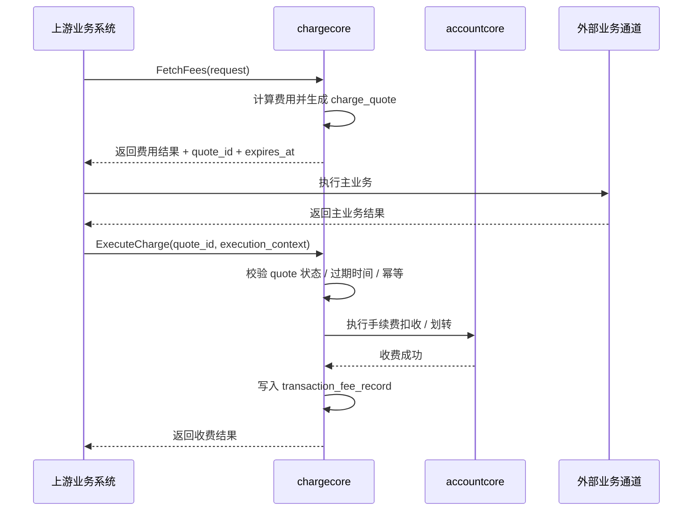
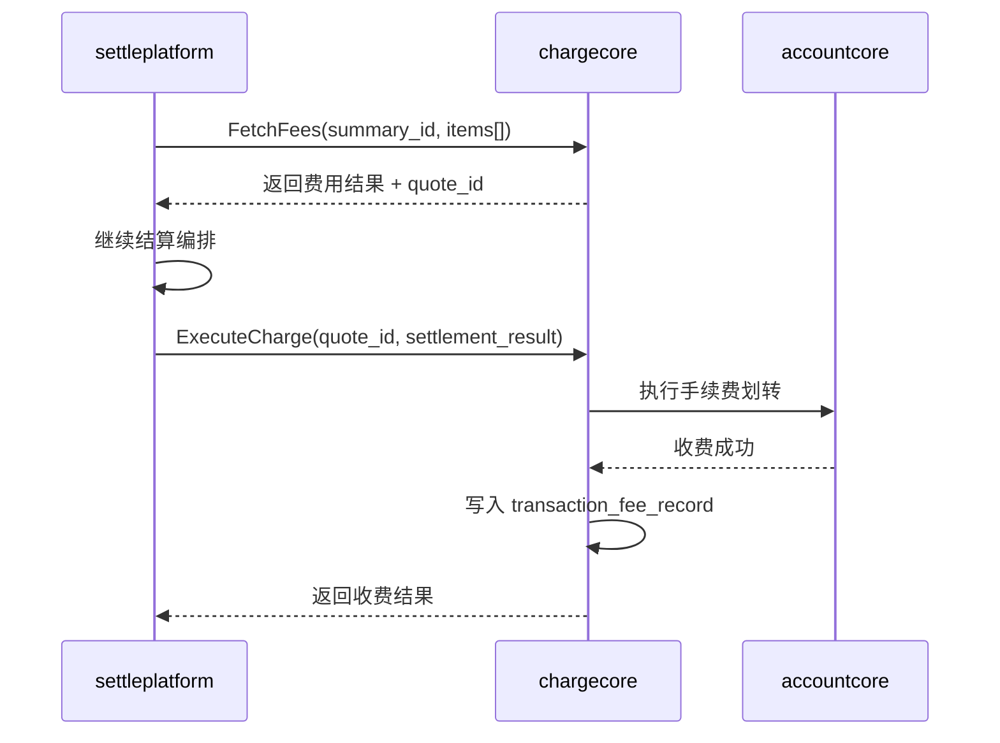
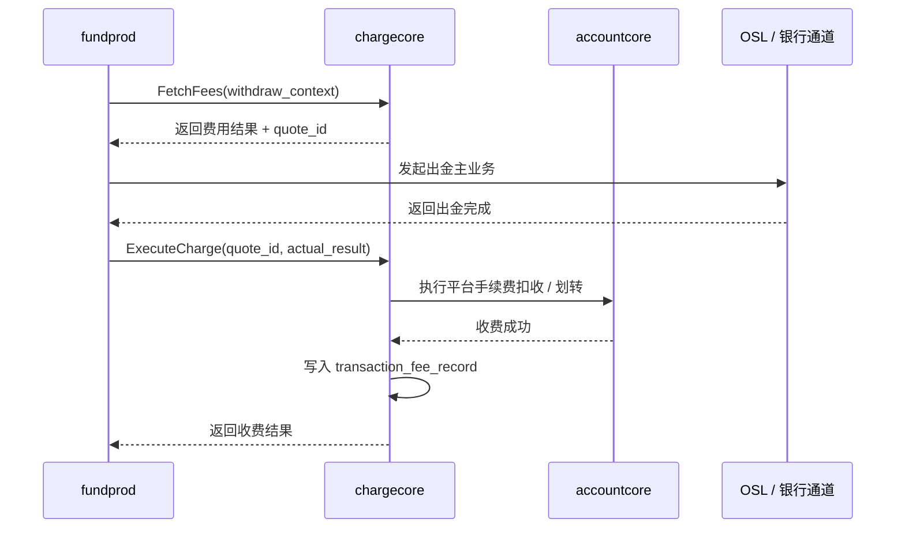
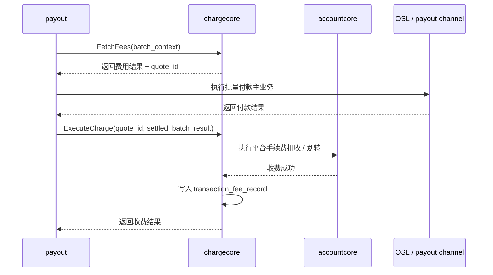

# StablePay ChargeCore 收费执行规划方案
## 1. 定位
本文档不属于本期“计费能力建设”范围，只用于规划：如果 `chargecore` 后续继续演进到“收费执行中心”，其职责边界、快照模型和核心接口应如何设计。
当前本期已明确的能力仍然是：
- `CalculateFees / FetchFees`
- `CommitFeeRecords`
- 统一收费结果查询
本文规划的未来能力是：
- 基于已锁定收费快照执行收费
- 调用 `accountcore` 完成平台手续费资金动作
- 收费成功后直接写入统一收费明细

## 2. 核心决策
### 2.1 先锁定快照，再执行收费
后续如果进入收费执行语义，推荐采用：
- `FetchFees` 返回费用结果和 `charge_quote`
- 上游系统执行主业务
- `ExecuteCharge` 基于 `charge_quote` 执行收费

不推荐采用：
- `ExecuteCharge` 时重新按当前最新规则重算
- 当前规则变化后直接拒绝收费

原因：
- 对商户可见的实时场景下，商户看到的是某一时刻的费用结果
- 若上游主业务已执行，再按“当前规则”拦截收费，只会制造新的不一致
- 更合理的方式是：执行阶段消费“已确认的收费快照”，而不是重新定价

### 2.2 `chargecore` 只承接收费职责，不承接业务履约职责
后续即使 `chargecore` 进入收费执行，也建议只承接：
- 平台向商户收费
- 手续费划转
- 收费明细写入

仍保留在上游系统的职责：
- 主业务状态机
- OSL / 银行 / chaincore / custody 等外部通道交互
- 业务本身的冻结、释放、出金、付款、结算
- 业务失败补偿

### 2.3 收费执行的核心资金系统是 `accountcore`
后续如果 `chargecore` 承担收费执行，最核心的新增交互系统会是：
- `accountcore`

原因：
- 真正的收费动作本质上是资金动作
- 包括冻结、扣款、解冻、入账、手续费划转
- 这些能力天然属于账户 / 账务域，而不是业务履约域

## 3. 数据模型
### 3.1 设计目标
为了支撑“先展示费用，再执行收费”，建议在 `chargecore` 中新增一张轻量快照表：
- 锁定一次可执行收费快照
- 记录快照状态和有效期
- 记录收费执行结果

同时继续复用现有：
- `transaction_fee_record`
作为最终收费结果明细表

### 3.2 `charge_quote`
建议新增表：

```text
charge_quote
```

字段建议如下：

| 字段 | 类型 | 说明 |
| --- | --- | --- |
| `id` | bigint | 物理主键 |
| `quote_id` | varchar(64) | 收费快照业务 ID，唯一 |
| `merchant_id` | varchar(64) | 商户 ID |
| `source_system` | varchar(32) | 来源系统，如 `settleplatform` / `fundprod` / `payout` |
| `source_biz_type` | varchar(32) | 来源业务类型 |
| `source_biz_id` | varchar(64) | 来源业务单号 |
| `charge_timing` | varchar(16) | `t1` / `realtime` |
| `fee_currency` | varchar(16) | 本次收费结果币种 |
| `total_fee_amount` | bigint | 本次收费总金额（minor units） |
| `status` | varchar(16) | `active` / `executed` / `expired` / `canceled` |
| `quote_snapshot` | json | 本次费用项、规则引用、金额结果、必要业务上下文 |
| `expires_at` | datetime(3) | 快照失效时间 |
| `executed_at` | datetime(3) | 实际收费完成时间，可空 |
| `execute_idempotency_key` | varchar(64) | 执行幂等键，可空 |
| `accountcore_txn_id` | varchar(64) | 账户侧资金流水 ID，可空 |
| `created_at` | datetime(3) | 创建时间 |
| `updated_at` | datetime(3) | 更新时间 |

说明：
- `quote_snapshot` 里保存完整费用项列表，不再额外拆 `charge_quote_item`
- 目的是把规划保持轻量
- 若后续有大规模批量查询 quote item 的需求，再考虑拆子表

### 3.3 `quote_snapshot` 内容建议
`quote_snapshot` 至少包含：
- 每个费用项的 `fee_category`
- 每个费用项的 `fee_item`
- 每个费用项的 `fee_channel`
- 每个费用项的 `fee_amount`
- 规则来源引用 `fee_source_ref_type/ref_id/ref_version`
- 计费基数、费率、固定费用
- 汇率类场景的报价信息 / quote 信息
- 前端展示给商户的总费用和净额口径

### 3.4 与 `transaction_fee_record` 的关系
- `charge_quote`：执行前的已锁定收费快照
- `transaction_fee_record`：执行成功后的最终收费明细

关系：
- 一个 `charge_quote` 可生成多条 `transaction_fee_record`
- 每条 `transaction_fee_record` 可在 `fee_snapshot` 中回溯对应 `quote_id`

## 4. 核心流程
### 4.1 通用实时场景


关键点：
- `ExecuteCharge` 不重新按最新规则定价
- `ExecuteCharge` 消费的是 `quote_snapshot`
- 若 `quote` 已过期，拒绝执行并要求重新获取费用结果

### 4.2 T+1：SettlePlatform


说明：
- `settleplatform` 继续负责结算编排
- `chargecore` 只承接手续费收费职责
- 该场景下 `quote` 生命周期可以很短，因为 `Fetch` 和 `Execute` 几乎在同一结算任务内完成

### 4.3 Realtime：FundProd Off Ramp


说明：
- `fundprod` 继续和 `OSL` 交互
- `chargecore` 不直接调 `OSL`
- `chargecore` 只承接收费职责

### 4.4 Realtime：FundProd Crypto 提现


### 4.5 Realtime：Payout


说明：
- `payout` 继续负责 batch / item 状态机
- `chargecore` 不接管批量付款履约

## 5. 接口设计
### 5.1 `FetchFees`
用途：
- 计算费用
- 生成可执行收费快照
- 返回给上游系统展示 / 预估 / 后续执行使用

请求示例：

```json
{
  "source_system": "fundprod",
  "merchant_id": "800000000001",
  "charge_timing": "realtime",
  "currency": "USDT",
  "items": [
    {
      "source_biz_type": "fiat_offramp_payout",
      "source_biz_id": "wr_xxx",
      "product_code": "off_ramp",
      "amount": "1000.00",
      "currency": "USDT",
      "context": {
        "quote_id": "fxq_xxx",
        "channel": "OSL"
      }
    }
  ]
}
```

返回示例：

```json
{
  "quote_id": "cq_xxx",
  "expires_at": "2026-05-23T12:05:00+08:00",
  "currency": "USDT",
  "total_fee_amount": "35.10",
  "items": [
    {
      "source_biz_id": "wr_xxx",
      "total_fee_amount": "35.10",
      "fee_items": [
        {
          "fee_category": "channel_service_fee",
          "fee_item": "risk_control_fee",
          "fee_amount": "0.10"
        },
        {
          "fee_category": "channel_service_fee",
          "fee_item": "osl_bank_fee",
          "fee_amount": "35.00"
        }
      ]
    }
  ]
}
```

### 5.2 `ExecuteCharge`
用途：
- 消费已锁定 `quote`
- 执行平台手续费资金动作
- 写统一收费明细

请求示例：

```json
{
  "quote_id": "cq_xxx",
  "execute_idempotency_key": "exec_wr_xxx_v1",
  "execution_context": {
    "source_system": "fundprod",
    "source_biz_type": "fiat_offramp_payout",
    "source_biz_id": "wr_xxx",
    "business_status": "completed",
    "actual_amount": "1000.00",
    "actual_currency": "USDT"
  }
}
```

返回示例：

```json
{
  "quote_id": "cq_xxx",
  "charge_status": "succeeded",
  "accountcore_txn_id": "at_xxx",
  "record_ids": [
    "tfr_off_001",
    "tfr_off_002"
  ],
  "executed_at": "2026-05-23T12:03:00+08:00"
}
```

### 5.3 `GetChargeQuote`
用途：
- 运营排查
- 上游补偿时查询 quote 状态

返回重点：
- `quote_id`
- `status`
- `expires_at`
- `executed_at`
- `total_fee_amount`
- `quote_snapshot`

## 6. 执行前校验
`ExecuteCharge` 重点校验：
- `quote_id` 是否存在
- `quote` 是否仍为 `active`
- `quote` 是否已过期
- `execute_idempotency_key` 是否已执行过
- 当前执行上下文是否与 quote 绑定对象一致

不做的校验：
- 不在 `ExecuteCharge` 阶段重新按最新规则重算并覆盖旧报价
- 不在主业务已经执行后，再因为规则变动拒绝收费

## 7. 暂不建议优先进入收费执行的场景
- On Ramp 汇率差产品服务费
- 深度依赖外部异步通道结果、且费用终态只能在业务最终完成后确定的场景

## 8. 当前结论
如果未来推进 `chargecore` 的收费执行能力，建议演进路径是：
- 从“计费中心 + 结果中心”
- 演进到“基于快照执行收费”

最重要的边界是：
- `chargecore` 负责收费职责
- 上游系统继续负责业务履约职责
- `accountcore` 是收费执行的核心资金系统
