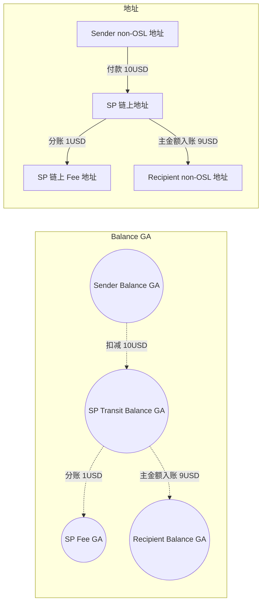
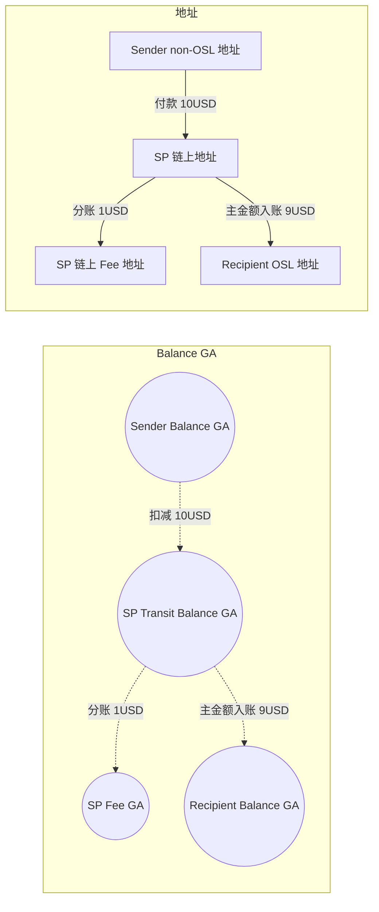
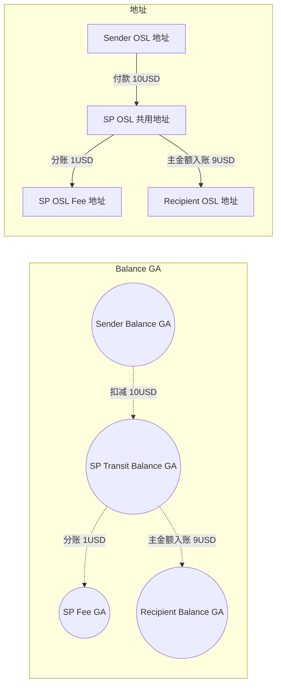
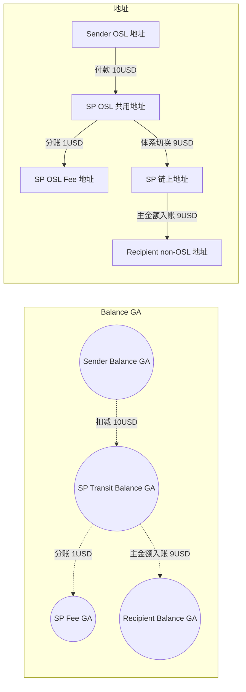
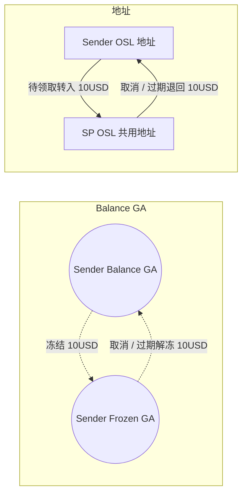
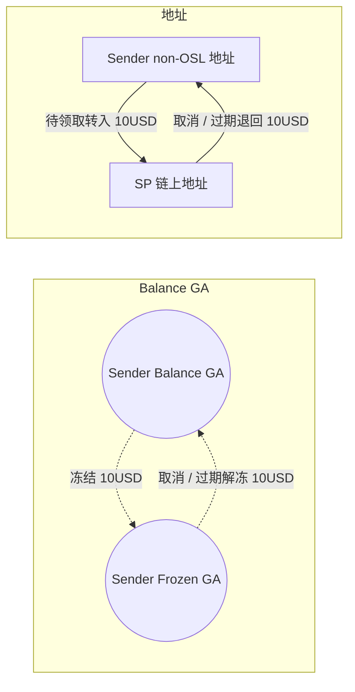

# Payout 转 StablePay Account 资金流与账户流梳理

## 使用约定
- 全文统一按 `10USD` 作为示例金额。
- `StablePay Account` 场景对商户侧展示为 `Free`。
- 图和表按平台内部视角表达：若存在收费资金，已注册场景先分账 `1USD` 到对应场景的 `SP OSL Fee 地址` 或 `SP 链上 Fee 地址`，主金额 `9USD` 入账 `Recipient`。
- 地址流和 GA 流统一经过 `StablePay` 中转，不再区分“同体系直达”。
- 未注册场景本文只表达“暂停在哪里、过期怎么退回”；`Recipient` 成功领取后，再衔接对应已注册场景。

## 5.1 non-OSL -> 已注册 non-OSL

| 阶段 | 资金动作 | Sender non-OSL 地址 | SP 链上地址 | Recipient non-OSL 地址 | SP 链上 Fee 地址 | Sender Balance GA | SP Transit Balance GA | Recipient Balance GA | SP Fee GA |
| --- | --- | --- | --- | --- | --- | --- | --- | --- | --- |
| 账号类型 |  | 实体资金账户 | 实体资金账户 | 实体资金账户 | 实体资金账户 | AccountCore 虚拟资金账户 | AccountCore 虚拟资金账户 | AccountCore 虚拟资金账户 | AccountCore 虚拟资金账户 |
| 付款 | Sender 发起 payout | `-10USD` | `+10USD` | `0` | `0` | `-10USD` | `+10USD` | `0` | `0` |
| 分账 | Fee 分账 | `0` | `-1USD` | `0` | `+1USD` | `0` | `-1USD` | `0` | `+1USD` |
| 入账 | 主金额入账 | `0` | `-9USD` | `+9USD` | `0` | `0` | `-9USD` | `+9USD` | `0` |

## 5.2 non-OSL -> 已注册 OSL

| 阶段 | 资金动作 | Sender non-OSL 地址 | SP 链上地址 | Recipient OSL 地址 | SP 链上 Fee 地址 | Sender Balance GA | SP Transit Balance GA | Recipient Balance GA | SP Fee GA |
| --- | --- | --- | --- | --- | --- | --- | --- | --- | --- |
| 账号类型 |  | 实体资金账户 | 实体资金账户 | 实体资金账户 | 实体资金账户 | AccountCore 虚拟资金账户 | AccountCore 虚拟资金账户 | AccountCore 虚拟资金账户 | AccountCore 虚拟资金账户 |
| 付款 | Sender 发起 payout | `-10USD` | `+10USD` | `0` | `0` | `-10USD` | `+10USD` | `0` | `0` |
| 分账 | Fee 分账 | `0` | `-1USD` | `0` | `+1USD` | `0` | `-1USD` | `0` | `+1USD` |
| 入账 | 主金额入账 | `0` | `-9USD` | `+9USD` | `0` | `0` | `-9USD` | `+9USD` | `0` |

## 5.3 OSL -> 已注册 OSL

| 阶段 | 资金动作 | Sender OSL 地址 | SP OSL 共用地址 | Recipient OSL 地址 | SP OSL Fee 地址 | Sender Balance GA | SP Transit Balance GA | Recipient Balance GA | SP Fee GA |
| --- | --- | --- | --- | --- | --- | --- | --- | --- | --- |
| 账号类型 |  | 实体资金账户 | 实体资金账户 | 实体资金账户 | 实体资金账户 | AccountCore 虚拟资金账户 | AccountCore 虚拟资金账户 | AccountCore 虚拟资金账户 | AccountCore 虚拟资金账户 |
| 付款 | Sender 发起 payout | `-10USD` | `+10USD` | `0` | `0` | `-10USD` | `+10USD` | `0` | `0` |
| 分账 | Fee 分账 | `0` | `-1USD` | `0` | `+1USD` | `0` | `-1USD` | `0` | `+1USD` |
| 入账 | 主金额入账 | `0` | `-9USD` | `+9USD` | `0` | `0` | `-9USD` | `+9USD` | `0` |

## 5.4 OSL -> 已注册 non-OSL

| 阶段 | 资金动作 | Sender OSL 地址 | SP OSL 共用地址 | SP 链上地址 | Recipient non-OSL 地址 | SP OSL Fee 地址 | Sender Balance GA | SP Transit Balance GA | Recipient Balance GA | SP Fee GA |
| --- | --- | --- | --- | --- | --- | --- | --- | --- | --- | --- |
| 账号类型 |  | 实体资金账户 | 实体资金账户 | 实体资金账户 | 实体资金账户 | 实体资金账户 | AccountCore 虚拟资金账户 | AccountCore 虚拟资金账户 | AccountCore 虚拟资金账户 | AccountCore 虚拟资金账户 |
| 付款 | Sender 发起 payout | `-10USD` | `+10USD` | `0` | `0` | `0` | `-10USD` | `+10USD` | `0` | `0` |
| 分账 | Fee 分账 | `0` | `-1USD` | `0` | `0` | `+1USD` | `0` | `-1USD` | `0` | `+1USD` |
| 中转 | OSL 切到链上侧 | `0` | `-9USD` | `+9USD` | `0` | `0` | `0` | `0` | `0` | `0` |
| 入账 | 主金额入账 | `0` | `0` | `-9USD` | `+9USD` | `0` | `0` | `-9USD` | `+9USD` | `0` |

## 5.5 OSL -> 未注册
- 待领取态暂停在 `SP OSL 共用地址`。
- `Recipient` 成功领取后：
  - 领取为 `OSL`，衔接 `5.3`
  - 领取为 `non-OSL`，衔接 `5.4`
- Fee 分账在领取成功后，随对应已注册场景一起处理；待领取态不发生 Fee 分账。

| 阶段 | 资金动作 | Sender OSL 地址 | SP OSL 共用地址 | Sender Balance GA | Sender Frozen GA |
| --- | --- | --- | --- | --- | --- |
| 账号类型 |  | 实体资金账户 | 实体资金账户 | AccountCore 虚拟资金账户 | AccountCore 虚拟资金账户 |
| 创建 | 创建待领取 payout | `-10USD` | `+10USD` | `-10USD` | `+10USD` |
| 取消 / 过期 | 原路退回并解冻 | `+10USD` | `-10USD` | `+10USD` | `-10USD` |

## 5.6 non-OSL -> 未注册
- 待领取态暂停在 `SP 链上地址`。
- `Recipient` 成功领取后：
  - 领取为 `OSL`，衔接 `5.2`
  - 领取为 `non-OSL`，衔接 `5.1`
- Fee 分账在领取成功后，随对应已注册场景一起处理；待领取态不发生 Fee 分账。

| 阶段 | 资金动作 | Sender non-OSL 地址 | SP 链上地址 | Sender Balance GA | Sender Frozen GA |
| --- | --- | --- | --- | --- | --- |
| 账号类型 |  | 实体资金账户 | 实体资金账户 | AccountCore 虚拟资金账户 | AccountCore 虚拟资金账户 |
| 创建 | 创建待领取 payout | `-10USD` | `+10USD` | `-10USD` | `+10USD` |
| 取消 / 过期 | 原路退回并解冻 | `+10USD` | `-10USD` | `+10USD` | `-10USD` |
