# Payout to StablePay Account 技术方案

## 1. 方案概述
### 1.1 背景
当前 StablePay Portal 的 `Payouts` 模块已支持面向外部钱包地址的 payout。根据最新原型，`Payouts` 将演进为一个统一模块，承载两类 payout：
- `Send to wallet address`
- `Send to StablePay Business account`
该能力允许 sender 通过 `recipient email` 向另一个 StablePay Business Account 发起付款，系统根据邮箱识别 recipient 状态并走不同链路：
- `已注册且可收款`：先完成 `Account` 侧记账，并根据 sender / recipient 的地址体系同步执行真实资金动作。
- `未注册`：进入 `Claim` 模式，允许先创建 payout、锁定资金，并将真实资金暂停在 sender 所属资金体系对应的平台公共承接点，后续再等待 recipient 注册后领取或超时退回。
- `已注册但暂不可收款`：阻止创建 payout，并提示 sender 通知 recipient 完成账户激活、KYB 或合规流程。
根据原型，用户交互不是“直接复用旧 batch create 页面”，而是：
- 在 `Payouts` 列表右上角点击 `Create payout`
- 先选择 payout 类型
- 若选择 `Send to wallet address`，继续走原有 wallet/batch payouts 创建流程
- 若选择 `Send to StablePay Business account`，进入本次需求的独立创建流程
**因此，本需求在产品语义上仍属于 `payout`，但在创建交互与执行语义上都与现有链上 payout 不同：**
- 现有 payout 主链路是 `批次 -> 冻结 -> 通道/链上分发 -> 明细结算`。
- 新能力主链路是 `类型选择 -> 单收款人表单 -> review -> confirm -> Account 动作 + 真实资金动作 / 邀请待领`。
PRD 在评审后新增 3 个关键约束：
1. 界面交互保持现有批次逻辑。
2. 输入邮箱时增加信息验证：已注册商户需增加缺名校验。
3. 未注册收款人，在收款时需要补充名字验证。
### 1.2 目标
- 在 `merchantportal` 的 `Payouts` 模块中新增 `Send to StablePay Business account` payout 能力。
- 保持 `Payouts` 模块的统一入口、统一列表和统一详情体系，但为 StablePay Account payout 提供独立创建流程。
- 在后端复用 payout 业务域和统一状态/详情框架，而不是把前端创建交互继续做成旧版 batch create。
- StablePay Account payout 对商户侧展示为 `Free`；已注册与 claim 成功场景都需按 `sender / recipient` 地址体系同步完成真实资金动作，并在平台内部表达 `fee` 分账。
- 本次支持未注册 recipient 的锁资、邀请、claim、过期返还，以及 `resend email / copy claim link`。
- 本次支持 pending claim 场景下的 detail、share poster、copy claim link、resend email、cancel payout。
- 在已注册缺名、未注册待领取场景中补充名字校验能力，满足评审要求。
### 1.3 范围边界
本次包含：
- `merchantportal` 新增 StablePay Account payout 的入口、列表集成、创建、review、结果页、详情页、share poster、claim 承接页。
- `stablepay-payout` 新增 recipient lookup、`Account` 动作编排、真实资金动作编排、invite/claim 链路、claim 状态管理。
- `stablepay-merchantcore` 提供 recipient email 对应商户/账户信息识别、账户映射查询，以及 claim 注册完成后的商户识别与账户映射能力。
- `stablepay-accountcore` 提供冻结、解冻、消费冻结、账户余额增减能力，承接本需求中的全部 `Account` 动作。
- `stablepay-channelcore` 复用现有 OSL 托管接口，承接 OSL 侧真实资金动作。
- `stablepay-chaincore` 复用平台链上地址承接与 non-OSL 地址出账能力，承接 non-OSL 侧真实资金动作。
- `stablepay-communication` 发送 invitation email、claim success/expiry 等通知邮件。
- `stablepay-idl` 增补 payout / merchantcore / accountcore 相关 RPC 契约。
本次不包含：
- 外部钱包地址 payout 现有流程改造。
- 代理商返佣、奖励发放、分佣结算规则。
- recipient 领取到外部钱包地址。
- 为 `recipient` 单独建设新的外部托管系统或新的链上地址产品语义。
- 邀请归因结果沉淀实现。
- 视觉设计细节与像素级前端样式说明。
### 1.4 关键决策
1. 新能力复用 `Payouts` 模块入口、列表和详情体系，但 `Send to StablePay Business account` 创建流是独立页面流程，不等同于旧 wallet batch create。
2. `Send to wallet address` 继续复用现有 wallet/batch payouts 交互与后端链路，不在本次实质改造范围内。
3. StablePay Account payout 在产品上按单笔 payout 交互设计：单 recipient、单 source account、单 payout currency。
4. 新能力复用 `stablepay-payout` 作为主业务域，但新增一条区别于链上 payout 的执行分支。
5. `merchantportal` 仍作为入口和 BFF，`payout` 负责业务编排；`accountcore` 只负责 `Account` 动作，真实资金动作由 `payout` 分别通过 `channelcore / chaincore` 复用既有能力承接。
6. 本需求统一拆成两层动作：
   - `Account` 动作：系统内账户的冻结、解冻、扣减、增加
   - 真实资金动作：地址到地址的真实资金划转
7. 已注册场景下，`Account` 动作统一落为 `sender` 侧所选 `Balance Account` 扣减、`recipient` 侧默认 `Balance Account` 增加。
8. 已注册场景下，真实资金动作统一先经过 `StablePay` 中转，再按地址体系决定是否需要跨体系桥接：
   - `OSL -> OSL`：经 `StablePay OSL` 公共地址中转
   - `non-OSL -> non-OSL`：经 `StablePay` 链上地址中转
   - `OSL -> non-OSL`：经 `StablePay OSL` 公共地址与 `StablePay` 链上地址桥接
   - `non-OSL -> OSL`：经 `StablePay` 链上地址桥接
9. 已注册场景在平台内部资金表达上，统一包含 `fee` 分账链路：OSL 场景落 `StablePay OSL Fee 地址`，non-OSL 场景落 `StablePay` 链上 `Fee 地址`；GA 侧统一使用同一组 `Transit / Fee GA` 口径，不按 OSL / non-OSL 再拆分。
10. 未注册 `recipient` 的本质是 `Claim` 场景，而不是即时到账场景；这类场景下，`sender` 侧先冻结，最终结果要么是 `claim` 成功到账，要么是超时失败回退。
11. 前端交互独立，但后端不建议强行复用当前地址导向的 `CreateBatch/PatchBatch/SubmitBatch` 明细契约；应在 `stablepay-payout` 中新增 StablePay Account payout 专属接口与子语义层。
12. “缺名校验 / 名字验证”不单独抽象出新系统，优先依托 `merchantcore` 商户资料与 `payout claim` 上下文扩展。
13. StablePay Account payout 本期不接入传统 payout 的商户费率配置能力，前端对商户侧固定展示 `Free`；但平台内部资金表达仍保留 `fee` 分账，用于对齐真实资金和账户流。该链路不占用现有 payout quota，但仍需满足 PRD 已定义的余额、未注册限额、merchant account limit、risk limit、compliance limit、product payout limit 等业务限制。
## 2. 现状分析
### 2.1 现有系统职责
#### 2.1.1 merchantportal
- 作为前端入口和 BFF，承载 `Payouts` 列表、create payout 类型选择、wallet payout 流程、StablePay Account payout 流程、claim 承接页等路由。
- 原有 wallet payout 仍是 batch 导向流程；新 StablePay Account payout 是单笔表单 + review + result/detail 的独立流程。
- 通过 [stablepay-merchantportal/pkg/client/payout_client.go](/Users/gelatoni/workspace/stablepay-merchantportal/pkg/client/payout_client.go) 调用 `stablepay-payout` RPC。
- 通过 [stablepay-merchantportal/app/service/account_balance_service.go](/Users/gelatoni/workspace/stablepay-merchantportal/app/service/account_balance_service.go) 聚合 `merchantcore + accountcore` 获取账户余额。
结论：
- `merchantportal` 不是 payout 核心模型持有者。
- 适合承接页面、BFF 转换、source account 选择，以及 claim 页面与注册/登录衔接。
#### 2.1.2 stablepay-payout
- 当前 `payout batch / payout item` 核心模型、批次提交、冻结、执行、取消均在 `stablepay-payout`。
- 现有链路以链上分发为中心：
  - `CreateBatch / PatchBatch / SubmitBatch`
  - `FreezeBalance`
  - `ChannelCore / ChainCore` 执行
  - `ConsumeFrozenBalance / UnfreezeBalance`
- 现有 IDL 明细模型核心字段仍是 `network / address / memo / amount`，未包含 `recipient_email / recipient_status / claim / invite`。
结论：
- 新能力若复用现有 `batch / item`，`stablepay-payout` 必须改造。
- 不能仅在 `merchantportal` 做表面拼装，否则无法承接状态机、锁资、取消、过期、详情与通知链路。
- **本次 Transfer to Account 虽然沿用 payout 域承载，但真实资金动作需要同时复用 OSL 托管能力与平台链上地址承接/出账能力。**
#### 2.1.3 stablepay-accountcore
- 负责账户与余额管理，提供：
  - `AdjustBalance`
  - `BatchAdjustBalance`
  - `FreezeBalance`
  - `UnfreezeBalance`
  - `ConsumeFrozenBalance`
- 本需求统一按 Global Account Phase 1 口径使用 `Balance Account`：
  - sender 从可用的 `Balance Account` 中选择 source account
  - recipient 入账到该币种默认 `Balance Account`
- 账户余额操作全部带交易记录、事务一致性与幂等键。
结论：
- 账务加减一定落在 `accountcore`。
- 当前没有现成“账户到账户转账”服务能力；本需求适合在 `accountcore` 下沉一层更高语义的 `transfer` 类能力，避免长期由 `payout` 侧编排双边记账。
#### 2.1.4 stablepay-merchantcore
- 持有商户主资料、注册激活、商户账户映射 `merchant_accounts`、商户详情聚合。
- `GetMerchantDetailInfo` 可返回 merchant 基本资料与 `accounts`。
- `CreateRegistrationActivation / VerifyRegistrationActivation / SaveRegistrationDetails / ConsumeRegistrationActivation` 已支持自助注册链路。
- `ensureMerchantAccountsFromActivation` 会在注册消费时向 `accountcore` 创建并同步账户映射。
结论：
- recipient email 是否已注册、是否有 business account、商户名/对外名是否缺失、对应哪些 account，天然属于 `merchantcore` 的查询能力范畴。
- claim 过程中 recipient 注册完成后的识别与账户映射同步，继续复用现有注册激活链路更合理。
#### 2.1.5 stablepay-communication
- 已有通用邮件发送 RPC：`SendEmail(template_id, params)`。
- 模板通过 `template_id` 管理，服务负责渲染、发送、记录发送状态。
- `merchantcore` 现有注册激活邮件已通过 communication 发出。
结论：
- invitation / claim success / expiry 等通知优先复用 communication 模板发信能力。
- communication 大概率只需补模板，不一定需要新增复杂业务逻辑。
#### 2.1.6 stablepay-channelcore
- 当前代码中，OSL 托管资金能力已经统一沉淀在 `channelcore` 的 `CustodyService` 中，核心包括：
  - `createCustodyPayout`
  - `confirmCustodyPayout`
  - `queryCustodyPayout`
  - `internalTransfer`
- `stablepay-payout` 当前也已经有现成的 `ChannelCoreClient` 封装，对应 `CreatePayout / ConfirmPayout / QueryPayout / InternalTransfer` 调用适配。
结论：
- **本需求中 OSL 真实资金动作需要重点依赖 `channelcore`。**
- **按当前资金流设计，`channelcore` 仅需被复用现有接口，不要求在本次需求中修改其服务代码。**
- `channelcore` 因此属于“明确涉及的系统”，但在研发拆分上更偏“联调依赖系统”而不是“主要改造仓库”。
#### 2.1.7 stablepay-chaincore
- 当前平台侧链上地址承接、链上地址出账与既有 non-OSL 地址能力沉淀在 `chaincore`。
- 本次 `non-OSL -> non-OSL` 平台中转、`OSL -> non-OSL` 跨体系桥接、`non-OSL -> OSL` 跨体系桥接，以及未注册 non-OSL sender 的平台暂停点，都需要明确依赖平台链上地址能力。
结论：
- **本需求中的 non-OSL 真实资金动作需要依赖 `chaincore`。**
- **本期优先复用既有平台链上地址承接与出账能力，不在方案阶段要求新增 `chaincore` 产品语义，但需要将其纳入明确涉及系统。**
### 2.2 现有能力与本需求差异
#### 2.2.1 交互现状与原型口径
现有 wallet payout 创建页具备：
- 草稿批次创建
- 明细 patch
- confirm 页校验
- submit 后进入 done
而根据本次原型，StablePay Account payout 的交互是：
- `Payouts` 列表中同时展示 `Wallet address` 和 `StablePay account` 两类记录
- 点击 `Create payout` 后先选择 payout type
- 选择 `Send to wallet address` 才进入旧 batch create
- 选择 `Send to StablePay Business account` 后进入独立创建页
- 创建页围绕 `source account / recipient email / payout currency / amount / memo`
- 根据 recipient 状态分成 registered、not registered、cannot receive 等分支
- 分别进入 review、done/detail/share/claim 页面
因此，“界面交互保持批次逻辑”不能再表述为“直接复用旧 batch create 骨架”，更准确的理解应是：
- 仍位于统一 `Payouts` 模块内
- 仍复用统一列表/详情/状态管理心智
- 但 StablePay Account payout 自身是独立创建流
#### 2.2.2 payout 模型现状
现有 payout item 面向链上分发，关键字段为：
- `beneficiary_id`
- `real_name`
- `network`
- `address`
- `memo`
- `amount`
PRD 新能力需要的核心字段为：
- `recipient_email`
- `recipient_business_account_id`
- `recipient_status`
- `claim_id`
- `invite_id`
- `expires_at`
进一步结合代码可见：
- `stablepay-idl/idl/payout/payout_service.thrift` 中 `PayoutItemInput` 为强地址模型：
  - `network`
  - `address`
  - `memo`
  - `amount`
- `stablepay-payout/internal/domain/entity/payout_item.go` 与 `internal/infrastructure/persistence/mysql/model/models.go` 也都以 `network/address/tx_hash` 为核心字段。
因此本次可以复用 `payout` 作为业务域与批次展示模型，但不建议把 `recipient_email` 生硬塞进现有通用 `PayoutItemInput` 契约中。
#### 2.2.3 账户模型现状
基于 `accountcore feature/ga` 最新代码，本需求账户模型按 Global Account Phase 1 口径对齐，主链路只使用 `Balance Account` 承接商户可用余额划转。
当前已对齐的实现口径是：
- sender 出账账户按 Global Account Phase 1 的账户模型处理，由 merchant 在可用 `Balance Account` 中显式选择 source account。
- recipient 入账账户统一落在该商户该币种 `is_default = true` 的 `Balance Account`。
- 已注册场景下，`Account` 动作统一表达为 `sender selected Balance Account -> recipient default Balance Account`。
同时，若 `merchantcore` 本地注释或旧 IDL 仍残留旧账户命名，方案与实现均以 Global Account Phase 1 的 `Balance Account` 口径为准，并补充回归验证。
基于本地代码进一步核对后，可以明确一点：现有系统没有现成的“按 `recipient email` 直接返回 payout 可收款资格”的聚合接口。当前更接近的能力只有：
- `merchantcore.GetMerchantDetailInfo`：可返回 merchant 基础资料、KYB、账户列表，但本质是详情聚合，不直接给出 payout eligibility 结论
- 其他业务中的 eligibility 判定：通常也是上层服务拿 merchant / KYB / account 基础数据后自行组合规则，并非可直接复用的统一 RPC
因此，本期需要把“recipient eligibility 聚合接口”作为 `merchantcore` 的明确新增能力写入方案，而不是默认由 `payout` 自行拼装多个内部查询。
#### 2.2.4 费率与额度配置现状
当前传统 payout 的配置上下文在代码中已经基本固化：
- `stablepay-payout/internal/app/service/batch_service.go` 创建批次时，费率查询固定使用 `product_code = "payouts"`
- `stablepay-payout/internal/infrastructure/client/quota_client.go` 冻结额度时，固定校验：
  - `business_domain_code = "payouts"`
  - `product_code = "payouts"`
  - `source_service = "payout"`
- 批次提交、完成、失败补偿也都沿用同一组 quota 上下文
这意味着当前“传统链上 payout”默认绑定的是一套收费产品、额度语义以及以出金执行为中心的资金链路。
而本次 StablePay Account payout 当前已经明确的是：
- 商户侧展示 `Free`
- 已注册与 claim 成功场景都需要按 `sender / recipient` 地址体系执行真实资金动作，并在平台内部表达 `fee` 分账；差异只在 OSL / non-OSL 路径以及是否处于待领取暂停态
- 列表与详情读模型继续复用 payout 域
- 不占用传统 payout quota
- 仍需满足 PRD 定义的业务 limit 校验
据此，本期方案先明确两点：
- 不接入 merchant 侧费率配置管理，前端固定展示 `Free`
- 不接入 MerchantCore QuotaService 的 `FreezeQuota / ConsumeFrozenQuota / UnfreezeQuota` 链路；相关额度限制改由业务校验显式承接
需要保留的风险意识是：
- 若新链路误走传统 payout 对商户收费逻辑，会与“商户侧 Free”语义冲突；若完全忽略平台内部 `fee` 分账，又会与资金流/账户流设计冲突
- 不能因为不占用 quota，就遗漏 PRD 已要求的各类 amount / account / risk / compliance limit 校验
### 2.3 约束条件
- 原型已经明确：StablePay Account payout 不是旧 wallet batch create 的变体，而是同模块下的独立创建流。
- 新能力名义属于 payout，但执行语义不能直接复用传统链上 payout 的批量出账链路；需要改为 `Account` 记账 + 平台中转真实资金动作的专属编排。
- 未注册 recipient 必须锁资而非直接扣减到底。
- recipient lookup 涉及邮箱枚举风险，返回信息必须脱敏。
- recipient claim 涉及邮箱校验、注册衔接、business account eligibility 与风险控制。
- 原型材料中出现了 `fund password` 与 `email verification code` 校验项；其中 `recipient` claim 侧的 email verification 在 PRD 正文中已明确，而 `sender` 提交前是否统一引入额外安全校验、以及其适用范围，需单独确认。
- 现有 `stablepay-payout` IDL 与数据模型尚未承载 email recipient / claim / invite 语义。
## 3. 总体架构
### 3.1 系统职责
- `merchantportal`
  - 展示统一 `Payouts` 列表、类型选择、StablePay Account payout 创建/校验/详情/分享/claim 页面
  - 作为前端与 BFF 承接 payout 主流程页面，以及 claim 入口中的注册/登录前台衔接
- `stablepay-payout`
  - 作为主业务域，管理 StablePay Account payout 的批次、明细、lookup、claim、invite、状态流转
- `stablepay-merchantcore`
  - 对 `payout` 提供基于 `recipient email` 的 `recipient eligibility` 聚合接口，统一承接商户识别、账户映射、可收款状态、不可收款原因与名字缺失判定
  - 提供注册激活与注册完成后的 merchant 建档
- `stablepay-accountcore`
  - 负责 sender 锁资、解冻、消费冻结、sender 扣减、recipient 入账等 `Account` 动作
- `stablepay-channelcore`
  - 负责 OSL 侧真实资金动作
  - 复用现有 `CreatePayout / ConfirmPayout / QueryPayout / InternalTransfer`
- `stablepay-chaincore`
  - 负责 non-OSL 侧真实资金动作，以及 OSL / non-OSL 跨体系时的平台链上承接与释放
  - 复用现有平台链上地址承接与出账能力
- `stablepay-communication`
  - 发送 recipient invitation email、recipient claim success email、sender claim success notification、sender expiry notification，以及 resend invitation email
### 3.2 架构图

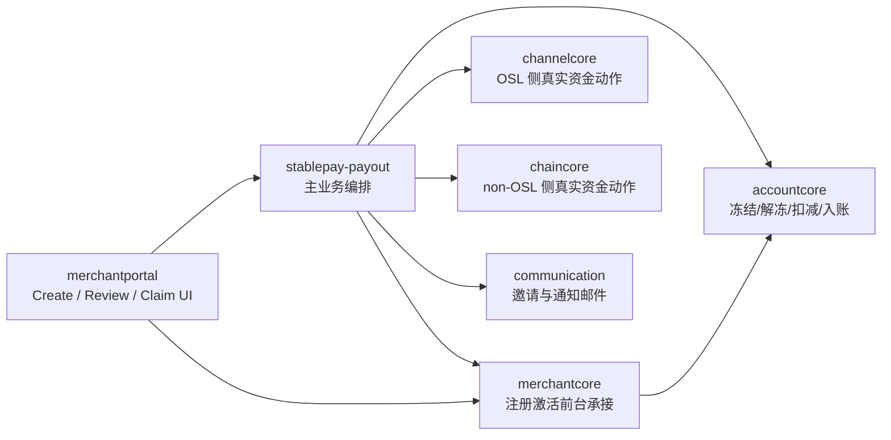

说明：
- payout 主流程中的 lookup、创建、claim、取消、过期等业务编排统一由 `stablepay-payout` 承接
- `stablepay-payout` 统一编排两层动作：
  - `Account` 动作调用 `accountcore`
  - 真实资金动作通过 `channelcore / chaincore` 复用既有地址承接与出账能力
- `merchantportal -> merchantcore` 的直接调用，仅用于 claim 承接页中的注册激活前台链路，不承担 payout 主流程编排
- **当前资金流设计下，`chaincore` 属于真实资金主链路的一部分，但本期优先复用既有平台链上地址承接与出账能力，不要求新增 `chaincore` 产品语义。**
### 3.3 数据流
#### 3.3.1 动作分层与判断维度
本需求统一按两层动作、三个维度处理：
- 两层动作
  - `Account` 动作：系统内账户的冻结、解冻、扣减、增加
  - 真实资金动作：地址到地址的真实资金划转
- 三个维度
  - `sender` 属于 OSL 还是 non-OSL 地址体系
  - `recipient` 是否已注册
  - `recipient` 属于 OSL 还是 non-OSL 地址体系
补充说明：
- 本方案中的“真实资金动作”统一指真实资金在地址体系之间的划转。
- OSL 侧真实资金动作优先复用 `channelcore` 现有托管能力；non-OSL 侧真实资金动作优先复用 `chaincore` 现有平台链上地址承接与出账能力。
- 已注册场景下，`Account` 动作统一表达为 `sender` 侧所选 `Balance Account` 扣减、`recipient` 侧默认 `Balance Account` 增加；差异仅体现在真实资金路径。
- 已注册场景下，真实资金路径统一先经过 `StablePay` 中转；平台内部资金表达统一包含 `fee` 分账链路：
  - OSL 场景：`StablePay OSL Fee 地址`
  - non-OSL 场景：`StablePay` 链上 `Fee 地址`
  - GA 侧统一使用同一组 `Transit / Fee GA`
  - 商户侧展示与平台内部资金动作分别表达，示例表只表达 `fee` 分账后的主金额入账
- 未注册场景创建时只处理“冻结 + 资金暂停”，不在待领取态执行 `fee` 分账；领取成功后，再衔接到对应已注册场景释放资金。
#### 3.3.2 决策分流图

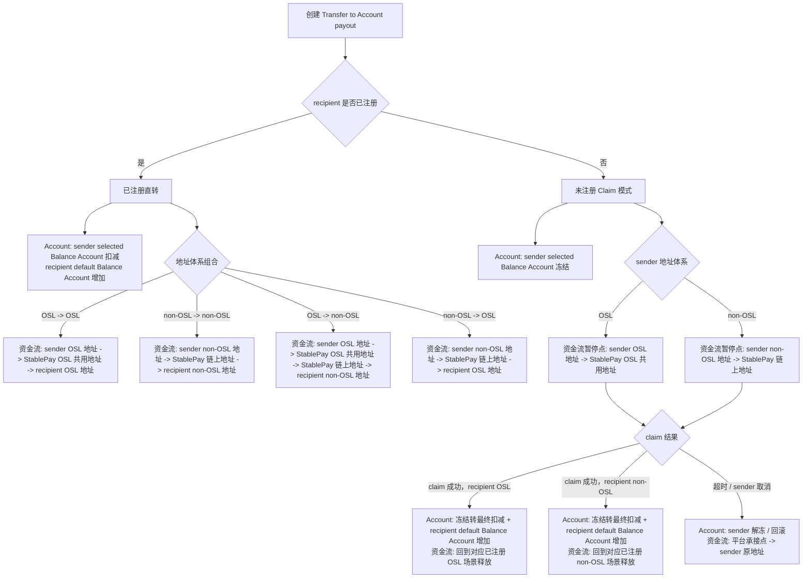

#### 3.3.3 场景矩阵
| 场景 | Account 动作 | 真实资金动作 | 说明 |
| --- | --- | --- | --- |
| `sender OSL -> recipient 已注册 OSL` | `sender selected Balance Account` 扣减，`recipient default Balance Account` 增加 | `sender OSL 地址 -> StablePay OSL 共用地址 -> recipient OSL 地址` | OSL 场景统一经 `StablePay OSL` 中转；fee 落 `StablePay OSL Fee 地址` |
| `sender non-OSL -> recipient 已注册 non-OSL` | `sender selected Balance Account` 扣减，`recipient default Balance Account` 增加 | `sender non-OSL 地址 -> StablePay 链上地址 -> recipient non-OSL 地址` | non-OSL 场景统一经平台链上地址中转；fee 落 `StablePay` 链上 `Fee 地址` |
| `sender OSL -> recipient 已注册 non-OSL` | `sender selected Balance Account` 扣减，`recipient default Balance Account` 增加 | `sender OSL 地址 -> StablePay OSL 共用地址 -> StablePay 链上地址 -> recipient non-OSL 地址` | OSL 侧承接后切到链上侧释放；fee 落 `StablePay OSL Fee 地址` |
| `sender non-OSL -> recipient 已注册 OSL` | `sender selected Balance Account` 扣减，`recipient default Balance Account` 增加 | `sender non-OSL 地址 -> StablePay 链上地址 -> recipient OSL 地址` | 平台链上侧承接后释放到 OSL；fee 落 `StablePay` 链上 `Fee 地址` |
| `sender OSL -> recipient 未注册` | `sender selected Balance Account` 冻结；claim 成功后转最终扣减，取消/过期则解冻 | 创建时：`sender OSL 地址 -> StablePay OSL 共用地址`；claim 成功后回到 `sender OSL` 对应已注册场景释放；取消/过期时回退到 `sender OSL 地址` | 真实资金暂停在 OSL 侧平台公共承接点；待领取态不做 fee 分账 |
| `sender non-OSL -> recipient 未注册` | `sender selected Balance Account` 冻结；claim 成功后转最终扣减，取消/过期则解冻 | 创建时：`sender non-OSL 地址 -> StablePay 链上地址`；claim 成功后回到 `sender non-OSL` 对应已注册场景释放；取消/过期时回退到 `sender non-OSL 地址` | 真实资金暂停在 non-OSL 侧平台公共承接点；待领取态不做 fee 分账 |

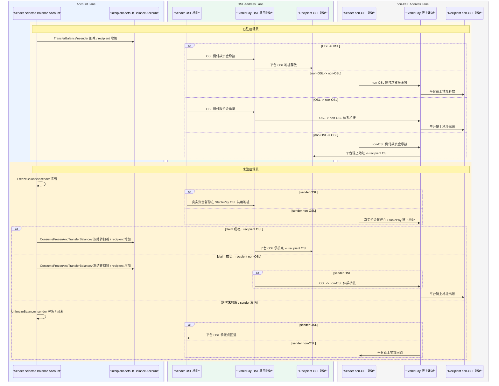

### 3.4 资金流与账户流明细

#### 3.4.1 使用约定
- 全文统一按 `10USD` 作为示例金额。
- `StablePay Account` 场景对商户侧展示为 `Free`。
- 图和表按平台内部视角表达：若存在收费资金，已注册场景先分账 `1USD` 到对应场景的 `SP OSL Fee 地址` 或 `SP 链上 Fee 地址`，主金额 `9USD` 入账 `Recipient`。
- 地址流和 GA 流统一经过 `StablePay` 中转，不再区分“同体系直达”。
- 未注册场景本文只表达“暂停在哪里、过期怎么退回”；`Recipient` 成功领取后，再衔接对应已注册场景。

#### 3.4.2 non-OSL -> 已注册 non-OSL
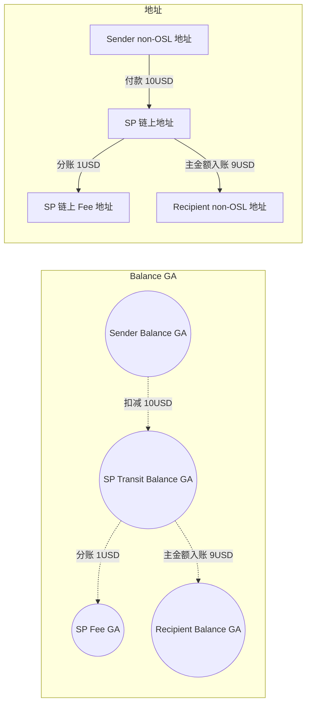

| 阶段 | 资金动作 | Sender non-OSL 地址 | SP 链上地址 | Recipient non-OSL 地址 | SP 链上 Fee 地址 | Sender Balance GA | SP Transit Balance GA | Recipient Balance GA | SP Fee GA |
| --- | --- | --- | --- | --- | --- | --- | --- | --- | --- |
| 账号类型 |  | 实体资金账户 | 实体资金账户 | 实体资金账户 | 实体资金账户 | AccountCore 虚拟资金账户 | AccountCore 虚拟资金账户 | AccountCore 虚拟资金账户 | AccountCore 虚拟资金账户 |
| 付款 | Sender 发起 payout | `-10USD` | `+10USD` | `0` | `0` | `-10USD` | `+10USD` | `0` | `0` |
| 分账 | Fee 分账 | `0` | `-1USD` | `0` | `+1USD` | `0` | `-1USD` | `0` | `+1USD` |
| 入账 | 主金额入账 | `0` | `-9USD` | `+9USD` | `0` | `0` | `-9USD` | `+9USD` | `0` |

#### 3.4.3 non-OSL -> 已注册 OSL
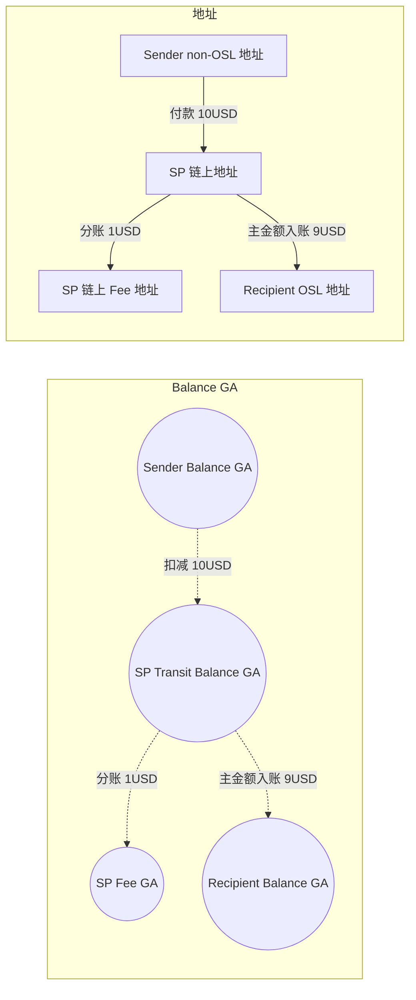

| 阶段 | 资金动作 | Sender non-OSL 地址 | SP 链上地址 | Recipient OSL 地址 | SP 链上 Fee 地址 | Sender Balance GA | SP Transit Balance GA | Recipient Balance GA | SP Fee GA |
| --- | --- | --- | --- | --- | --- | --- | --- | --- | --- |
| 账号类型 |  | 实体资金账户 | 实体资金账户 | 实体资金账户 | 实体资金账户 | AccountCore 虚拟资金账户 | AccountCore 虚拟资金账户 | AccountCore 虚拟资金账户 | AccountCore 虚拟资金账户 |
| 付款 | Sender 发起 payout | `-10USD` | `+10USD` | `0` | `0` | `-10USD` | `+10USD` | `0` | `0` |
| 分账 | Fee 分账 | `0` | `-1USD` | `0` | `+1USD` | `0` | `-1USD` | `0` | `+1USD` |
| 入账 | 主金额入账 | `0` | `-9USD` | `+9USD` | `0` | `0` | `-9USD` | `+9USD` | `0` |

#### 3.4.4 OSL -> 已注册 OSL
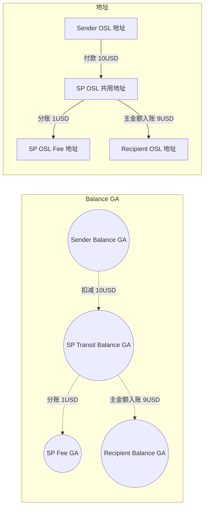

| 阶段 | 资金动作 | Sender OSL 地址 | SP OSL 共用地址 | Recipient OSL 地址 | SP OSL Fee 地址 | Sender Balance GA | SP Transit Balance GA | Recipient Balance GA | SP Fee GA |
| --- | --- | --- | --- | --- | --- | --- | --- | --- | --- |
| 账号类型 |  | 实体资金账户 | 实体资金账户 | 实体资金账户 | 实体资金账户 | AccountCore 虚拟资金账户 | AccountCore 虚拟资金账户 | AccountCore 虚拟资金账户 | AccountCore 虚拟资金账户 |
| 付款 | Sender 发起 payout | `-10USD` | `+10USD` | `0` | `0` | `-10USD` | `+10USD` | `0` | `0` |
| 分账 | Fee 分账 | `0` | `-1USD` | `0` | `+1USD` | `0` | `-1USD` | `0` | `+1USD` |
| 入账 | 主金额入账 | `0` | `-9USD` | `+9USD` | `0` | `0` | `-9USD` | `+9USD` | `0` |

#### 3.4.5 OSL -> 已注册 non-OSL
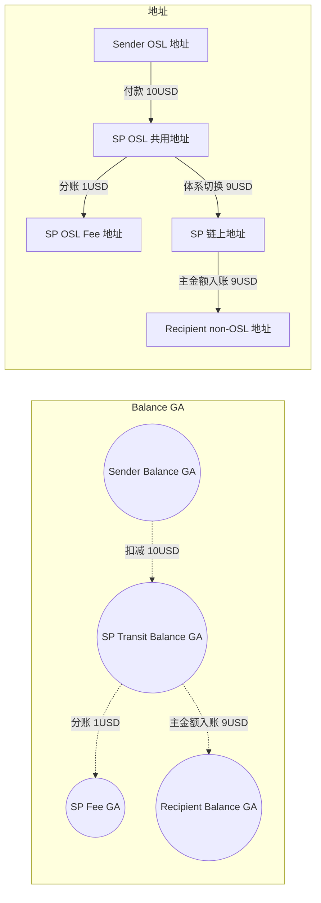

| 阶段 | 资金动作 | Sender OSL 地址 | SP OSL 共用地址 | SP 链上地址 | Recipient non-OSL 地址 | SP OSL Fee 地址 | Sender Balance GA | SP Transit Balance GA | Recipient Balance GA | SP Fee GA |
| --- | --- | --- | --- | --- | --- | --- | --- | --- | --- | --- |
| 账号类型 |  | 实体资金账户 | 实体资金账户 | 实体资金账户 | 实体资金账户 | 实体资金账户 | AccountCore 虚拟资金账户 | AccountCore 虚拟资金账户 | AccountCore 虚拟资金账户 | AccountCore 虚拟资金账户 |
| 付款 | Sender 发起 payout | `-10USD` | `+10USD` | `0` | `0` | `0` | `-10USD` | `+10USD` | `0` | `0` |
| 分账 | Fee 分账 | `0` | `-1USD` | `0` | `0` | `+1USD` | `0` | `-1USD` | `0` | `+1USD` |
| 中转 | OSL 切到链上侧 | `0` | `-9USD` | `+9USD` | `0` | `0` | `0` | `0` | `0` | `0` |
| 入账 | 主金额入账 | `0` | `0` | `-9USD` | `+9USD` | `0` | `0` | `-9USD` | `+9USD` | `0` |

#### 3.4.6 OSL -> 未注册
- 待领取态暂停在 `SP OSL 共用地址`。
- `Recipient` 成功领取后：
  - 领取为 `OSL`，衔接 `5.3`
  - 领取为 `non-OSL`，衔接 `5.4`
- Fee 分账在领取成功后，随对应已注册场景一起处理；待领取态不发生 Fee 分账。

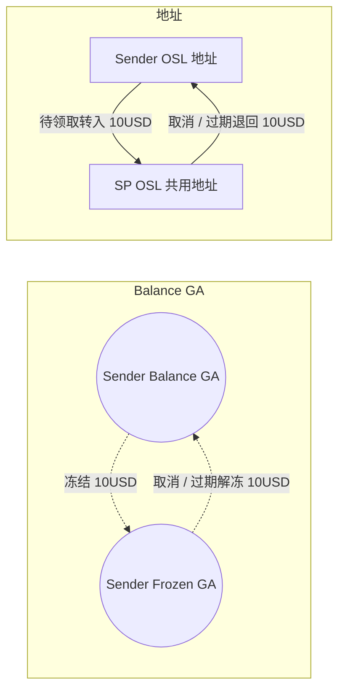

| 阶段 | 资金动作 | Sender OSL 地址 | SP OSL 共用地址 | Sender Balance GA | Sender Frozen GA |
| --- | --- | --- | --- | --- | --- |
| 账号类型 |  | 实体资金账户 | 实体资金账户 | AccountCore 虚拟资金账户 | AccountCore 虚拟资金账户 |
| 创建 | 创建待领取 payout | `-10USD` | `+10USD` | `-10USD` | `+10USD` |
| 取消 / 过期 | 原路退回并解冻 | `+10USD` | `-10USD` | `+10USD` | `-10USD` |

#### 3.4.7 non-OSL -> 未注册
- 待领取态暂停在 `SP 链上地址`。
- `Recipient` 成功领取后：
  - 领取为 `OSL`，衔接 `5.2`
  - 领取为 `non-OSL`，衔接 `5.1`
- Fee 分账在领取成功后，随对应已注册场景一起处理；待领取态不发生 Fee 分账。

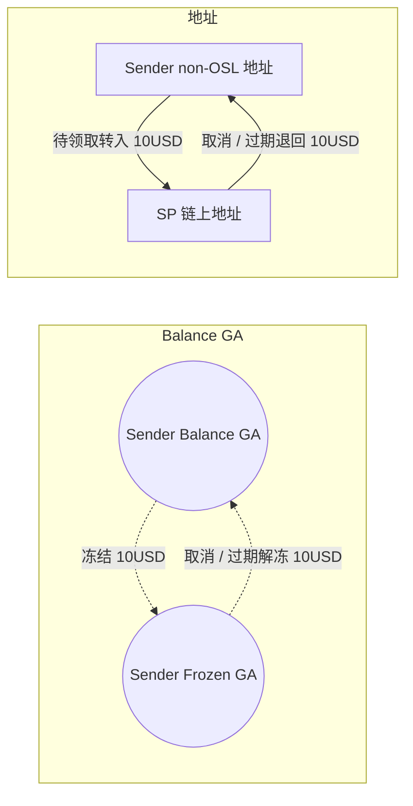

| 阶段 | 资金动作 | Sender non-OSL 地址 | SP 链上地址 | Sender Balance GA | Sender Frozen GA |
| --- | --- | --- | --- | --- | --- |
| 账号类型 |  | 实体资金账户 | 实体资金账户 | AccountCore 虚拟资金账户 | AccountCore 虚拟资金账户 |
| 创建 | 创建待领取 payout | `-10USD` | `+10USD` | `-10USD` | `+10USD` |
| 取消 / 过期 | 原路退回并解冻 | `+10USD` | `-10USD` | `+10USD` | `-10USD` |

## 4. 模块设计
### 4.1 merchantportal
#### 4.1.1 路由与页面承接
基于最新原型，`merchantportal` 需承接以下页面与动作：
- `Payouts` 列表页
  - 同时展示 `Wallet address` 和 `StablePay account` 两类记录
  - wallet 记录的 `View` 继续跳转旧详情页
  - StablePay account 记录的 `View` 跳转本次新详情页
  - pending claim 场景额外展示 `Share`
- `Create payout` 类型选择弹窗
  - `Send to wallet address`
  - `Send to StablePay Business account`
- StablePay Account payout 创建页
- registered review 页
- unregistered review + invitation email preview 页
- done / invitation sent 页
- payout detail 页
  - pending claim
  - succeeded
  - expired
  - canceled
- share claim poster 页
- claim 承接相关页面
  - claim email verification
  - claim failed
  - claim succeeded
同时，现有注册页 `/auth/register` 已支持通过 query/fragment 承接：
- `activation_id`
- `verify_token`
- `email`
- `return_to`
因此未注册 recipient 的 claim 链路可以复用现有注册激活页面与后端注册激活主链路，但前端不建议整页原样复用，而应在现有注册页上新增 `claim mode` 变体：
- 后端继续复用现有 `CreateRegistrationActivation / VerifyRegistrationActivation / SaveRegistrationDetails / ConsumeRegistrationActivation`
- 前端继续复用现有注册路由、页面骨架与提交流程
- claim 场景下的表单项、文案与提交流程按原型裁剪，不直接沿用当前自助注册页的完整字段集合
#### 4.1.2 表单模式改造
StablePay Account payout 创建页围绕以下字段构建：
- `source account`
- `recipient email`
- `payout currency`
- `amount`
- `memo`
其中，评审新增的名字校验按以下方式承接：
- 已注册 recipient：
  - lookup 命中 `account_found` 且 `name_status = ok` 后，进入 `recipient business name challenge`
  - challenge 的权威名字来源固定使用 `merchantcore.merchant.legal_business_name`
  - sender 需补齐被掩码的若干字符，校验通过后方可继续 review
- 未注册 recipient：
  - create 阶段新增必填 `expected_recipient_name`
  - 该字段用于后续 recipient claim 时的名字挑战校验
  - create 时由 sender 录入并随 payout 一起落库
名字来源固定使用 `legal_business_name` 的原因是：当前生产样本中 `business_name` 基本为空，而 `legal_business_name` 覆盖完整，使用单一字段更稳定，也能避免 sender / recipient / merchantcore 对“名字”口径不一致。
并配套右侧 `Payout Summary`，动态展示：
- source account
- payout currency
- amount
- fee
- total payout
- recipient status
- arrival
- limit check / action 等提示位
PRD 附件字段表明确要求：
- `Source account` 必填
- `Recipient email` 必填
- `Payout currency` 必填
- `Amount` 必填
- `Memo` 选填
#### 4.1.3 lookup 状态渲染
前端需根据 lookup / amount / eligibility 返回状态渲染：
- `not_checked`
- `account_found`
- `not_registered`
- `cannot_receive`
- `self_recipient`
- `invalid_email`
- `missing_name` 或等效的名字校验状态扩展
- `unregistered_limit_blocked`
其中评审新增的“已注册缺名校验”建议不要和 `cannot_receive` 混合，而单独表达名字维度问题。
对于 `account_found + name_status = ok` 的场景，portal 还需渲染名字挑战组件，建议直接展示后端返回的掩码结果，例如：
- `阿【】【】巴（杭州）有限公司`
- `HONG KO【】【】HEN TECHNOLOGY LIMITED`
当前方案约定：
- challenge 只针对权威名字中的“主体部分”生成
- 常见企业后缀与尾部地区修饰（如 `（香港）有限公司`、`LIMITED`、`LLC`、`PTE. LTD.`）默认保留展示，不参与 challenge
- portal 不自行生成 challenge，统一以后端返回的 `masked_name` 渲染，避免多端规则漂移
基于当前真实商户名样本，按本方案规则手工演示的 challenge 效果如下：
| 商户名 | 展示效果 | 需填写空字 |
| --- | --- | --- |
| `LRISNAILS LTD` | `LRIS【】【】ILS LTD` | `NA` |
| `ONEWING LIMITED` | `ONE【】【】NG LIMITED` | `WI` |
| `FutureVision AI Limited` | `Future【】【】sion AI Limited` | `Vi` |
| `FlashTV Limited` | `Fla【】【】TV Limited` | `sh` |
| `URNAENERGY PTE. LTD.` | `URNA【】【】RGY PTE. LTD.` | `EN` |
| `集非斯國際物流(南非)有限公司` | `集非斯【】【】物流(南非)有限公司` | `國際` |
| `下一代科技（香港）有限公司` | `下一【】【】技（香港）有限公司` | `代科` |
| `物享雲國際（香港）有限公司` | `物享【】【】際（香港）有限公司` | `雲國` |
| `雲帆出海科技有限公司` | `雲帆【】【】科技有限公司` | `出海` |
| `香港腾富国际贸易有限公司` | `香港腾富【】【】贸易有限公司` | `国际` |

说明：
- 中文名整体效果相对稳定，主体部分较容易定位。
- 英文名在存在空格、缩写或长后缀时，challenge 位置可能不完全符合人工直觉；本期优先保证规则统一、后端单点生成与多端一致性，不为长尾名称额外引入复杂特判。
#### 4.1.4 review 页面
根据原型，review 页面不是一个统一模板，而是至少区分两种：
- registered review
  - 展示 recipient、status、source account、amount、fee、memo
  - 明示 `Internal account payout` / `Instant`
- unregistered review
  - 展示 recipient email、status、source account、amount、fee、memo
  - 展示 `What happens next`
  - 右侧展示 invitation email preview
原型材料中出现了 `fund password` 与 `email verification code` 页面元素，但当前已对齐的业务结论是：
- 这些校验项不应改变 `registered recipient = sender confirm 后直接内部划转成功` 的主语义
- `recipient` claim 侧的 email verification 是 PRD 正文明确要求
- `sender` 提交前是否存在统一安全校验步骤，以及其是否同时适用于 registered / unregistered 两类提交链路，需要单独确认
因此在本方案当前版本中，不将 sender security verification 作为已确认主流程节点展开设计。
#### 4.1.5 detail / share / claim 页面
StablePay Account payout 需要新增多种 detail 变体：
- `Succeeded`
- `Pending claim`
- `Expired`
- `Canceled`
其中 `Pending claim` detail 需支持：
- `Create poster`
- `Copy claim link`
- `Resend email`
- `Cancel payout`
并新增 `Share claim poster` 页面，展示：
- 绑定到当前 recipient email 的海报/二维码
- 下载海报
- 复制图片
- 分享 open invitation link
#### 4.1.6 导出能力保持原则
本次已明确的导出结论如下：
- `Payouts` 统一列表页继续保留 `Export`，新旧两类记录都在同一列表页导出
- 列表页导出仍沿用当前前端本地导出模式，不引入新的后端结果文件链路
- 原有 wallet/batch payout 详情页中的导出入口保持不变
- StablePay Account payout 本期不接入 `payout_batch_result_reports`
原因是当前代码中的两类导出语义本就不同：
- 列表页与详情页导出是 `merchantportal` 前端基于当前查询结果/详情数据即时生成 CSV
- `payout_batch_result_reports` 是传统 batch 完成后由后端异步生成并存档的结果文件索引
StablePay Account payout 不走链上明细结果文件模型，因此本期没有接入 `payout_batch_result_reports` 的必要。
### 4.2 stablepay-payout
#### 4.2.1 新业务子域
在现有 payout 域内新增 `StablePay Account Payout` 子链路，建议拆出独立应用服务：
- `StablePayRecipientLookupService`
- `StablePayAccountBatchService`
- `StablePayAccountExecutionService`
- `StablePayAccountClaimService`
- `StablePayAccountInviteService`
避免把新逻辑继续堆在现有链上 `BatchService / BatchSubmitService / BatchExecutor` 中。
这些服务仍归属于 `stablepay-payout`，但与链上 payout 共享的仅是：
- 批次列表/详情视图入口
- 通用状态统计框架
- 通用幂等、任务、审计、通知基础设施
#### 4.2.2 接口与执行模式分流
现有 `CreateBatch/PatchBatch/SubmitBatch` 与 `PayoutItemInput` 已强绑定地址模型，不适合直接承载邮箱 recipient。建议分两层复用：
- 交互层：
  - `merchantportal` 复用统一 `Payouts` 模块入口、列表和详情体系
  - StablePay Account payout 使用独立创建/校验流程
- 业务层：
  - `stablepay-payout` 新增 StablePay Account payout 专属 RPC / REST
  - 专属接口内部仍可复用 `payout_batches` 与统一批次读模型
建议新增业务模式：
- `payout_scene = onchain_wallet`
- `payout_scene = stablepay_account`
在 `stablepay_account` 场景下，后端仍需分别承接两类已由前端创建流程和 lookup 结果显式分流的执行语义：
- `execution_mode = direct_transfer`
- `execution_mode = invite_claim`
其中：
- 已注册可收款链路承接为 `direct_transfer`
- 未注册待领取链路承接为 `invite_claim`
这里的重点不是“后端再做一次产品入口判断”，而是：
- 前端入口与交互在产品上已经分流到新的 StablePay Account payout 创建流
- 后端需要为这条新创建流承接两种不同执行语义的持久化、状态流转与账务编排
该方案比“继续扩通用 `PayoutItemInput`”更清晰，原因是：
- 避免污染现有链上 payout IDL
- 避免地址/邮箱双语义共存导致字段大量条件分支
- 降低对既有 payout 页面与明细接口兼容性的回归风险
### 4.3 merchantcore
#### 4.3.1 recipient eligibility 聚合接口
`merchantcore` 目前没有现成的“按邮箱给 payout 返回可收款判定”的聚合 RPC，但已有足够基础能力：
- 注册链路可通过 `auth_user` 按 email 判断是否已注册
- `GetMerchantDetailInfo` 可返回 merchant 基础资料、KYB、`merchant_accounts`
- 现有业务中已存在“基于 merchant / KYB / account 做 eligibility 判定”的模式，但没有可直接复用的 payout eligibility RPC
- `ensureMerchantAccountsFromActivation` 已可在注册完成时补齐 accountcore 账户与本地映射
因此建议在 `merchantcore` 新增面向 payout 的聚合查询 RPC，而不是让 `payout` 自己拼装多个内部查询。
这个接口在本方案中的定位不是普通信息查询，而是 `StablePay Account payout` 创建前置判断的核心能力。其职责是把“是否已注册、是否可收款、入账到哪个 account、为什么不可收款、是否缺少名字”统一收口到 `merchantcore`，避免：
- `payout` 重复拼接 `auth_user / merchant / kyb / merchant_accounts`
- 不同调用方对 `cannot_receive` 判定口径不一致
- 后续 Global Account Phase 1 上线后，recipient 入账 account 选择逻辑继续散落在多个系统
建议返回：
- 是否存在已注册 business merchant
- merchant_id
- 商户状态 / KYB 状态 / 限制状态
- payout 收款资格
- `cannot_receive_reason_code`
- 对应 `merchant_accounts`
- 用于展示和校验的名称字段
- `default_balance_account_id`
- `missing_name` 判定结果
#### 4.3.2 注册承接
未注册 recipient claim 时，继续复用现有：
- `CreateRegistrationActivation`
- `VerifyRegistrationActivation`
- `SaveRegistrationDetails`
- `ConsumeRegistrationActivation`
并在消费时通过 `ensureMerchantAccountsFromActivation` 完成 `accountcore` 账户创建与 `merchant_accounts` 映射。
但这里的“复用”主要是指后端注册激活主链路复用，而不是 claim 页面把当前自助注册前台原样照搬。需要额外明确：
- claim 前已经单独完成 recipient email verification，因此 claim 注册页不必重复现有注册入口页的邮箱发信步骤
- 当前自助注册页详情表单除密码外，还包含 `industry`、`invite_code` 等现有自助注册语义字段；claim 原型若未要求这些字段，则不应强行带入
- 当前前端提交流程会写入 `internal_industry_category`，并将 `business_type` 固定为 `1`；若 claim 原型中的 `Business type` 确认为真实必填字段，则需要对现有注册详情表单做模式化改造，而不是继续硬编码
- 推荐做法是在现有 `/auth/register` 页面内增加 `claim mode`，复用现有 RPC 主链路，但按 claim 原型裁剪字段、文案与提交流程
#### 4.3.3 claim mode 注册表单建议
claim 注册页的目标是承接“未注册 recipient 为领取这笔 payout 完成最小注册”，因此表单应遵循“只暴露本次领取所需字段，能由系统默认或后端补齐的字段不透出”的原则。
建议保留以下表单项：
| 字段 | 是否展示 | 中文含义 | 说明 |
| --- | --- | --- | --- |
| `legal_business_name` | 是 | 企业法定名称 | 注册建档必需字段，同时作为后续商户主资料 |
| `registered_country` | 是 | 注册国家/地区 | 注册建档建议保留，避免创建后还需立即补充基础资料 |
| `business_website` | 是 | 企业官网 | 建议在 claim mode 中直接收集，便于后续商户资料完整性 |
| `password` | 是 | 登录密码 | 强必填，注册完成后需要直接具备登录能力 |
| `business_type` | 待模式化支持 | 企业类型 | 若原型最终确认需要该字段，则 claim mode 应显式展示并提交真实值，不再沿用当前前端 `business_type = 1` 的硬编码 |

建议不展示以下字段：
| 字段 | 是否展示 | 中文含义 | 说明 |
| --- | --- | --- | --- |
| `invite_code` | 否 | 邀请码 | 当前 payout invite / claim 语义与现有代理邀请码链路不同，本链路不透出该字段 |
| `internal_industry_category` | 否 | 内部行业分类 | 若本次 claim 原型未要求，则不在 recipient 领取注册时强行收集 |
| 其他可系统推导字段 | 否 | 例如邮箱等 | recipient email 已在 claim 前完成校验并可由上下文带入，无需重复录入 |

实现口径建议：
- 继续复用现有 `SaveRegistrationDetails` 与 `ConsumeRegistrationActivation`
- `claim mode` 仅提交本场景需要的最小资料集合
- 对当前自助注册页中仍存在但 claim 不需要的字段，前端不展示，后端也不要求 claim 场景必须传入
- 若评审后确认 `business_type` 暂不纳入本期，也可先沿用现有默认值，但需在方案中注明这是阶段性兼容处理，而非 claim 产品语义本身
### 4.4 accountcore
#### 4.4.1 账务原语现状
当前已有原语：
- `AdjustBalance`
- `BatchAdjustBalance`
- `FreezeBalance`
- `UnfreezeBalance`
- `ConsumeFrozenBalance`
可直接支持：
- sender 冻结
- sender 解冻
- sender 消费冻结
- sender 扣减
- recipient 入账
#### 4.4.2 `Account` 动作能力
本期 `accountcore` 的职责边界明确为“只负责 `Account` 动作，不负责真实资金动作”。
因此本期建议把“账户到账户划转”显式下沉为 `accountcore` 新能力，由 `payout` 调用该能力完成双边记账，而不是继续在 `payout` 内部分别编排 `sender AdjustBalance(-)` 与 `recipient AdjustBalance(+)`。
建议拆分两类能力：
- `TransferBalance`
  - 用于已注册 recipient 的直接到账场景
  - 一次请求内完成 `sender` 扣减、`recipient` 增加、统一交易上下文记录、幂等控制
- `ConsumeFrozenAndTransferBalance`
  - 用于未注册 recipient 在 `claim` 成功时的最终入账场景
  - 一次请求内完成 sender 冻结余额消费、`recipient` 增加、统一交易上下文记录、幂等控制
现有原语继续保留其职责：
- 创建未注册 payout 时：`FreezeBalance`
- 超时/取消时：`UnfreezeBalance`
也就是说，`accountcore` 在本需求中的最终职责边界是：
- 直接到账：`TransferBalance`
- claim 成功到账：`ConsumeFrozenAndTransferBalance`
- 创建锁资：`FreezeBalance`
- 取消/过期解冻：`UnfreezeBalance`
这样处理的收益是：
- 双边记账语义收口到 `accountcore`
- 降低 `payout` 侧自行编排两次余额变更带来的中间态复杂度
- 后续其他“商户到账户转账”类场景也可复用同一层能力
补充并行改造背景：
- `Global Account Phase 1` 已作为本需求账户流的基准口径：
  - sender 侧 source account 来自可用 `Balance Account`
  - recipient 侧入账落到默认 `Balance Account`
  - 账户模型通过 `is_default` 标记默认 `Balance Account`
- 对本需求的直接影响主要有两点：
  - sender 侧 source account 选择，需要按新模型从可用的 `Balance Account` 中选择
  - recipient 侧入账路由，统一明确落到该商户对应币种、`is_default = true` 的 `Balance Account`
- 本并行改造不改变本需求的产品定义，但需要在实现阶段与 Global Account Phase 1 协调发布节奏、接口字段及旧模型兼容策略。
### 4.4.3 费率与额度上下文
基于当前代码现状，传统 payout 的费率查询与 quota 校验都绑定在既有 `payouts` 上下文中；但本次 StablePay Account payout 已确认的产品语义是“商户侧 Free + 平台内部 `fee` 分账 + 统一存在平台中转真实资金动作（已注册即时执行、未注册待 claim 成功后执行）”。
因此本期方案的明确口径是：
- 不接入 merchant 侧费率配置能力
- 前端与业务展示固定为 `Free`
- 后端实现上需要确保新链路不会误走传统 payout 对商户收费逻辑
- 平台内部仍需按资金流/账户流设计表达 `fee` 分账，不得把 `Free` 简化为“无 fee 资金动作”
- 不接入现有 `payouts` quota 冻结/消费/解冻链路
对于额度与更细分产品上下文，本期结论如下：
- 不需要占用现有 payout quota
- 也不因为本期需求单独新增 quota 维度的 `product_code / business_domain_code / source_service`
- 但业务上仍需显式校验 PRD 定义的限制项，包括：
  - source account available balance
  - 未注册 recipient `1,000 USD equivalent` 限额
  - merchant account limit
  - risk limit
  - compliance limit
  - product payout limit
也就是说，本方案在“quota 不接入”的前提下，把 limit 承接问题收敛为业务规则校验问题，而不是额度账户隔离问题。
### 4.5 communication
复用现有 `SendEmail(template_id, params)` 能力，新增模板即可：
- invitation email
- sender claim success email
- sender expiry email
- recipient claim success email
如果后续需要更强业务可观测性，可考虑新增 scene，但初版不强制要求改 communication 业务代码。
## 5. 数据模型设计
### 5.1 现有模型复用策略
**本次数据模型改造采用“payout 核心表复用扩展 + claim/invite 子模型新增”的方式：**
- `transfer to account` 每次创建动作固定落 1 条 `payout_batches` + 1 条 `payout_items`
- 一个 `batch` 下不混用两种 payout 类型
- `payout_batches` 继续承接 sender 侧 / 发起动作侧语义
- `payout_items` 继续承接 recipient 侧 / 收款明细侧语义
- 未注册场景额外新增 `payout_claims`、`payout_invites`
**该方案的核心前提如下：**
- **即使当前是 `1 batch : 1 item`，也不打乱原有 `batch` 偏 sender、`item` 偏 recipient 的模型分层**
- `claim` 继续保留在 payout 域，作为资金领取语义模型
- `invite` 继续保留在 payout 域，作为 claim link 投递与使用状态模型
### 5.1.1 数据模型关联图

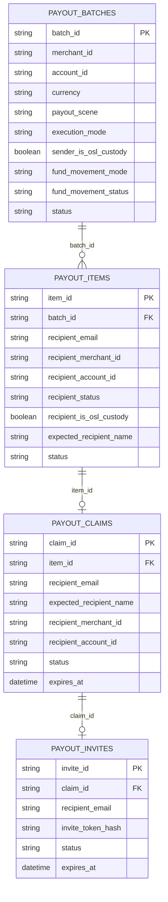

### 5.2 payout_batches 扩展
`payout_batches` 继续作为本次 payout 发起动作的主记录，改造如下：
| 字段 | 处理方式 | 中文含义 | 说明 |
| --- | --- | --- | --- |
| `batch_id` | 复用 | 这次 payout 动作的主单号 | 保持现有主键语义 |
| `merchant_id` | 复用 | 发起方商户 ID | sender 侧主体 |
| `account_id` | 复用 | 发起方出账账户 ID | 对齐 Global Account Phase 1 中 sender 选中的 `Balance Account` |
| `currency` | 复用 | 本次 payout 币种 | 如 `USDC` / `USDT` |
| `status` | 复用 | 这次 payout 动作的整体状态 | 继续承接列表/详情层整体状态 |
| `description` | 复用 | 这次 payout 的整体备注 | 保持现有语义 |
| `total_count` | 复用 | 批次内明细数 | 本场景固定为 `1` |
| `total_amount` | 复用 | 本次 payout 总金额 | 本场景等于唯一 item 的金额 |
| `service_fee_amount` | 复用 | 对商户侧展示的服务费 | 商户侧展示为 `Free`；平台内部 `fee` 分账不以“固定 0 表示无资金动作”处理，需由资金动作/对账上下文表达 |
| `debit_amount` | 复用 | sender 应扣总额 | 本期通常等于 `total_amount` |
| `frozen_amount` | 复用 | 当前冻结金额 | 未注册待 claim 场景使用 |
| `submitted_at` | 复用 | 正式提交时间 | 保持现有语义 |
| `completed_at` | 复用 | 完成时间 | 保持现有语义 |
| `payout_scene` | 新增 | 这条 batch 属于哪种 payout 业务场景 | 用于区分 `onchain_wallet` 和 `stablepay_account` |
| `execution_mode` | 新增 | 这次 `stablepay_account` payout 的执行方式 | 用于区分 `direct_transfer` 和 `invite_claim` |
| `sender_is_osl_custody` | 新增 | 发起方在创建时是否为 OSL 托管商户 | 作为真实资金动作判定快照 |
| `fund_movement_mode` | 新增 | 真实资金动作模式 | 用于区分 `osl_to_osl_via_stablepay`、`non_osl_to_non_osl_via_stablepay`、`osl_to_non_osl_via_stablepay`、`non_osl_to_osl_via_stablepay`、`hold_at_osl_platform`、`hold_at_chain_platform`、`legacy_onchain_wallet` |
| `fund_movement_status` | 新增 | 真实资金动作当前状态 | 用于区分 `not_applicable`、`pending`、`holding`、`completed`、`refunded`、`failed`；其中 `not_applicable` 仅用于历史 `onchain_wallet` 记录回填 |

本次不新增到 `payout_batches` 的字段：
- `recipient_email`
- `recipient_merchant_id`
- `recipient_account_id`
- `recipient_status`
- `expected_recipient_name`
- `claim_id`
- `invite_id`
- `claim_expires_at`
以上字段均归属于 recipient / 单条收款明细语义，保留在 `payout_items` 或 claim/invite 子表。
### 5.3 payout_items 扩展
`payout_items` 继续作为 recipient 侧 / 单条收款明细主记录，改造如下：
| 字段 | 处理方式 | 中文含义 | 说明 |
| --- | --- | --- | --- |
| `item_id` | 复用 | 明细单号 | 保持现有主键语义 |
| `batch_id` | 复用 | 所属 batch ID | 与 `payout_batches.batch_id` 关联 |
| `merchant_id` | 复用 | 发起方商户 ID | 保持现有语义 |
| `memo` | 复用 | 这条明细备注 | 保持现有语义 |
| `currency` | 复用 | 这条明细币种 | 与 batch 币种一致 |
| `amount` | 复用 | 这条明细付款金额 | 本场景唯一收款金额 |
| `service_fee_amount` | 复用 | 对商户侧展示的明细服务费 | 商户侧展示为 `Free`；平台内部 `fee` 分账不以“固定 0 表示无资金动作”处理，需由资金动作/对账上下文表达 |
| `debit_amount` | 复用 | 这条明细对应的扣款额 | 本期通常等于 `amount` |
| `status` | 复用 | 这条明细执行结果状态 | PRD 未单独定义 `payout_items.status`，本期保持兼容现有 payout 明细执行态：`pending / processing / succeeded / failed` |
| `failure_code` | 复用 | 执行失败原因编码 | 保持现有语义 |
| `failure_message` | 复用 | 执行失败原因描述 | 保持现有语义 |
| `recipient_email` | 新增 | 这条明细对应的收款邮箱 | 本次业务的核心 recipient 标识 |
| `recipient_merchant_id` | 新增 | 这条明细对应的收款商户 ID | 已注册场景创建时可确定，未注册场景 claim 成功后回填 |
| `recipient_account_id` | 新增 | 这条明细最终入账的收款账户 ID | 语义上对应原地址 payout 的 `address` 层；对齐 Global Account 默认 `Balance Account` |
| `recipient_status` | 新增 | 这条明细的收款方状态 | 如 `registered_eligible`、`registered_missing_name`、`registered_cannot_receive`、`not_registered` |
| `recipient_is_osl_custody` | 新增 | 收款方在创建或 claim 完成时是否为 OSL 托管商户 | 作为真实资金动作分流快照；未注册创建时可为空，claim 成功后回填 |
| `expected_recipient_name` | 新增 | sender 录入的预期收款商户法定名称 | 未注册场景 create 时录入，claim 时作为名字挑战校验基准 |

`payout_items` 原有但在本场景不再作为主语义使用的字段如下：
| 字段 | 当前处理方式 | 说明 |
| --- | --- | --- |
| `beneficiary_id` | 保留兼容，不作为主语义使用 | 原有受益人 ID，偏钱包地址 payout |
| `real_name` | 保留兼容，不用于替代 `expected_recipient_name` | 避免污染原有合规姓名语义 |
| `network` | 保留兼容，不作为主语义使用 | `stablepay_account` 场景不走链网络 |
| `address` | 保留兼容，不作为主语义使用 | 本场景收款目标是内部账户，不是外部钱包地址 |
| `tx_hash` | 保留兼容，不作为主语义使用 | 本场景不产生链上交易哈希 |
| `tx_from_address_id` | 保留兼容，不作为主语义使用 | 本场景不使用链上出账地址 |

**决策说明：**
- **`payout_items.status` 本期不新增 `expired / canceled / completed` 等新状态**
- 未注册场景下的 `expired / canceled` 产品语义由 `payout / claim / invite` 承接，避免打破现有明细执行态模型
- lookup 接口对外仍按 PRD 返回 `account_found / not_registered / cannot_receive / self_recipient / invalid_email`
- **`payout_items.recipient_status` 作为持久化层内部归一化状态**，映射规则如下：
  - `account_found + name_status=ok` -> `registered_eligible`
  - `account_found + name_status=missing_name` -> `registered_missing_name`
  - `cannot_receive` -> `registered_cannot_receive`
  - `not_registered` -> `not_registered`
### 5.4 新增 payout_claims
`payout_claims` 负责承接 recipient 领取生命周期。`claim` 直接从属于 `item`，不冗余 `batch_id`，`payout_items` 中也不反向保存 `claim_id`。字段如下：
| 字段 | 中文含义 | 说明 |
| --- | --- | --- |
| `claim_id` | 领取记录 ID | claim 主键 |
| `item_id` | 关联 item ID | claim 主体挂在 recipient 明细侧，作为主关联字段 |
| `recipient_email` | 领取目标邮箱 | 与 payout recipient 邮箱一致 |
| `expected_recipient_name` | 领取时需要校验的预期名称 | claim 场景校验上下文 |
| `recipient_merchant_id` | 实际领取商户 ID | claim 成功后回填 |
| `recipient_account_id` | 实际入账账户 ID | claim 成功后回填 |
| `status` | 领取状态 | `pending` / `claimed` / `canceled` / `expired` / `failed` |
| `expires_at` | 领取过期时间 | 作为 claim 主记录上的过期时间，不再要求 item 冗余保存 |
| `claimed_at` | 实际领取时间 | claim 成功时写入 |
| `canceled_at` | 取消时间 | sender 取消时写入 |

### 5.5 新增 payout_invites
`payout_invites` 负责承接邀请生命周期。`invite` 直接从属于 `claim`，不冗余 `batch_id`、`item_id`，`payout_items` 中也不反向保存 `invite_id`。字段如下：
| 字段 | 中文含义 | 说明 |
| --- | --- | --- |
| `invite_id` | 邀请记录 ID | invite 主键 |
| `claim_id` | 关联 claim ID | 邀请与领取一一关联 |
| `recipient_email` | 邀请目标邮箱 | 与 claim 目标邮箱一致 |
| `invite_token_hash` | 邀请链接 token 哈希 | 只保存 hash，不保存明文 token |
| `status` | 邀请状态 | 直接沿 PRD 使用 `active` / `used` / `expired` / `canceled` |
| `expires_at` | 邀请过期时间 | 与 claim 过期时间一致 |
| `used_at` | 邀请被使用时间 | claim 成功时写入 |
| `canceled_at` | 邀请被取消时间 | sender 取消时写入 |

说明：
- claim link 只保存 token hash，不保存明文 token
- `copy claim link` 复用现有有效 token，不重新生成 claim 关系
- `resend email` 的频率限制通过发送记录、缓存或通用 rate limit 能力承接，不在 `payout_invites` 主表中新增 `resend_count / last_sent_at`
- `invite.status` 本期直接采用 PRD 状态，不再兼容扩展为 `pending / sent / opened`
### 5.6 邀请归因处理结论
**最终结论：本期不改造邀请归因模型，也不新增 invitation 归因结果落库。**
本期只保留 payout 域内与资金领取直接相关的模型：
- `payout_batches`
- `payout_items`
- `payout_claims`
- `payout_invites`
原因如下：
1. 当前需求核心是 `transfer to account` 的创建、到账、claim、取消、过期与资金/账务闭环，不依赖额外的邀请归因结果表才能成立。
2. 邀请归因更偏向渠道模型，而不是 payout 主链路的资金状态模型；将其纳入本期会扩大改造面。
3. 现阶段业务已确认：本次不需要为 `payout invite` 再额外沉淀商户到商户的邀请关系结果。
因此，若后续产品仍需建设统一邀请归因体系，应单独立项，不纳入本次开发与发布范围。
### 5.7 枚举设计
本次新增字段涉及的核心枚举如下：
| 枚举 | 取值 | 中文含义 |
| --- | --- | --- |
| `payout_scene` | `onchain_wallet` / `stablepay_account` | 区分原有钱包地址 payout 与本次 transfer to account |
| `execution_mode` | `direct_transfer` / `invite_claim` | 区分已注册直转与未注册邀请领取 |
| `fund_movement_mode` | `osl_to_osl_via_stablepay` / `non_osl_to_non_osl_via_stablepay` / `osl_to_non_osl_via_stablepay` / `non_osl_to_osl_via_stablepay` / `hold_at_osl_platform` / `hold_at_chain_platform` / `legacy_onchain_wallet` | 区分四类已注册资金路径、两类待领取暂停路径，以及历史钱包地址 payout 兼容值 |
| `fund_movement_status` | `not_applicable` / `pending` / `holding` / `completed` / `refunded` / `failed` | 记录真实资金动作当前状态；`not_applicable` 仅用于历史 `onchain_wallet` 记录 |
| `recipient_status` | `registered_eligible` / `registered_missing_name` / `registered_cannot_receive` / `not_registered` | 区分收款方当前业务状态 |
| `claim.status` | `pending` / `claimed` / `canceled` / `expired` / `failed` | 领取状态 |
| `invite.status` | `active` / `used` / `expired` / `canceled` | 邀请状态，直接沿 PRD |

IDL、领域实体、持久化层、前端状态映射统一使用这些枚举值，避免同一语义出现多套字符串。
### 5.8 历史数据回填与 DDL 兼容
#### 5.8.1 历史数据回填
本期新增 `payout_scene` 等类型字段时，历史 wallet payout 记录需先完成数据回填，再让新代码依赖该字段。
上线顺序：
1. 先执行 DDL，新增新字段，允许旧代码兼容读写。
2. 对历史 `payout_batches` 数据执行一次回填：
   - 既有 batch 全量回填 `payout_scene = onchain_wallet`
   - 既有 batch 全量回填 `fund_movement_mode = legacy_onchain_wallet`
   - 既有 batch 全量回填 `fund_movement_status = not_applicable`
3. 新代码上线后：
   - 新建 `transfer to account` 记录写入 `payout_scene = stablepay_account`
   - 新建未注册场景写入 `execution_mode = invite_claim`
   - 新建已注册直转场景写入 `execution_mode = direct_transfer`
后续其他新增枚举字段若被历史查询、列表筛选或报表逻辑依赖，同样遵循“先回填历史数据，再切换依赖逻辑”的原则。
#### 5.8.2 邀请归因 DDL 兼容
本期无邀请归因 DDL 变更，也无历史数据回填要求。
如后续重新纳入邀请归因结果沉淀需求，应单独立项评估对应数据模型及历史数据回填方案。
#### 5.8.3 旧字段必填性检查
根据现网 DDL，现有 `payout_batches` / `payout_items` 中并不是所有旧字段都能依赖数据库默认值兼容，新场景需要区分“有默认值可直接兼容”和“必须显式写兼容值”两类字段。
`payout_batches` 中需要显式写兼容值的字段包括：
- `fee_rate`：`NOT NULL` 且无默认值
- `osl_payout_id`：`NOT NULL` 且无默认值
- `chaincore_batch_id`：`NOT NULL` 且无默认值
`payout_items` 中需要显式写兼容值的字段包括：
- `network`：`NOT NULL` 且无默认值
- `address`：`NOT NULL` 且无默认值
- `is_valid`：`NOT NULL` 且无默认值
- `validation_error`：`NOT NULL` 且无默认值
现网已带默认值、可直接兼容的典型字段包括：
- `payout_batches.network`：`NOT NULL DEFAULT ''`
- `payout_items.beneficiary_id`：`NOT NULL DEFAULT ''`
- `payout_items.real_name`：`NOT NULL DEFAULT ''`
- `payout_items.tx_hash`：`NOT NULL DEFAULT ''`
- `payout_items.tx_from_address_id`：`NOT NULL DEFAULT ''`
本期按以下口径处理：
- 数据库层面本期先不强制下掉这些旧字段的必填约束
- `stablepay_account` 场景在 Repository 写入层显式补兼容值，例如：
  - `fee_rate = 0`
  - `osl_payout_id = ''`
  - `chaincore_batch_id = ''`
  - `network = ''`
  - `address = ''`
  - `is_valid = 1`
  - `validation_error = ''`
- 应用层校验、领域校验、IDL 入参校验、Repository 写入逻辑中，对这些字段的原 batch payout 强必填假设统一改为按 `payout_scene` 条件化校验
本期补充以下上线前置检查项：
- 系统性排查 `CreateBatch / PatchBatch / SubmitBatch` 相关校验中，对 `network / address / beneficiary_id / real_name` 等字段的必填假设
- 对 `stablepay_account` 场景改为条件化校验，而不是沿用原钱包地址 payout 的强必填逻辑
### 5.9 merchantcore 识别视图
如果现有 `GetMerchantDetailInfo` 无法直接高效支撑 lookup，建议在 `merchantcore` 增加聚合查询返回：
- `merchant_id`
- `merchant_email`
- `legal_business_name`
- `business_name`
- `merchant_status`
- `kyb_status`
- `has_business_account`
- `default_balance_account_id`
- `is_eligible_to_receive_payout`
- `missing_name`
## 6. 接口设计
### 6.1 payout 接口新增/改造
#### 6.1.1 Recipient Lookup
建议新增 StablePay Account payout 专属 lookup 接口，而不是复用现有 beneficiary/address 相关接口：

```http
POST /v1/payout/stablepay-account/recipients/lookup
```

建议请求：

```json
{
  "recipient_email": "finance@abc.com",
  "source_account_id": "acc_xxx",
  "currency": "USD"
}
```

建议响应：

```json
{
  "recipient_status": "account_found",
  "display_email": "f******@abc.com",
  "display_business_name": "A*** T***** Ltd.",
  "can_receive_payouts": true,
  "arrival": "instant",
  "name_status": "ok",
  "default_balance_account_id": "acc_rcv_xxx",
  "name_challenge": {
    "required": true,
    "source_name_type": "legal_business_name",
    "masked_name": "阿【】【】巴（杭州）有限公司",
    "slot_count": 2
  }
}
```

其中：
- `recipient_status` 对外沿 PRD 表达 lookup 结果
- `name_status` 独立表达“缺名校验”维度，避免把多个概念混入一个枚举
- `display_business_name` 用于列表卡片和 review 展示，采用“轻量展示脱敏”而不是 `name_challenge` 的强校验打码规则
- `name_challenge` 仅在 `account_found + name_status = ok` 时返回
- 持久化到 `payout_items` 时，再映射为内部 `recipient_status` 枚举

`display_business_name` 建议统一按后端生成，规则如下：
- 仅用于 lookup 展示，不用于名字 challenge 校验
- 先做标准化：去首尾空格、合并连续空格
- 常见企业后缀与尾部短地区修饰保留展示，不参与主体打码，例如：
  - `Ltd.`
  - `Limited`
  - `LLC`
  - `PTE. LTD.`
  - `有限公司`
  - `（香港）有限公司`
- 英文/数字 token：
  - 保留首字符
  - 剩余字符统一替换为按长度分桶后的 `*`
  - `*` 数量不与原始长度严格一一对应，避免精确暴露词长
  - 建议分桶：
    - `1` 个字符：`保留首字符 + 1 个 *`
    - `2` 个字符：`保留首字符 + 2 个 *`
    - `3~8` 个字符：`保留首字符 + 3 个 *`
    - `>=9` 个字符：`保留首字符 + 5 个 *`
- 中文连续主体 token：
  - 长度 `1`：`保留首字符 + 1 个 *`
  - 长度 `2~3`：`保留首字符 + 2 个 *`
  - 长度 `4~6`：`保留前 2 个字符 + 2 个 *`
  - 长度 `>=7`：`保留前 2 个字符 + 3 个 *`
- 词与词之间的空格、连接符、括号等分隔符保留原样
- portal 只渲染后端返回值，不自行生成展示打码

基于 2026-06-10 `merchantcore_dev` 真实商户名样本，按上述规则演示如下：

| 场景 | 原始商户名 | `display_business_name` 展示建议 |
| --- | --- | --- |
| 英文带后缀 | `Test Merchant Ltd` | `T*** M*** Ltd` |
| 英文双词 | `Huan Merchant` | `H*** M***` |
| 中文短名 | `稳付科技` | `稳付**` |
| 英文多词 | `Test Merchant Sunborn` | `T*** M*** S***` |
| 英文混合大小写 | `Muilt channel Test2` | `M*** c*** T***` |
| 英文短词 | `my test company` | `m** t*** c***` |

说明：
- 该规则相较 `name_challenge.masked_name` 更轻，目标是降低邮箱枚举风险的同时，仍让 sender 能大致判断是否找对收款方。
- `display_business_name` 与 `name_challenge.masked_name` 故意保持两套不同强度：前者服务于展示确认，后者服务于安全校验。
#### 6.1.2 Create StablePay Account Payout
建议新增专属创建接口：

```http
POST /v1/payout/stablepay-account/payouts
```

建议请求：

```json
{
  "source_account_id": "acc_src_xxx",
  "recipient_email": "finance@abc.com",
  "currency": "USD",
  "amount": "100.00",
  "memo": "May settlement",
  "expected_recipient_name": "Alibaba (Hangzhou) Co., Ltd.",
  "name_challenge_answer": "里巴",
  "lookup_snapshot": {
    "recipient_status": "not_registered",
    "name_status": "pending_claim_input"
  }
}
```

说明：
- 前端是独立 payout 创建页，不再沿用旧版 batch create 交互
- confirm 后一次性创建 `payout_batch + payout_item`
- `expected_recipient_name` 仅 `not_registered` 场景必填，来源于 sender 录入的预期法定商户名
- `name_challenge_answer` 仅 `account_found + name_status = ok` 场景必填，用于校验 sender 是否正确识别目标商户名
create 后按执行分支处理：
- `registered_eligible` -> 直接转账
- `not_registered` -> 冻结 + 建 claim/invite + 发邮件
- `registered_missing_name / registered_cannot_receive` -> 阻止创建
#### 6.1.3 Claim
新增：

```http
POST /v1/payout/stablepay-account/claims/{claim_id}/claim
```

建议请求：

```json
{
  "name_challenge_answer": "里巴"
}
```

claim 服务端需校验：
- 当前登录账号邮箱是否与 `recipient_email` 一致
- 邮箱是否已验证
- business merchant/account 是否已创建
- 当前账户是否 eligible
- 名字 challenge answer 是否与 `expected_recipient_name` 生成的 challenge 匹配
- claim / invite / batch 状态是否有效
#### 6.1.4 Resend Invitation
新增或复用：

```http
POST /v1/payout/stablepay-account/claims/{claim_id}/resend
```

#### 6.1.5 Cancel Invite Payout
复用取消语义，但需支持 invite claim 场景的：
- payout canceled
- claim canceled
- invite canceled
- sender 解冻
### 6.2 merchantcore 接口新增/改造
建议新增 recipient lookup RPC，避免 payout 直接拼装多个 merchantcore 接口：
- `LookupRecipientByEmailForStablePayPayout`
建议返回：
- `registered`
- `merchant_id`
- `merchant_status`
- `kyb_status`
- `cannot_receive_reason`
- `default_balance_account_id`
- `business_name`
- `legal_business_name`
- `missing_name`
如果短期不新增 RPC，也可由 payout 组合：
- auth user by email
- merchant by id
- `GetMerchantDetailInfo`
- `merchant_accounts`
但组合式调用会增加 payout 侧复杂度，也更难统一错误码。
### 6.3 accountcore 接口新增/改造
本期 `accountcore` 接口层建议新增转账类能力，而不是继续由 `payout` 编排两次独立余额调整。
建议新增：
- `TransferBalance`
  - 输入：`from_account_id`、`to_account_id`、`currency`、`amount`、`biz_id`、`idem_key`、`operator`、`remark`
  - 语义：一次完成 sender 扣减与 recipient 增加
- `ConsumeFrozenAndTransferBalance`
  - 输入：`from_account_id`、`to_account_id`、`currency`、`amount`、`freeze_reference`、`biz_id`、`idem_key`、`operator`、`remark`
  - 语义：一次完成 sender 冻结余额消费与 recipient 增加
继续复用现有原语：
- 创建未注册 payout：`FreezeBalance`
- 超时/取消：`UnfreezeBalance`
因此本期 `payout` 侧需要重点补的是：
- 调用上述转账能力的业务时序与最终态定义
- `Account` 动作与真实资金动作的先后顺序
- 转账成功、真实资金失败时的补偿与重试策略
- 通过 `channelcore` 复用 OSL 接口时的幂等、状态推进与回退策略
### 6.4 communication 模板
新增模板：
- `stablepay_payout_invitation_en_us`
- `stablepay_payout_invitation_zh_cn`
- `stablepay_payout_claim_success_sender_en_us`
- `stablepay_payout_claim_expired_sender_en_us`
是否需要中英双语全量模板，视产品上线语言范围决定。
## 7. 关键流程设计
### 7.1 已注册 recipient
1. sender 在 `Payouts` 列表点击 `Create payout`。
2. 选择 `Send to StablePay Business account`。
3. 选择 source account。
4. 输入 `recipient email` 后，portal 调 payout lookup。
5. payout 调 merchantcore 识别 recipient：
   - 商户是否存在
   - 是否有 business account
   - 是否可收款
   - 名字是否缺失
   - 当前是否为 OSL 托管商户
6. 若 `account_found + name_status = ok`，payout 返回名字 challenge：
   - 名字来源固定使用 `legal_business_name`
   - portal 展示 `masked_name`
   - sender 补齐 challenge 缺失字符
7. sender 通过名字 challenge 后，映射为内部 `registered_eligible`，进入 registered review。
8. sender 确认 payout。
9. payout 创建内部记录，并按以下分支执行：
   - `sender OSL -> recipient OSL`
     - `Account` 动作：`sender selected Balance Account` 扣减，`recipient default Balance Account` 增加
     - 真实资金动作：通过 `channelcore` 执行 `sender OSL -> StablePay OSL` 共用地址 -> `recipient OSL`
   - `sender OSL -> recipient 已注册 non-OSL`
     - `Account` 动作：`sender selected Balance Account` 扣减，`recipient default Balance Account` 增加
     - 真实资金动作：`sender OSL -> StablePay OSL` 共用地址 -> `StablePay` 链上地址 -> `recipient non-OSL`
   - `sender non-OSL -> recipient 已注册 OSL`
     - `Account` 动作：`sender selected Balance Account` 扣减，`recipient default Balance Account` 增加
     - 真实资金动作：`sender non-OSL` -> `StablePay` 链上地址 -> `recipient OSL`
   - `sender non-OSL -> recipient 已注册 non-OSL`
     - `Account` 动作：`sender selected Balance Account` 扣减，`recipient default Balance Account` 增加
     - 真实资金动作：`sender non-OSL` -> `StablePay` 链上地址 -> `recipient non-OSL`
   - 平台内部资金表达统一补齐 `fee` 分账：
     - OSL 场景：`StablePay OSL Fee 地址`
     - non-OSL 场景：`StablePay` 链上 `Fee 地址`
     - GA 侧统一使用 `Transit / Fee GA`
10. payout 在所需动作全部完成后进入 `succeeded`，展示 `Payout sent` 页面和新详情页。
### 7.2 已注册但缺名
评审要求：输入邮箱时增加信息验证，已注册商户增加缺名验证。
基于当前评审信息，初版建议流程如下：
1. lookup 命中已注册商户。
2. 若 `legal_business_name` 为空、仅空白字符，或不足以生成有效 challenge，则 merchantcore 返回 `name_status = missing_name`。
3. portal 阻断继续创建，提示 recipient 先完善商户名称信息。
4. sender 不可继续 confirm。
采用阻断方案的原因：
- 已注册场景本身不应再走 claim 补资料链路
- 若允许 sender 代填名称，会引入“谁是名字事实来源”的额外争议
该点仍保留为待确认项，但初版方案正文以“阻断创建”为主。
### 7.3 未注册 recipient
1. lookup 返回 `not_registered`。
2. portal 额外要求 sender 录入 `expected_recipient_name`，作为后续 recipient claim 的名字校验基准。
3. 若金额不超过未注册 recipient 限额，sender 可进入 unregistered review。
4. review 页展示 invitation email preview、`What happens next` 以及 sender 录入的 `expected_recipient_name`。
5. sender 确认 payout。
6. confirm 后：
   - payout 创建内部记录
   - `sender` 冻结资金
   - 真实资金同步暂停在 sender 所属资金体系对应的平台公共承接点：
     - `sender OSL`：`sender OSL -> StablePay OSL` 共用地址
     - `sender non-OSL`：`sender non-OSL -> StablePay` 链上地址
   - 待领取态不执行 `fee` 分账，待 recipient 成功领取后再衔接对应已注册场景
   - claim / invite 记录创建
   - communication 发送 invitation email
7. payout 进入 `pending claim`
8. 展示 `Invitation sent` 页面，并可进入 pending claim detail。
### 7.4 未注册 recipient claim
1. recipient 通过 email link 或海报二维码打开 claim 入口。
2. 先进入 `Verify your email to claim` 页面。
3. claim 前复用现有 email verification 能力完成当前 recipient email 的验证码校验后，才能继续 claim：
   - 当前原型按 `Send code + 6 位 OTP` 交互承接
   - 本期不单独新增一套 claim 专属验证码体系
   - 验证码长度、有效期、重发频控沿用现有认证/邮箱验证码能力口径
4. 若尚未登录/注册，则进入注册承接流程。
   - 继续复用现有注册激活后端主链路
   - 前端在现有注册页上新增 `claim mode`，不直接复用完整自助注册表单
5. 若尚未创建 merchant / business account，则走 merchantcore 激活注册流程。
6. 注册消费完成后，merchantcore 通过 `ensureMerchantAccountsFromActivation` 确保 recipient 已具备 accountcore 账户与 `merchant_accounts` 映射。
7. claim 页面基于 `expected_recipient_name` 生成名字 challenge，recipient 需补齐缺失字符。
8. payout 按 sender 托管状态执行：
   - `Account` 动作：统一调用 `ConsumeFrozenAndTransferBalance`
   - 真实资金动作：按 recipient 最终地址体系，回到对应已注册场景释放
     - `recipient OSL`：衔接 OSL 对应已注册场景
     - `recipient non-OSL`：衔接 non-OSL 对应已注册场景
   - `fee` 分账也在此时一并按对应已注册场景执行
9. 更新 claim / invite / batch / item 状态为成功，并同步推进真实资金状态。
10. 展示 `Stablecoins claimed` 成功页；失败则进入 `Claim failed` 页。
### 7.5 cannot_receive
依据 PRD 附件，原因可能包括：
- `Business account not activated`
- `KYB pending`
- `KYB rejected`
- `Region unsupported`
- `Account restricted`
- `Account closed`
建议 payout lookup 返回统一 `cannot_receive + reason_code`，portal 默认展示业务可理解文案，不暴露过细内部风控细节。
**本方案按当前 PRD 主流程与既有心智处理为：**
- **`KYB pending` 属于已注册 recipient 的 `cannot_receive` 子场景**
- **该场景在 lookup 阶段即判定为不可收款，sender 不可进入 review，更不能创建 payout**
- 因此本期不展开“已注册但 KYB pending 的 recipient 先 claim、后补 KYB”这类分支设计
### 7.6 取消与过期
#### 7.6.1 sender 取消
- 仅 `pending claim` 可取消
- sender 资金解冻
- 真实资金按原暂停点原路退回：
  - `sender OSL`：`StablePay OSL` 共用地址 -> `sender OSL`
  - `sender non-OSL`：`StablePay` 链上地址 -> `sender non-OSL`
- claim / invite 一并失效
#### 7.6.2 过期
- 定时任务扫描 `expires_at`
- payout/claim/invite 更新为 `expired`
- sender 资金解冻
- 真实资金按原暂停点原路退回：
  - `sender OSL`：`StablePay OSL` 共用地址 -> `sender OSL`
  - `sender non-OSL`：`StablePay` 链上地址 -> `sender non-OSL`
### 7.7 状态流转图

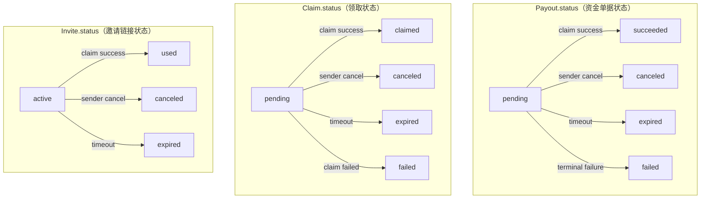

**三组状态分别挂在 `payout / claim / invite` 三个对象上；**未注册 recipient payout 创建后，会分别进入：
- `Payout.status = pending`
- `Claim.status = pending`
- `Invite.status = active`
**后续由同一业务事件分别推动三组状态同步收敛：**
- **`claim success`：`payout -> succeeded`，`claim -> claimed`，`invite -> used`**
- **`sender cancel`：`payout -> canceled`，`claim -> canceled`，`invite -> canceled`**
- **`timeout`：`payout -> expired`，`claim -> expired`，`invite -> expired`**
- **`claim failed / terminal failure`：`payout -> failed`，`claim -> failed`**
## 8. 校验与错误码
### 8.1 业务校验
依据 PRD 与附件，需覆盖：
- `recipient email` 格式校验
- `self recipient` 校验
- amount 必填
- amount > 0
- sender balance 足够
- 未注册 recipient `amount <= 1,000 USD equivalent`
- recipient 是否 eligible
- source account / payout currency 组合是否合法
- claim 时 recipient email 与 payout.recipient_email 一致
- claim 时 email_verified = true
- claim 时邮箱验证码校验复用现有 email verification 能力，当前原型按 `6 位 OTP` 交互承接
- 已注册场景下，sender 需通过基于 `legal_business_name` 的名字 challenge
- 未注册场景下，recipient 需通过基于 `expected_recipient_name` 的名字 challenge
名字校验建议拆成两类：
- `registered recipient missing name`
- `unregistered recipient claim name mismatch`
名字 challenge 规则统一如下：
- 名字源字段：
  - 已注册：`legal_business_name`
  - 未注册：sender 录入并落库的 `expected_recipient_name`
- 标准化：
  - 去首尾空格
  - 合并连续空格
  - 英文字母按大小写不敏感比对
  - 全角/半角括号统一
- challenge 生成：
  - 常见企业后缀与尾部地区修饰保留展示，不参与 challenge
  - 若标准化后有效字符长度为 `2`，展示首字符并要求输入末字符
  - 若有效字符长度大于等于 `3`，优先在主体部分中间位置选择 `2` 个连续字符作为 challenge 槽位
  - 若中间位置无法稳定取到 `2` 个连续字符，则向左扩展，不向右扩展，避免落入 `有限公司`、`LIMITED`、`LLC`、`PTE. LTD.` 等后缀区域
  - challenge 槽位默认避开首字符、尾字符以及企业后缀区域
  - portal 仅按后端返回的 `masked_name` 渲染，不自行生成 challenge
- 设计声明：
  - 由于真实商户名在语言、长度、括号/地区修饰、英文单词边界、企业后缀等方面差异较大，按固定规则生成的 `2` 个连续字符 challenge 在少量长尾名称上可能不是最自然的位置
  - 本期优先保证规则单一、实现稳定、前后端一致，不为长尾个案引入过多人工特判
  - 若后续线上反馈表明部分名字 challenge 可读性明显不足，再基于真实样本迭代更细的名称分词或模板优化规则
### 8.2 错误码设计
建议新增业务错误码：
- `recipient_invalid_email`
- `recipient_self_forbidden`
- `recipient_not_eligible`
- `recipient_name_missing`
- `recipient_name_mismatch`
- `unregistered_amount_limit_exceeded`
- `claim_email_mismatch`
- `claim_email_not_verified`
- `claim_not_eligible`
- `claim_expired`
- `claim_canceled`
- `claim_already_used`
## 9. 安全、幂等与一致性
### 9.1 安全设计
- lookup 返回值脱敏，降低邮箱枚举风险。
- claim link 仅作为入口，不作为直接领取凭证。
- invite token 仅存 hash。
- claim 必须绑定：
  - 指定 email
  - 已验证邮箱
  - 合法 business account
  - 名字校验
### 9.2 幂等设计
- create payout：请求级 idempotency key
- submit payout：batch / payout 级 idempotency key
- claim：claim_id + idem_key
- accountcore：
  - freeze / unfreeze / transfer 类接口都需 idem_key
### 9.3 一致性设计
已注册 recipient 场景：
- 本期统一由 payout 编排：
  - 调用 `accountcore.TransferBalance`
  - 编排真实资金动作（通过 `channelcore / chaincore` 现有地址承接与出账能力）
- 需要保证：
  - `TransferBalance` 调用带稳定幂等键
  - 真实资金动作也具备稳定的业务幂等上下文
  - 只有本场景要求的动作全部完成后，payout 才能落最终成功态
- 具体约束如下：
  - `sender OSL -> recipient OSL`：`Account` 动作成功、`sender OSL -> StablePay OSL` 共用地址 -> `recipient OSL` 地址成功后，才算最终成功
  - `sender OSL -> recipient 已注册 non-OSL`：`Account` 动作成功、`sender OSL -> StablePay OSL` 共用地址 -> `StablePay` 链上地址 -> `recipient non-OSL` 地址成功后，才算最终成功
  - `sender non-OSL -> recipient 已注册 OSL`：`Account` 动作成功、`sender non-OSL` 地址 -> `StablePay` 链上地址 -> `recipient OSL` 地址成功后，才算最终成功
  - `sender non-OSL -> recipient 已注册 non-OSL`：`Account` 动作成功、`sender non-OSL` 地址 -> `StablePay` 链上地址 -> `recipient non-OSL` 地址成功后，才算最终成功
未注册 recipient 场景：
- 先冻结 sender
- 创建成功还要求真实资金成功暂停在 sender 所属资金体系对应的平台公共承接点
- claim 成功后调用 `accountcore.ConsumeFrozenAndTransferBalance`
- 若最终超时/取消，还要求真实资金从原暂停点成功回退到 sender 原地址
- 因此 payout 侧需定义失败补偿：
- `ConsumeFrozenAndTransferBalance` 成功但后续真实资金状态推进失败时，claim 不应直接标记为全链路最终成功
- 平台公共承接点回退失败时，过期/取消也不应直接标记为完全成功
- 需落失败重试任务，避免资金处于“已扣未达”的中间态
## 10. 监控与埋点
### 10.1 指标
- recipient lookup 总量 / 命中率
- `account_found / not_registered / cannot_receive / missing_name` 分布
- `sender OSL / recipient OSL / recipient 非 OSL / recipient 未注册` 场景分布
- invite 创建量
- claim 成功率
- expired 数量
- resend 频次
- 平台 OSL 共用地址入池量 / 在途量 / 回退量
- 平台链上地址入池量 / 在途量 / 回退量
- 真实资金动作成功率 / 失败率 / 重试次数
### 10.2 告警
- invitation email 发送失败率
- claim 成功后入账失败
- 过期定时任务失败
- payout 与 claim 状态不一致
### 10.3 埋点
- create payout type selected
- stablepay account create entered
- source account changed
- recipient lookup triggered
- lookup result shown
- review entered
- payout confirmed
- claim opened
- claim completed
- poster created
- resend clicked
- copy claim link clicked
## 11. 部署与配置
- `merchantportal`：新增列表集成、类型选择、StablePay Account payout 前端路由与 BFF 接口配置。
- `stablepay-payout`：新增 StablePay Account payout 配置项与 claim 过期扫描任务配置。
- `merchantcore`：如新增 lookup RPC，需要同步注册服务。
- `communication`：新增模板与模板配置。
配置建议：
- 费率能力：本期不接入 merchant 侧费率配置，产品展示固定为 `Free`；平台内部仍保留 `fee` 分账表达
- 额度能力：本期不接入现有 payout quota；PRD 要求的 limit 由业务校验显式承接
- 常量治理：实现时需显式避开传统 payout 对商户收费逻辑，避免新链路误命中既有 `payouts` 费率路径；同时不得因此删除平台内部 `fee` 分账动作
## 12. 测试策略
- 单元测试
  - payout lookup 判定
  - claim 状态流转
  - amount limit 校验
  - 名字校验
- 集成测试
  - registered recipient 即时到账
  - unregistered recipient 冻结 -> 注册 -> claim
  - cancel / expire
- 回归测试
  - 现有 wallet address payouts 流程不受影响
  - `Payouts` 列表混合展示两类记录不受影响
## 13. 研发任务拆分
### 13.1 merchantportal
- 新 payout type 入口
- 新列表页类型展示与 action 展示
- 新 create/review/detail/share/claim UI
- lookup / claim / resend / cancel API 接入
### 13.2 stablepay-payout
- 新 StablePay Account payout 专属接口
- 新 lookup 服务
- 新 batch/item/claim/invite 子模型
- 新 claim/invite 状态机
- 新过期扫描任务
- 新 registered / unregistered 执行分支
- 新 `Account` 动作与真实资金动作编排
- 新平台 OSL 共用地址与平台链上地址暂停、释放、退款状态推进
- 复用 `channelcore` 现有 OSL 接口与 `chaincore` 现有平台链上地址能力
### 13.3 stablepay-merchantcore
- recipient email lookup 聚合能力
- 名字缺失判定
- claim 注册承接与账户映射复用
### 13.4 stablepay-accountcore
- 新增 `TransferBalance`
- 新增 `ConsumeFrozenAndTransferBalance`
- 继续复用 `FreezeBalance / UnfreezeBalance`
- 补足转账类接口的幂等、交易流水与错误码语义
### 13.5 stablepay-channelcore
- 本期默认不改代码
- 重点做现有接口联调确认：
  - `CreatePayout`
  - `ConfirmPayout`
  - `QueryPayout`
  - `InternalTransfer`
### 13.6 stablepay-chaincore
- 本期默认不新增产品语义
- 重点复用平台链上地址承接与出账能力，覆盖 non-OSL 侧中转、释放和回退
### 13.7 stablepay-communication
- 新模板上线
- resend 场景验证
### 13.8 stablepay-idl
- payout / merchantcore / accountcore 契约扩展
## 14. 待确认事项
当前无阻塞上线的待确认事项。
