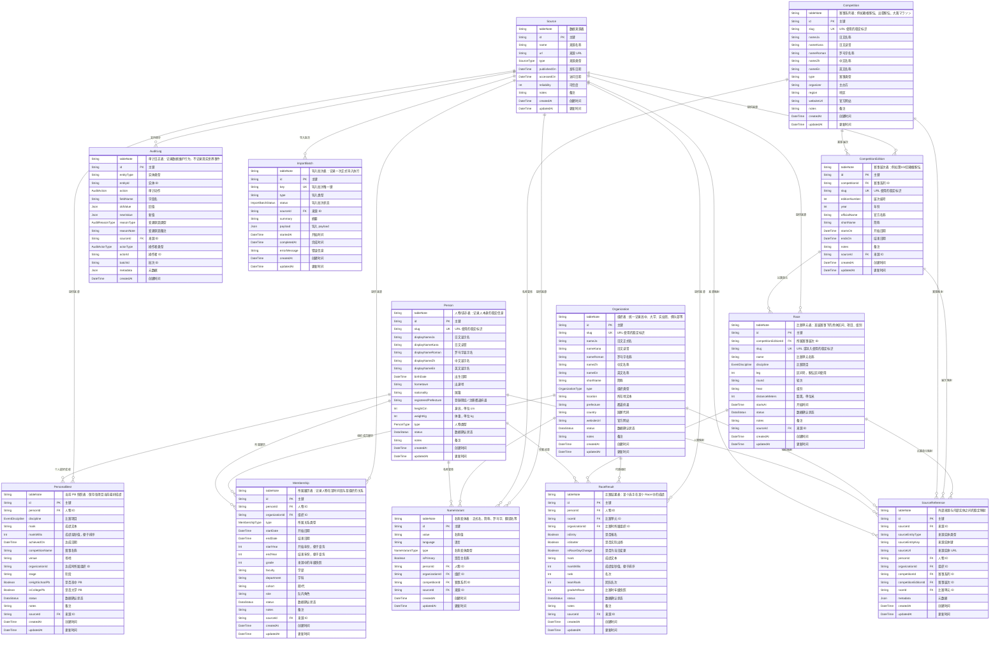

# 襷の系譜 数据模型图

更新时间：2026-06-29 15:37:31 CST

```mermaid
erDiagram
  Person {
    String tableNote "人物/选手表：记录人本身的稳定信息"
    String id PK "主键"
    String slug UK "URL 使用的稳定标识"
    String displayNameJa "日文显示名"
    String displayNameKana "日文读音"
    String displayNameRoman "罗马字显示名"
    String displayNameZh "中文显示名"
    String displayNameEn "英文显示名"
    DateTime birthDate "出生日期"
    String hometown "出身地"
    String nationality "国籍"
    String registeredPrefecture "登録陸協 / 注册都道府县"
    Int heightCm "身高，单位 cm"
    Int weightKg "体重，单位 kg"
    PersonType type "人物类型"
    DataStatus status "数据确认状态"
    String notes "备注"
    DateTime createdAt "创建时间"
    DateTime updatedAt "更新时间"
  }

  Organization {
    String tableNote "组织表：统一记录高中、大学、实业团、俱乐部等"
    String id PK "主键"
    String slug UK "URL 使用的稳定标识"
    String nameJa "日文正式名"
    String nameKana "日文读音"
    String nameRoman "罗马字名称"
    String nameZh "中文名称"
    String nameEn "英文名称"
    String shortName "简称"
    OrganizationType type "组织类型"
    String location "所在地文本"
    String prefecture "都道府县"
    String country "国家代码"
    String websiteUrl "官方网站"
    DataStatus status "数据确认状态"
    String notes "备注"
    DateTime createdAt "创建时间"
    DateTime updatedAt "更新时间"
  }

  Membership {
    String tableNote "所属履历表：记录人物在某时间段与某组织的关系"
    String id PK "主键"
    String personId FK "人物 ID"
    String organizationId FK "组织 ID"
    MembershipType type "所属关系类型"
    DateTime startDate "开始日期"
    DateTime endDate "结束日期"
    Int startYear "开始年份，便于查询"
    Int endYear "结束年份，便于查询"
    Int grade "来源中的年级快照"
    String faculty "学部"
    String department "学科"
    String cohort "期/代"
    String role "队内角色"
    DataStatus status "数据确认状态"
    String notes "备注"
    String sourceId FK "来源 ID"
    DateTime createdAt "创建时间"
    DateTime updatedAt "更新时间"
  }

  PersonalBest {
    String tableNote "当前 PB 快照表：保存各项目当前最好成绩"
    String id PK "主键"
    String personId FK "人物 ID"
    EventDiscipline discipline "比赛项目"
    String mark "成绩文本"
    Int markMillis "成绩毫秒值，便于排序"
    DateTime achievedOn "达成日期"
    String competitionName "赛事名称"
    String venue "场地"
    String organizationId "达成时所属组织 ID"
    String stage "阶段"
    Boolean isHighSchoolPb "是否高中 PB"
    Boolean isCollegePb "是否大学 PB"
    DataStatus status "数据确认状态"
    String notes "备注"
    String sourceId FK "来源 ID"
    DateTime createdAt "创建时间"
    DateTime updatedAt "更新时间"
  }

  Competition {
    String tableNote "赛事系列表：例如箱根駅伝、出雲駅伝、大阪マラソン"
    String id PK "主键"
    String slug UK "URL 使用的稳定标识"
    String nameJa "日文名称"
    String nameKana "日文读音"
    String nameRoman "罗马字名称"
    String nameZh "中文名称"
    String nameEn "英文名称"
    String type "赛事类型"
    String organizer "主办方"
    String region "地区"
    String websiteUrl "官方网站"
    String notes "备注"
    DateTime createdAt "创建时间"
    DateTime updatedAt "更新时间"
  }

  CompetitionEdition {
    String tableNote "赛事届次表：例如第102回箱根駅伝"
    String id PK "主键"
    String competitionId FK "赛事系列 ID"
    String slug UK "URL 使用的稳定标识"
    Int editionNumber "届次编号"
    Int year "年份"
    String officialName "官方名称"
    String shortName "简称"
    DateTime startsOn "开始日期"
    DateTime endsOn "结束日期"
    String notes "备注"
    String sourceId FK "来源 ID"
    DateTime createdAt "创建时间"
    DateTime updatedAt "更新时间"
  }

  Race {
    String tableNote "比赛单元表：某届赛事下的具体区间、项目、组别"
    String id PK "主键"
    String competitionEditionId FK "所属赛事届次 ID"
    String slug UK "URL 或导入使用的稳定标识"
    String name "比赛单元名称"
    EventDiscipline discipline "比赛项目"
    Int leg "区间号，駅伝区间使用"
    String round "轮次"
    String heat "组别"
    Int distanceMeters "距离，单位米"
    DateTime startsAt "开始时间"
    DataStatus status "数据确认状态"
    String notes "备注"
    String sourceId FK "来源 ID"
    DateTime createdAt "创建时间"
    DateTime updatedAt "更新时间"
  }

  RaceResult {
    String tableNote "比赛结果表：某个选手在某个 Race 中的成绩"
    String id PK "主键"
    String personId FK "人物 ID"
    String raceId FK "比赛单元 ID"
    String organizationId FK "比赛时所属组织 ID"
    Boolean isEntry "是否报名"
    Boolean isStarter "是否实际出场"
    Boolean isRaceDayChange "是否为当日変更"
    String mark "成绩文本"
    Int markMillis "成绩毫秒值，便于排序"
    Int rank "名次"
    Int teamRank "团队名次"
    Int gradeAtRace "比赛时年级快照"
    DataStatus status "数据确认状态"
    String notes "备注"
    String sourceId FK "来源 ID"
    DateTime createdAt "创建时间"
    DateTime updatedAt "更新时间"
  }

  Source {
    String tableNote "数据来源表"
    String id PK "主键"
    String name "来源名称"
    String url "来源 URL"
    SourceType type "来源类型"
    DateTime publishedOn "发布日期"
    DateTime accessedOn "访问日期"
    Int reliability "可信度"
    String notes "备注"
    DateTime createdAt "创建时间"
    DateTime updatedAt "更新时间"
  }

  NameVariant {
    String tableNote "名称变体表：正式名、简称、罗马字、翻译名等"
    String id PK "主键"
    String value "名称值"
    String language "语言"
    NameVariantType type "名称变体类型"
    Boolean isPrimary "是否主名称"
    String personId FK "人物 ID"
    String organizationId FK "组织 ID"
    String competitionId FK "赛事系列 ID"
    String sourceId FK "来源 ID"
    DateTime createdAt "创建时间"
    DateTime updatedAt "更新时间"
  }

  AuditLog {
    String tableNote "审计日志表：记录数据维护行为，不记录现实世界事件"
    String id PK "主键"
    String entityType "实体类型"
    String entityId "实体 ID"
    AuditAction action "审计动作"
    String fieldName "字段名"
    Json oldValue "旧值"
    Json newValue "新值"
    AuditReasonType reasonType "变更原因类型"
    String reasonNote "变更原因备注"
    String sourceId FK "来源 ID"
    AuditActorType actorType "操作者类型"
    String actorId "操作者 ID"
    String batchId "批次 ID"
    Json metadata "元数据"
    DateTime createdAt "创建时间"
  }

  SourceReference {
    String tableNote "外部来源与内部实体之间的稳定映射"
    String id PK "主键"
    String sourceId FK "来源 ID"
    String sourceEntityType "来源实体类型"
    String sourceEntityKey "来源实体键"
    String sourceUrl "来源实体 URL"
    String personId FK "人物 ID"
    String organizationId FK "组织 ID"
    String competitionId FK "赛事系列 ID"
    String competitionEditionId FK "赛事届次 ID"
    String raceId FK "比赛单元 ID"
    Json metadata "元数据"
    DateTime createdAt "创建时间"
    DateTime updatedAt "更新时间"
  }

  ImportBatch {
    String tableNote "导入批次表：记录一次正式导入执行"
    String id PK "主键"
    String key UK "导入批次唯一键"
    String type "导入类型"
    ImportBatchStatus status "导入批次状态"
    String sourceId FK "来源 ID"
    String summary "摘要"
    Json payload "导入 payload"
    DateTime startedAt "开始时间"
    DateTime completedAt "完成时间"
    String errorMessage "错误信息"
    DateTime createdAt "创建时间"
    DateTime updatedAt "更新时间"
  }

  Person ||--o{ Membership : "所属履历"
  Organization ||--o{ Membership : "组织成员履历"
  Source ||--o{ Membership : "提供来源"

  Person ||--o{ PersonalBest : "个人最好成绩"
  Source ||--o{ PersonalBest : "提供来源"

  Competition ||--o{ CompetitionEdition : "赛事届次"
  CompetitionEdition ||--o{ Race : "比赛单元"
  Source ||--o{ CompetitionEdition : "提供来源"
  Source ||--o{ Race : "提供来源"

  Person ||--o{ RaceResult : "参赛结果"
  Race ||--o{ RaceResult : "比赛成绩"
  Organization ||--o{ RaceResult : "代表组织"
  Source ||--o{ RaceResult : "提供来源"

  Person ||--o{ NameVariant : "名称变体"
  Organization ||--o{ NameVariant : "名称变体"
  Competition ||--o{ NameVariant : "名称变体"
  Source ||--o{ NameVariant : "提供来源"

  Source ||--o{ AuditLog : "支持审计"

  Source ||--o{ SourceReference : "来源映射"
  Person ||--o{ SourceReference : "人物映射"
  Organization ||--o{ SourceReference : "组织映射"
  Competition ||--o{ SourceReference : "赛事映射"
  CompetitionEdition ||--o{ SourceReference : "届次映射"
  Race ||--o{ SourceReference : "比赛单元映射"

  Source ||--o{ ImportBatch : "导入批次"
```
