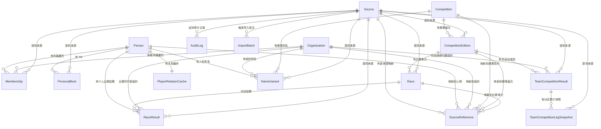

# 襷の系譜 数据模型图

更新时间：2026-07-01 CST

说明：这是一版“中文解释版”数据模型文档。内容按当前项目 `/Users/xuhuan/workspace_new/project/tasuki-keifu/prisma/schema.prisma` 与最新迁移整理，重点补充每张表、主要字段、枚举值的中文含义，方便直接阅读。

## 这套模型在管什么

这套数据模型主要在管 5 类东西：

1. 人和组织
   `Person` 记录选手/教练/工作人员，`Organization` 记录初中、高中、大学、实业团、会社、俱乐部等组织。
2. 人和组织之间的关系
   `Membership` 记录“某人在某段时间属于某个组织”的履历。
3. 比赛与成绩
   `Competition`、`CompetitionEdition`、`Race` 记录赛事结构，`RaceResult`、`PersonalBest` 记录个人成绩，`TeamCompetitionResult`、`TeamCompetitionLegSnapshot` 记录队伍成绩。
4. 来源与数据治理
   `Source`、`SourceReference`、`AuditLog`、`ImportBatch` 用来记录数据从哪来、怎么导入、怎么改过。
5. 派生内容
   `PlayerRelationCache` 用来缓存“选手关系”这类计算结果。

## 先看关系图

## 表说明

### 1. Person

用途：人物主表。记录一个人本身比较稳定的信息。

常见场景：
- 一个选手一条 `Person`
- 一个教练一条 `Person`
- 一个队伍经理如果要记录，也是一条 `Person`

主要字段：

| 字段 | 中文含义 |
| --- | --- |
| `id` | 主键 |
| `slug` | 稳定标识，一般用于 URL |
| `displayNameJa` | 日文显示名 |
| `displayNameKana` | 日文假名读音 |
| `displayNameRoman` | 罗马字名 |
| `displayNameZh` | 中文名 |
| `displayNameEn` | 英文名 |
| `birthDate` | 出生日期 |
| `hometown` | 出身地 |
| `nationality` | 国籍 |
| `heightCm` | 身高，厘米 |
| `weightKg` | 体重，公斤 |
| `type` | 人物类型 |
| `status` | 数据确认状态 |
| `notes` | 备注 |
| `createdAt` | 创建时间 |
| `updatedAt` | 更新时间 |

补充说明：
- 旧版本里提到的 `registeredPrefecture` 现在已经没有了。

### 2. Organization

用途：组织主表。把学校、大学、实业团、公司、俱乐部等统一成一种实体。

主要字段：

| 字段 | 中文含义 |
| --- | --- |
| `id` | 主键 |
| `slug` | 稳定标识 |
| `nameJa` | 日文正式名 |
| `nameKana` | 日文读音 |
| `nameRoman` | 罗马字名称 |
| `nameZh` | 中文名称 |
| `nameEn` | 英文名称 |
| `shortName` | 简称 |
| `type` | 组织类型 |
| `location` | 所在地文本 |
| `prefecture` | 都道府县 |
| `country` | 国家代码，默认 `JP` |
| `websiteUrl` | 官网 |
| `status` | 数据确认状态 |
| `notes` | 备注 |

### 3. Membership

用途：所属履历表。记录“这个人在这段时间属于这个组织”。

例子：
- 某人 2021 年到 2024 年就读青山学院大学
- 某人高中阶段属于佐久长圣高校
- 某人后来加入某实业团

主要字段：

| 字段 | 中文含义 |
| --- | --- |
| `personId` | 对应哪一个人 |
| `organizationId` | 对应哪一个组织 |
| `type` | 关系类型 |
| `startDate` | 开始日期 |
| `endDate` | 结束日期 |
| `startYear` | 开始年份，方便查询 |
| `endYear` | 结束年份，方便查询 |
| `faculty` | 学部 |
| `department` | 学科 |
| `cohort` | 第几期/第几代 |
| `role` | 在这段组织关系中的身份 |
| `status` | 数据确认状态 |
| `sourceId` | 来源 |

补充说明：
- 旧文档里的 `grade` 已删除。
- 当前 `role` 不是自由填写，而是固定枚举。

### 4. PersonalBest

用途：个人最好成绩快照表。只保留某人在某个项目下“当前最佳”的记录。

主要字段：

| 字段 | 中文含义 |
| --- | --- |
| `personId` | 对应人物 |
| `discipline` | 比赛项目 |
| `mark` | 成绩原文，如 `28:12.34` |
| `markMillis` | 方便排序和比较的毫秒值 |
| `achievedOn` | 达成日期 |
| `competitionName` | 赛事名称 |
| `venue` | 场地 |
| `organizationId` | 当时所属组织 ID，仅作快照记录 |
| `stage` | 比赛阶段 |
| `isHighSchoolPb` | 是否是高中阶段 PB |
| `isCollegePb` | 是否是大学阶段 PB |
| `status` | 数据确认状态 |
| `sourceId` | 来源 |

补充说明：
- 当前 Prisma 中 `PersonalBest.organizationId` 只是字段，没有正式外键关系。

### 5. Competition

用途：赛事系列表。表示一个赛事品牌或系列。

例子：
- 箱根駅伝
- 出雲駅伝
- 全国高校駅伝
- 大阪马拉松

主要字段：

| 字段 | 中文含义 |
| --- | --- |
| `slug` | 稳定标识 |
| `nameJa` | 日文名 |
| `nameZh` | 中文名 |
| `type` | 赛事系列类型 |
| `organizer` | 主办方 |
| `region` | 地区 |
| `websiteUrl` | 官网 |

### 6. CompetitionEdition

用途：赛事届次表。表示这个赛事在某一年、某一届的具体实例。

例子：
- 第 102 回箱根駅伝
- 2025 大阪马拉松

主要字段：

| 字段 | 中文含义 |
| --- | --- |
| `competitionId` | 属于哪个赛事系列 |
| `slug` | 稳定标识 |
| `editionNumber` | 第几届 |
| `year` | 年份 |
| `officialName` | 官方全名 |
| `shortName` | 简称 |
| `startsOn` | 开始日期 |
| `endsOn` | 结束日期 |
| `sourceId` | 来源 |

### 7. Race

用途：比赛单元表。表示某届赛事下更细的一场比赛、一个区间、一个组别。

例子：
- 箱根駅伝 5 区
- 男子 10000m 第 4 组

主要字段：

| 字段 | 中文含义 |
| --- | --- |
| `competitionEditionId` | 属于哪个赛事届次 |
| `slug` | 稳定标识 |
| `name` | 比赛单元名称 |
| `discipline` | 比赛项目 |
| `leg` | 第几区，駅伝常用 |
| `round` | 轮次，如预选、决赛 |
| `heat` | 第几组 |
| `distanceMeters` | 距离，米 |
| `startsAt` | 开始时间 |
| `status` | 数据确认状态 |
| `sourceId` | 来源 |

### 8. RaceResult

用途：个人比赛结果表。记录“某个人在某个 `Race` 里的成绩”。

主要字段：

| 字段 | 中文含义 |
| --- | --- |
| `personId` | 对应人物 |
| `raceId` | 对应比赛单元 |
| `organizationId` | 比赛时代表的组织 |
| `isEntry` | 是否报名 |
| `isStarter` | 是否实际出场 |
| `isRaceDayChange` | 是否为比赛当天变更 |
| `mark` | 成绩文本 |
| `markMillis` | 成绩毫秒值 |
| `rank` | 名次 |
| `teamRank` | 所属队伍名次 |
| `gradeAtRace` | 比赛时年级快照 |
| `status` | 数据确认状态 |
| `notes` | 备注，如区間賞、区間新 |
| `sourceId` | 来源 |

### 9. TeamCompetitionResult

用途：队伍总成绩表。记录一个组织在某一届赛事中的最终队伍成绩。

常见场景：
- 记录青山学院大学在某届箱根駅伝的总成绩和最终排名

主要字段：

| 字段 | 中文含义 |
| --- | --- |
| `competitionEditionId` | 对应赛事届次 |
| `organizationId` | 对应组织 |
| `finalRank` | 最终名次 |
| `finalMark` | 最终总成绩文本 |
| `finalMarkMillis` | 最终总成绩毫秒值 |
| `status` | 数据确认状态 |
| `sourceId` | 来源 |

补充说明：
- 同一个“赛事届次 + 组织”只能有一条记录。

### 10. TeamCompetitionLegSnapshot

用途：队伍分区快照表。记录队伍跑完第 N 区之后的累计状态。

主要字段：

| 字段 | 中文含义 |
| --- | --- |
| `teamCompetitionResultId` | 对应哪条队伍总成绩 |
| `leg` | 第几区 |
| `cumulativeRank` | 跑完这一段后的累计排名 |
| `cumulativeMark` | 跑完这一段后的累计成绩文本 |
| `cumulativeMarkMillis` | 累计成绩毫秒值 |
| `gapFromLeader` | 与第一名差距文本 |
| `gapFromLeaderMillis` | 与第一名差距毫秒值 |
| `status` | 数据确认状态 |
| `sourceId` | 来源 |

### 11. PlayerRelationCache

用途：选手关系缓存表。不是原始事实表，而是把计算出来的关系结果缓存下来，方便页面直接读。

主要字段：

| 字段 | 中文含义 |
| --- | --- |
| `personId` | 对应哪个人 |
| `payload` | 缓存的关系结果 JSON |
| `generatedAt` | 生成时间 |
| `sourceHash` | 用于判断缓存是否过期的哈希 |

补充说明：
- 一个 `Person` 最多对应一条关系缓存。

### 12. Source

用途：数据来源表。记录这条数据来自哪里。

主要字段：

| 字段 | 中文含义 |
| --- | --- |
| `name` | 来源名称 |
| `url` | 来源链接 |
| `type` | 来源类型 |
| `publishedOn` | 来源发布时间 |
| `accessedOn` | 抓取/访问时间 |
| `reliability` | 可信度，默认 3 |
| `notes` | 备注 |

### 13. NameVariant

用途：名称变体表。解决“同一个东西有很多种叫法”的问题。

例子：
- 同一个人有正式日文名、媒体写法、中文译名
- 同一个学校有简称和全称

主要字段：

| 字段 | 中文含义 |
| --- | --- |
| `value` | 名称值本身 |
| `language` | 语言 |
| `type` | 名称变体类型 |
| `isPrimary` | 是否是主用名称 |
| `personId` | 如果这条别名属于人，则挂这里 |
| `organizationId` | 如果属于组织，则挂这里 |
| `competitionId` | 如果属于赛事，则挂这里 |
| `sourceId` | 来源 |

### 14. AuditLog

用途：审计日志表。记录“数据是怎么被创建、修改、合并、拆分的”。

注意：
- 它记录的是数据维护行为，不是现实世界发生的比赛事件。

主要字段：

| 字段 | 中文含义 |
| --- | --- |
| `entityType` | 被操作的实体类型，如 `Person`、`Organization` |
| `entityId` | 被操作实体的 ID |
| `action` | 做了什么动作 |
| `fieldName` | 改的是哪个字段 |
| `oldValue` | 修改前的值 |
| `newValue` | 修改后的值 |
| `reasonType` | 变更原因类型 |
| `reasonNote` | 原因备注 |
| `sourceId` | 依据哪个来源改的 |
| `actorType` | 谁改的 |
| `actorId` | 操作者 ID |
| `batchId` | 批次号 |
| `metadata` | 补充信息 JSON |
| `createdAt` | 记录创建时间 |

### 15. SourceReference

用途：外部来源映射表。把外部网站里的一个实体，稳定地映射到系统内部实体。

例子：
- 某大学官网球员页上的某个选手，对应系统里的哪个 `Person`
- 某 PDF 里的一场比赛，对应系统里的哪个 `Race`

主要字段：

| 字段 | 中文含义 |
| --- | --- |
| `sourceId` | 来自哪个来源 |
| `sourceEntityType` | 外部来源里的实体类型 |
| `sourceEntityKey` | 外部来源里的稳定键 |
| `sourceUrl` | 外部实体 URL |
| `personId` | 若映射到人物，则填这里 |
| `organizationId` | 若映射到组织，则填这里 |
| `competitionId` | 若映射到赛事系列，则填这里 |
| `competitionEditionId` | 若映射到赛事届次，则填这里 |
| `raceId` | 若映射到比赛单元，则填这里 |
| `metadata` | 补充信息 JSON |

补充说明：
- 同一个 `sourceId + sourceEntityType + sourceEntityKey` 只能映射一次。

### 16. ImportBatch

用途：导入批次表。记录一次正式导入执行的全过程。

主要字段：

| 字段 | 中文含义 |
| --- | --- |
| `key` | 导入批次唯一键 |
| `type` | 导入类型 |
| `status` | 导入状态 |
| `sourceId` | 来源 |
| `summary` | 摘要 |
| `payload` | 本次导入的原始载荷 |
| `startedAt` | 开始时间 |
| `completedAt` | 完成时间 |
| `errorMessage` | 错误信息 |

## 枚举中文说明

### DataStatus

数据确认状态：

| 值 | 中文含义 |
| --- | --- |
| `verified` | 已核实 |
| `pending` | 待确认 |
| `conflicting` | 有冲突，多个来源不一致 |
| `missing` | 数据缺失 |

### PersonType

人物类型：

| 值 | 中文含义 |
| --- | --- |
| `athlete` | 选手 |
| `coach` | 教练 |
| `staff` | 工作人员/管理人员 |

### MembershipRole

所属关系中的身份：

| 值 | 中文含义 |
| --- | --- |
| `athlete` | 以选手身份属于该组织 |
| `coach` | 以教练身份属于该组织 |
| `staff` | 以工作人员身份属于该组织 |

### OrganizationType

组织类型：

| 值 | 中文含义 |
| --- | --- |
| `junior_high_school` | 初中 |
| `high_school` | 高中 |
| `university` | 大学 |
| `corporate_team` | 实业团/企业田径队 |
| `company` | 公司法人主体 |
| `club` | 俱乐部 |
| `federation` | 协会/联合会 |
| `organizer` | 赛事主办方类组织 |

### MembershipType

人物和组织之间的关系类型：

| 值 | 中文含义 |
| --- | --- |
| `origin` | 出身/来源组织 |
| `enrolled` | 入学/在籍 |
| `affiliated` | 隶属/效力 |
| `graduated` | 毕业于 |
| `staff` | 以工作人员身份任职 |

### NameVariantType

名称变体类型：

| 值 | 中文含义 |
| --- | --- |
| `official` | 正式名称 |
| `short` | 简称 |
| `kana` | 假名写法 |
| `romanized` | 罗马字写法 |
| `chinese` | 中文译名 |
| `english` | 英文名称 |
| `former` | 曾用名 |
| `media` | 媒体常用写法 |

### SourceType

来源类型：

| 值 | 中文含义 |
| --- | --- |
| `university_official` | 大学官网/大学官方资料 |
| `hakone_official` | 箱根駅伝官方来源 |
| `ntv` | 日本电视台 NTV 来源 |
| `jaaf` | 日本田联来源 |
| `rikujokyogi_magazine` | 《月刊陸上競技》等专业媒体 |
| `data_site` | 数据网站 |
| `fan_site` | 爱好者网站 |
| `pdf` | PDF 文件来源 |
| `manual` | 人工录入 |

### EventDiscipline

比赛项目：

| 值 | 中文含义 |
| --- | --- |
| `m1500` | 男子 1500 米 |
| `m3000` | 男子 3000 米 |
| `m3000sc` | 男子 3000 米障碍 |
| `m5000` | 男子 5000 米 |
| `m10000` | 男子 10000 米 |
| `ten_mile` | 10 英里 |
| `half_marathon` | 半程马拉松 |
| `marathon` | 马拉松 |
| `ekiden_leg` | 駅伝区间 |

### CompetitionType

赛事系列类型：

| 值 | 中文含义 |
| --- | --- |
| `university_ekiden` | 大学駅伝 |
| `high_school_ekiden` | 高校駅伝 |
| `corporate_ekiden` | 实业团駅伝 |
| `mixed_ekiden` | 综合/混合駅伝 |
| `track_meet` | 场地赛 |
| `road_race` | 公路赛 |
| `marathon` | 马拉松 |

### AuditAction

审计动作：

| 值 | 中文含义 |
| --- | --- |
| `create` | 创建 |
| `update` | 更新 |
| `delete` | 删除 |
| `verify` | 核实确认 |
| `merge` | 合并实体 |
| `split` | 拆分实体 |

### AuditReasonType

审计原因类型：

| 值 | 中文含义 |
| --- | --- |
| `initial_entry` | 初次录入 |
| `source_update` | 来源更新导致变更 |
| `source_correction` | 来源更正导致变更 |
| `stale_source` | 旧来源过时，已替换 |
| `manual_error` | 人工修正错误 |
| `format_normalization` | 格式标准化 |
| `translation_update` | 翻译更新 |
| `verification_update` | 核验状态更新 |
| `entity_merge` | 实体合并 |
| `entity_split` | 实体拆分 |
| `import` | 导入过程产生 |
| `system` | 系统自动产生 |

### AuditActorType

操作者类型：

| 值 | 中文含义 |
| --- | --- |
| `admin` | 管理员/人工操作 |
| `import_script` | 导入脚本 |
| `system` | 系统自动处理 |

### ImportBatchStatus

导入批次状态：

| 值 | 中文含义 |
| --- | --- |
| `pending` | 待执行 |
| `running` | 执行中 |
| `completed` | 已完成 |
| `failed` | 失败 |

## 当前版本相对旧稿的关键变化

- `Person.registeredPrefecture` 已删除
- `Membership.grade` 已删除
- `Membership.role` 现在是固定枚举，不再是自由文本
- `Competition.type` 现在是固定枚举，不再是自由文本
- 新增 `TeamCompetitionResult`
- 新增 `TeamCompetitionLegSnapshot`
- 新增 `PlayerRelationCache`

## 一句话理解

如果只记核心脉络，可以这么看：

- `Person` 是“人”
- `Organization` 是“学校/队伍/机构”
- `Membership` 是“人在哪个阶段属于哪个组织”
- `Competition -> CompetitionEdition -> Race` 是“赛事系列 -> 某一届 -> 某一场/某一区”
- `RaceResult` 是“人在比赛中的成绩”
- `TeamCompetitionResult` 是“队伍在整届赛事中的总成绩”
- `Source` 是“这条数据从哪来”
