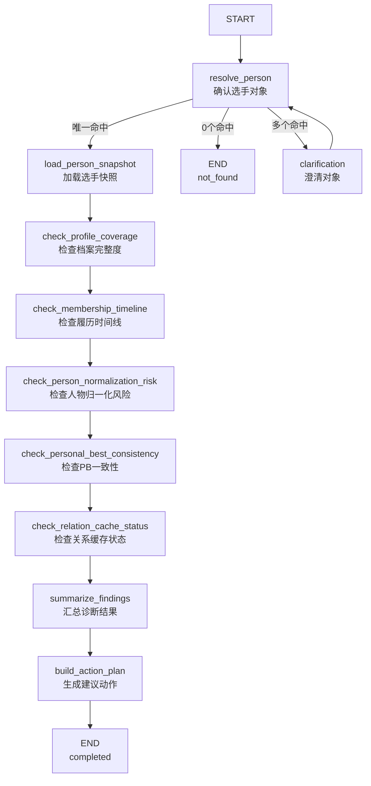

# tasuki-keifu Agent V1 技术方案

## 1. 当前目标

为 `tasuki-keifu` 先落地一个内部使用的业务型 Agent。

第一阶段不做前台聊天产品，不做开放式问答，不做通用 Agent 平台。

第一阶段只做：

> 面向数据维护与资料诊断的内部 Agent。

当前优先场景固定为：

> `person diagnosis graph`

即：

- 输入一个选手对象（`person slug / person id / person name`）
- 诊断该选手当前资料状态
- 汇总异常与风险
- 给出建议动作

### 1.1 为什么先做这个场景

当前 `tasuki-keifu` 已经具备以下现成资产：

1. 主业务事实库与 Prisma 模型
2. 大量可复用的 maintenance / audit 脚本
3. 明确的数据审计与来源策略文档
4. 已经存在的关系缓存与日志观测基础

因此 V1 不需要从零发明业务流程，更适合先把这些既有能力封装进一个强约束 graph。

## 2. 方案定位

本方案定位为：

- 业务型 Agent
- 单 Agent
- 强约束 graph
- 内部工具形态

不是：

- ToC 聊天产品
- 通用 Agent 平台
- 多 Agent 协作系统

## 3. V1 范围

### 3.1 要做的内容

1. 基于 `LangGraph` 搭建 `person diagnosis graph`
2. 使用独立仓库承载 Agent 工程
3. 业务事实继续读取 `tasuki-keifu` 主业务库
4. Agent 运行数据写入独立 `database`
5. 接入最小可观测能力
6. 输出结构化诊断结果和建议动作

### 3.2 暂时不做的内容

1. 自动修库
2. 前台对话入口
3. organization / race / import batch 的完整 graph
4. 通用 MCP tool 平台
5. 完整评测平台
6. 多 Agent

## 4. 技术选型

### 4.1 主框架

- `LangGraph`

原因：

- 更适合通用型 harness
- 更适合 graph / state / checkpoint / interrupt 结构
- 比 OpenAI Agents SDK 更符合企业通用运行骨架目标

### 4.2 语言与运行环境

- `TypeScript`
- 内部 CLI / admin 入口优先

原因：

- 与 `tasuki-keifu` 主项目技术栈一致
- 便于复用现有查询逻辑和脚本能力

### 4.3 可观测

- `LangSmith`：记录 graph trace、node path、tool call、error path
- 结构化日志：记录运行日志
- Agent 数据库：记录 run / checkpoint / diagnosis result

## 5. 部署与仓库结构

### 5.1 仓库

Agent 使用独立仓库：

- `tasuki-keifu-agent`

### 5.2 数据库

使用独立 database：

- `tasuki_keifu`：主业务事实库
- `tasuki_keifu_agent`：Agent 运行库

当前约定：

- Agent 对主业务库先只读
- Agent 运行库负责保存运行态数据

### 5.3 部署

V1 先与主业务同机部署，但独立进程或独立容器运行。

当前不要求独立实例。

## 6. person diagnosis graph V1

### 6.1 输入

- `personSlug`
- `personId`
- `personName`

### 6.2 输出

1. 诊断发现的问题列表
2. 当前对象的数据状态摘要
3. 建议动作列表

### 6.3 graph 节点草案

1. `resolve_person`
2. `load_person_snapshot`
3. `check_profile_coverage`
4. `check_membership_timeline`
5. `check_person_normalization_risk`
6. `check_personal_best_consistency`
7. `check_relation_cache_status`
8. `summarize_findings`
9. `build_action_plan`

说明：

- `person normalization` 在 V1 纳入 graph，但定位为风险发现节点
- V1 不自动执行 merge / split / normalize 修复

### 6.4 graph 流转草案

当前 V1 流转固定如下：

1. `resolve_person`
   - 若唯一命中，进入 `load_person_snapshot`
   - 若 0 个命中，直接结束并返回 `not_found`
   - 若多个命中，进入 `clarification`
2. `clarification`
   - 用户补充更精确对象信息
   - 回到 `resolve_person`
3. `load_person_snapshot`
   - 拉取统一事实快照
4. 进入 5 个检查节点：
   - `check_profile_coverage`
   - `check_membership_timeline`
   - `check_person_normalization_risk`
   - `check_personal_best_consistency`
   - `check_relation_cache_status`
5. `summarize_findings`
6. `build_action_plan`
7. `END`

V1 原则：

- 只有 `resolve_person` 会触发 `clarification`
- 其余检查节点不在 V1 中断
- 所有检查节点只追加 findings，不直接修复数据

### 6.5 graph Mermaid



## 7. V1 tools 草案

### 7.1 查询型 tool

1. `resolve_person_tool`
2. `load_person_snapshot_tool`
3. `check_relation_cache_tool`

### 7.2 脚本包装型 tool

4. `audit_profile_coverage_tool`
5. `audit_membership_timeline_tool`
6. `audit_person_normalization_risk_tool`
7. `audit_personal_best_consistency_tool`

### 7.3 暂缓接入

- 自动执行型 `person_normalization_tool`

原因：

- 当前能力分散在多个 merge / normalize / fix 脚本里
- V1 先做风险发现，不做自动修复

## 8. Agent State 最小草案

```ts
type PersonDiagnosisState = {
  input: {
    personSlug?: string;
    personId?: string;
    personName?: string;
    triggeredBy?: "cli" | "admin_api";
  };

  target: {
    personId: string | null;
    personSlug: string | null;
    resolved: boolean;
  };

  snapshot: {
    profile?: unknown;
    memberships?: unknown[];
    personalBests?: unknown[];
    relationCache?: unknown | null;
  };

  findings: DiagnosisIssue[];

  actions: SuggestedAction[];

  runtime: {
    runId: string;
    status: "running" | "need_clarification" | "completed" | "failed";
    currentNode: string;
    startedAt: string;
    errorMessage?: string;
  };
};
```

## 9. 当前已确认的共识

1. 先做数据运营 / 数据维护 Agent，而不是前台聊天 Agent
2. 先做业务型 graph，再考虑抽通用 harness
3. graph 先横向扩展，再局部纵向加深
4. 先做 person diagnosis，再扩 organization diagnosis
5. relation cache 先作为 person diagnosis 的子检查项
6. 先诊断，后执行
7. V1 不直接写主业务库
8. 单独仓库
9. 单独 agent database
10. LangSmith 在 V1 即接入

## 10. 下一步待确认项

1. CLI 入口形态
2. 主业务仓库与 agent 仓库的连接方式

## 11. Tool Contract（V1）

### 统一返回结构

```ts
type ToolResult<T> = {
  ok: boolean;
  data?: T;
  error?: {
    code: string;
    message: string;
  };
};
```

### `resolve_person_tool`

输入：

```ts
{
  personSlug?: string;
  personId?: string;
  personName?: string;
}
```

输出：

```ts
{
  matchType: "unique" | "multiple" | "not_found";
  person?: {
    personId: string;
    personSlug: string;
    displayNameJa: string;
  };
  candidates?: Array<{
    personId: string;
    personSlug: string;
    displayNameJa: string;
  }>;
}
```

### `load_person_snapshot_tool`

输入：

```ts
{
  personId: string;
}
```

输出：

```ts
{
  profile: Record<string, unknown>;
  memberships: Array<Record<string, unknown>>;
  personalBests: Array<Record<string, unknown>>;
  relationCache: Record<string, unknown> | null;
}
```

### 审计型 tool 的统一输出

```ts
{
  findings: DiagnosisIssue[];
}
```

### `check_relation_cache_tool`

输入：

```ts
{
  personId: string;
}
```

输出：

```ts
{
  findings: DiagnosisIssue[];
  cacheStatus: "fresh" | "stale" | "missing" | "invalid";
}
```

## 12. DiagnosisIssue / SuggestedAction（V1）

### `DiagnosisIssue`

```ts
type DiagnosisIssue = {
  category:
    | "profile_coverage"
    | "membership_timeline"
    | "person_normalization"
    | "personal_best_consistency"
    | "relation_cache";

  severity: "info" | "warning" | "error" | "critical";
  title: string;
  detail: string;
  evidence?: Record<string, unknown>;
  sourceTool:
    | "audit_profile_coverage_tool"
    | "audit_membership_timeline_tool"
    | "audit_person_normalization_risk_tool"
    | "audit_personal_best_consistency_tool"
    | "check_relation_cache_tool";
};
```

### `SuggestedAction`

```ts
type SuggestedAction = {
  type: "script" | "manual_check" | "recompute" | "defer";
  name: string;
  reason: string;
  command?: string;
  riskLevel: "low" | "medium" | "high";
  relatedIssueCategories?: DiagnosisIssue["category"][];
};
```

## 13. Agent 数据库设计（V1）

V1 采用独立 database：

- `tasuki_keifu`：主业务事实库
- `tasuki_keifu_agent`：Agent 运行库

### 13.1 表职责

- `agent_runs`：一条诊断任务一条记录，关联 LangSmith trace
- `agent_checkpoints`：保存 graph 执行状态快照
- `agent_events`：保存 node、tool、clarification、error 等结构化事件
- `diagnosis_results`：保存 findings、action plan 和摘要结果

### 13.2 主键与 run_id

- 每张表保留数据库主键 `id`
- `agent_runs.run_id` 单独唯一
- 其他表通过 `run_id` 关联

### 13.3 JSONB 字段

V1 先用 `jsonb` 保存：

- `agent_checkpoints.state_json`
- `agent_events.event_payload_json`
- `diagnosis_results.findings_json`
- `diagnosis_results.actions_json`

### 13.4 与 LangSmith 的关系

- `agent_runs.trace_id` 关联 LangSmith trace
- `agent_events.span_id` 可选关联 LangSmith span

LangSmith 负责 trace 和 observability，`tasuki_keifu_agent` 负责运行态和业务化诊断结果沉淀。

## 14. 研发推进步骤（V1）

### 14.1 阶段 A：方案冻结

1. 冻结 V1 边界、graph、tool 分层、state、可观测方案
2. 确认 `tasuki_keifu_agent` 为独立仓库、独立 database
3. 明确 V1 只读主业务库，不直接修库

### 14.2 阶段 B：仓库与工程初始化

1. 创建 GitHub 仓库 `tasuki-keifu-agent`
2. 本地初始化独立仓库
3. 初始化 TypeScript 项目
4. 安装 LangGraph、LangSmith、Prisma、数据库驱动、CLI 依赖
5. 建立基础目录结构

### 14.3 阶段 C：数据库与环境配置

1. 创建 `tasuki_keifu_agent` database
2. 初始化 Prisma schema
3. 落地 4 张运行表
4. 配置主业务库只读连接
5. 配置 agent 库读写连接
6. 配置 LangSmith 环境变量

### 14.4 阶段 D：最小运行骨架

1. 定义 `PersonDiagnosisState`
2. 创建最小 LangGraph graph
3. 接入 `runId`、runtime 状态
4. 接入 checkpoint 持久化
5. 接入结构化日志
6. 接入 LangSmith tracing
7. 提供 CLI 入口

### 14.5 阶段 E：最小能力接入

1. 实现 `resolve_person_tool`
2. 实现 `load_person_snapshot_tool`
3. 实现 `check_relation_cache_tool`
4. 跑通最小 graph

### 14.6 阶段 F：审计能力接入

1. 接 `audit_profile_coverage_tool`
2. 接 `audit_membership_timeline_tool`
3. 接 `audit_person_normalization_risk_tool`
4. 接 `audit_personal_best_consistency_tool`
5. 完成 9 节点完整 graph

### 14.7 阶段 G：部署与流水线

1. 在 GitHub 配置仓库密钥与环境变量
2. 编写构建脚本与 Dockerfile
3. 部署到 `ubuntu-3` 独立容器或独立服务
4. 配置与主业务库、agent 库的连接
5. 配置最小 CI/CD

### 14.8 阶段 H：真实样例验证

1. 选择 3-5 个真实 person case
2. 验证 resolve / clarification 路径
3. 验证 findings 是否合理
4. 验证 action plan 是否可用
5. 验证 LangSmith trace、日志、checkpoint 是否完整

## 15. 后续迭代方向

1. 横向扩展到 `organization diagnosis graph`
2. 增加更稳定的 `normalization risk` 能力
3. 引入 `dry-run` 执行建议
4. 引入人工确认后执行的低风险脚本
5. 增加批次级诊断
6. 逐步将高频脚本下沉为标准化 tool/runtime 能力
