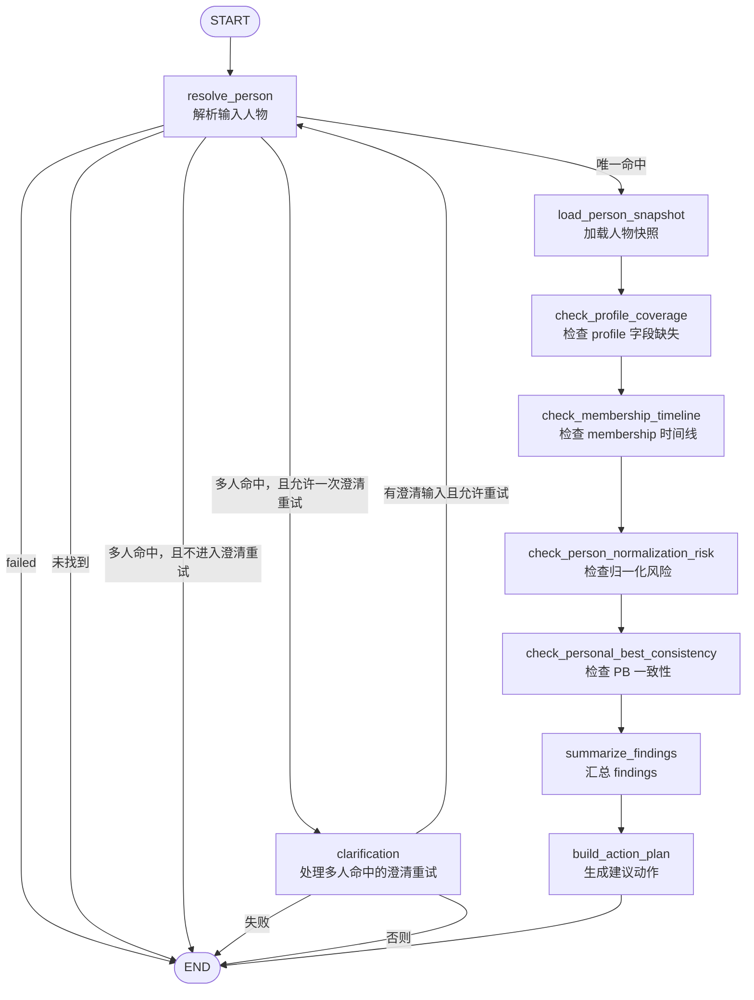

# tasuki-keifu-agent Graph 结构图

这份文档用于记录 `tasuki-keifu-agent` 当前 graph 的结构。

用途：

- 方便快速查看当前 graph 的节点和分支
- 后续新增 graph 时补充新的图
- 后续修改现有 graph 时同步更新这里

## 当前 graph

当前项目内只有一张主 graph：

- `person_diagnosis`

## 当前链路图

## 节点说明

- `resolve_person`
  负责解析输入人物，判断是唯一命中、多人冲突、未找到还是失败。

- `clarification`
  负责处理多人命中的澄清重试路径。

- `load_person_snapshot`
  负责加载人物快照，包括 profile、memberships、personalBests、relationCache。

- `check_profile_coverage`
  检查 profile 字段缺失情况。

- `check_membership_timeline`
  检查 membership 时间线问题。

- `check_person_normalization_risk`
  检查选手归一化风险。

- `check_personal_best_consistency`
  检查 PB 一致性问题。

- `summarize_findings`
  汇总 findings，生成结果摘要。

- `build_action_plan`
  根据 findings 生成建议动作。

## 当前分支说明

- `resolve_person` 是主要分叉点
  - 唯一命中：进入主诊断链路
  - 未找到：直接结束
  - 多人命中：进入澄清或结束
  - 失败：直接结束

- `clarification` 是重试分叉点
  - 允许重试：回到 `resolve_person`
  - 否则：结束

## 维护规则

- 新增 graph 时，在本文件中增加新章节和新 mermaid 图
- 修改现有 graph 节点、顺序或条件分支时，必须同步更新本图
- 如果后续归一化检查拆成子流程，也在这里补出更新后的结构图
