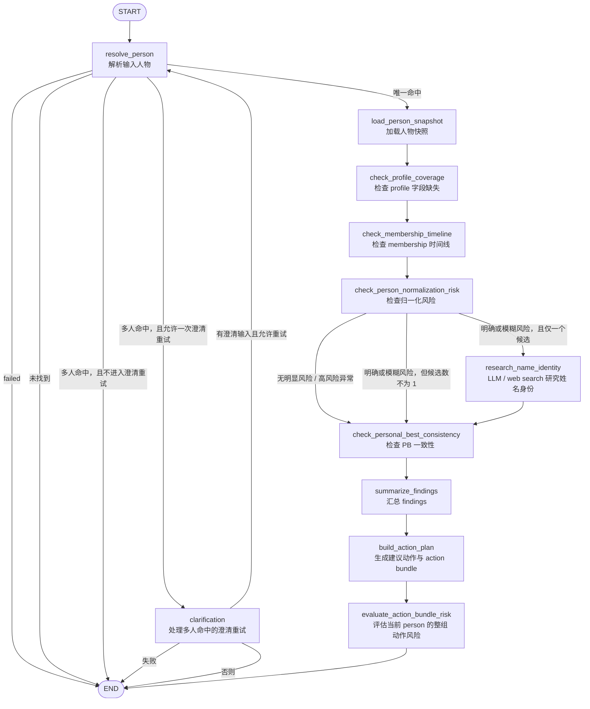
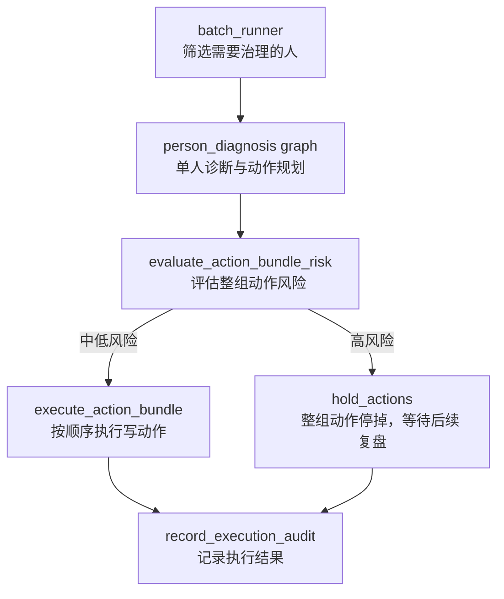
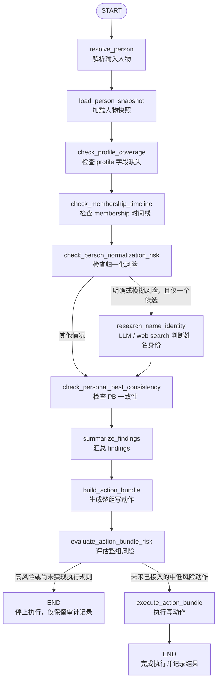

## tasuki-keifu-agent Graph 结构图

这份文档用于记录 `tasuki-keifu-agent` 当前 graph 的结构。

用途：

- 方便快速查看当前 graph 的节点和分支
- 后续新增 graph 时补充新的图
- 后续修改现有 graph 时同步更新这里

### 当前 graph

当前项目内只有一张主 graph：

- `person_diagnosis`

补充说明：

- 当前项目还没有 batch graph
- 批处理会先作为 graph 外层的 runner 存在
- 后续如果 batch 自身也变复杂，再考虑单独补第二张 graph

### 当前链路图

### 节点说明

- `resolve_person`
  负责解析输入人物，判断是唯一命中、多人冲突、未找到还是失败。

- `clarification`
  负责处理多人命中的澄清重试路径。

- `load_person_snapshot`
 负责加载人物快照，包括 profile、memberships、personalBests。

- `check_profile_coverage`
  检查 profile 字段缺失情况。

- `check_membership_timeline`
  检查 membership 时间线问题。

- `check_person_normalization_risk`
  先做 name-first 规则判断，输出无明显风险、明确风险、模糊风险或高风险异常。

- `research_name_identity`
  处理只有一个候选的明确或模糊归一化风险。优先使用本地 Codex provider 的 `gpt-5.4` 尝试联网研究；如果接口不支持 web search，则降级为普通 LLM 判断。判断为 `uncertain` 时写入 finding，判断为 `same` 时保留或补充明确的重复归一化 finding，判断为 `different` 时移除规则层的重复 finding，避免把同名不同人合并。

- `check_personal_best_consistency`
  检查 PB 一致性问题。

- `summarize_findings`
  汇总 findings，生成结果摘要。

- `build_action_plan`
  根据 findings 生成建议动作。
  同时生成带顺序、payload 和幂等键的 action bundle。

- `evaluate_action_bundle_risk`
  以单个 `person` 为边界评估整组动作风险。
  当前只有满足严格条件的 `merge_person_duplicate` 可进入计划执行；membership、PB、profile 等动作仍会停放，不会写入业务库。

### 当前分支说明

- `resolve_person` 是主要分叉点
  - 唯一命中：进入主诊断链路
  - 未找到：直接结束
  - 多人命中：进入澄清或结束
  - 失败：直接结束

- `clarification` 是重试分叉点
  - 允许重试：回到 `resolve_person`
  - 否则：结束

- `check_person_normalization_risk` 是归一化分叉点
  - 无明显风险：直接进入 PB 检查
  - 高风险异常：记录 finding 后直接进入 PB 检查
  - 明确或模糊风险，且只有一个候选：先进入 `research_name_identity`，再回到主链路
  - 明确或模糊风险，但候选数不为 1：记录 finding 后直接进入 PB 检查

### 下一阶段计划

下一阶段不会先把单人 graph 改成多人 graph。

更合理的做法是：

- 保持 `person_diagnosis` 继续只处理单个 `person`
- 在 graph 外层新增 `batch runner`
- `batch runner` 负责筛人、调度、重试、限流和运行记录
- 单人 graph 负责诊断与生成 action bundle

也就是说，下一阶段的整体结构更接近下面这样：

### 下一阶段的单人 graph 目标

当前 `person_diagnosis` 的主链路暂时不拆。

下一阶段主要补的是 graph 输出能力，而不是大改前半段检查结构：

- 前半段继续做检查与 finding 生成
- `build_action_plan` 当前已经生成结构化 `action bundle`；节点名称暂时保留，后续如重命名需同步修改本图
- 新增整组风险评估
- 新增写动作执行与执行审计

为了避免把 graph 一次改得太大，第一版建议按下面的目标形态推进：

### 结构理解

- `batch runner` 不是当前 graph 里的一个 node，而是 graph 外层调度器
- 单人 graph 仍然是当前系统的核心 worker
- 高风险不是停整个 batch，而是只停当前这个 `person`
- 中低风险按预设顺序执行 action bundle
- graph 文档后续要同时维护“当前已实现结构”和“下一阶段目标结构”

### 已实现的 Batch Runner

当前已经实现 `batch runner`，但它还是 graph 外层 CLI，不是一张新的 LangGraph。

- 从业务库读取 `Person`、`Membership`、`PersonalBest` 的最大更新时间
- 从 agent 库读取该 person 最近一次成功治理时间
- 比较后筛出需要治理的 person
- 逐人调用 `person_diagnosis`
- 将 findings、action bundle、风险等级和动作执行状态写入 agent 审计库
- 默认 dry-run，不会写入主业务库
- 目前仅已确认同人的 `merge_person_duplicate` 在显式开启写入后可执行；其他动作仍会记录为停放

### 维护规则

- 新增 graph 时，在本文件中增加新章节和新 mermaid 图
- 修改现有 graph 节点、顺序或条件分支时，必须同步更新本图
- 如果后续归一化检查拆成子流程，也在这里补出更新后的结构图
